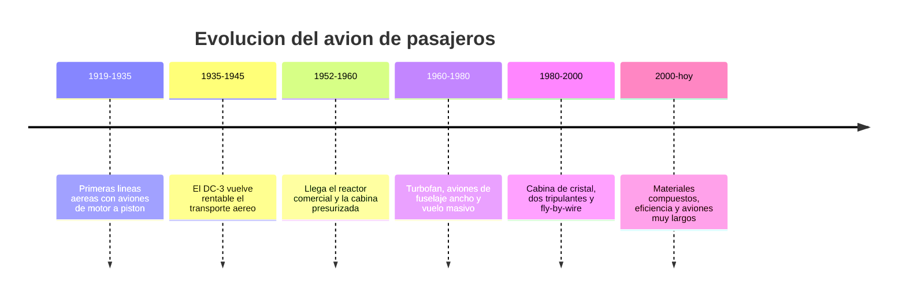

# 📜 Historia del avión de pasajeros

[🏠 Inicio](../../../README.md) · [🛫 Curso: Aviones de pasajeros](../README.md) · 📜 Historia

## Origen

El avión de pasajeros nace tras la Primera Guerra Mundial, cuando los primeros
operadores adaptaron aviones de motor a pistón para llevar correo y pasajeros. El
salto decisivo llegó con el DC-3 en los años treinta, que por primera vez hizo
rentable el transporte de pasajeros sin subsidio del correo. Después, el reactor
y la cabina presurizada permitieron volar más alto, más rápido y más cómodo.

## Línea de tiempo

| Periodo | Hito | Importancia |
| --- | --- | --- |
| 1919-1935 | Primeras líneas aéreas | El transporte aéreo comercial se pone en marcha. |
| 1935-1945 | El DC-3 | Vuelve rentable llevar pasajeros. |
| 1952-1960 | El reactor comercial | Vuelo más alto, rápido y presurizado. |
| 1960-1980 | Turbofan y fuselaje ancho | Transporte masivo y más eficiente. |
| 1980-2000 | Cabina de cristal y fly-by-wire | Dos pilotos y control asistido por computador. |
| 2000-presente | Compuestos y eficiencia | Menor consumo y mayor alcance. |

## Evolución tecnológica

- **Estructura**: del aluminio remachado a los materiales compuestos.
- **Propulsión**: del motor a pistón al turborreactor y al turbofan de alto índice de derivación.
- **Cabina**: de decenas de relojes a pantallas integradas (glass cockpit) y FMS.
- **Control**: de mandos mecánicos y por cable a sistemas fly-by-wire con protecciones.
- **Presurización**: cabinas que permiten volar cómodo a gran altitud.
- **Seguridad**: redundancia de sistemas, procedimientos y gestión de recursos de tripulación.

## Tipos representativos

| Tipo | Uso típico | Característica destacada |
| --- | --- | --- |
| Turbohelice regional | Rutas cortas y pistas modestas | Eficiente a baja altitud. |
| Reactor regional | Conexiones cortas de baja densidad | Alcance corto, menos asientos. |
| Fuselaje estrecho | Rutas cortas y medias | Un pasillo, muy común en flotas. |
| Fuselaje ancho | Rutas largas intercontinentales | Dos pasillos, gran alcance. |
| Carguero derivado | Transporte de carga | Fuselaje de pasaje adaptado. |

## Impacto social y económico

El avión de pasajeros conecto ciudades y continentes en horas, transformando el
turismo, el comercio y la vida de millones de personas. En países largos y de
geografía difícil, como Chile, la aviación comercial es clave para unir el
territorio. Su operación exige un marco de seguridad estricto porque transporta a
muchas personas en cada vuelo.

## Fuentes

- Registrar aquí las fuentes públicas consultadas.
- Enlazar cada fuente también en [`manuales/fuentes.md`](../../../manuales/fuentes.md).

---

[🎓 Portada del curso](../README.md) · [➡️ Siguiente: Características](../operacion/caracteristicas-avion-pasajeros.md)
