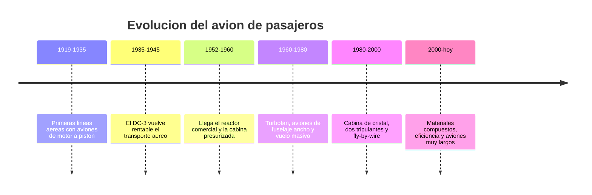

<!-- clase-meta
tipo_documento: clase
clase: 1
codigo: AVIONESPASAJ-01
curso: aviones-pasajeros
titulo: "Historia del avión de pasajeros"
modalidad: "teórica dialogada"
duracion_minutos: 45
nivel: introductorio
prerrequisito: ninguno
competencia: "contexto_historico"
resultados_aprendizaje:
  - "Explicar origen, evolución tecnológica, variantes representativas e impacto con vocabulario propio de Aviones de pasajeros."
  - "Aplicar esos conceptos a una decisión segura o a un escenario de simulación de Aviones de pasajeros."
evidencia: "Línea de tiempo comentada con cuatro hitos o más."
criterio_aprobacion: "Los hitos están ordenados, son pertinentes y dos relaciones de causa y efecto quedan justificadas."
fuentes: manuales/fuentes.md
ultima_revision: 2026-09-10
-->

# 📜 Historia del avión de pasajeros

[🏠 Inicio](../../../README.md) · [🛫 Curso: Aviones de pasajeros](../README.md) · 📜 Historia

```mermaid
timeline
    title Evolucion del avion de pasajeros
    1919-1935 : Primeras lineas aereas con aviones de motor a piston
    1935-1945 : El DC-3 vuelve rentable el transporte aereo
    1952-1960 : Llega el reactor comercial y la cabina presurizada
    1960-1980 : Turbofan, aviones de fuselaje ancho y vuelo masivo
    1980-2000 : Cabina de cristal, dos tripulantes y fly-by-wire
    2000-hoy : Materiales compuestos, eficiencia y aviones muy largos
```

## Origen

El avión de pasajeros nace tras la Primera Guerra Mundial, cuando los primeros
operadores adaptaron aviones de motor a pistón para llevar correo y pasajeros. El
salto decisivo llegó con el DC-3 en los años treinta, que por primera vez hizo
rentable el transporte de pasajeros sin subsidio del correo. Después, el reactor
y la cabina presurizada permitieron volar más alto, más rápido y más cómodo.

## Línea de tiempo

| Periodo | Hito | Importancia |
| --- | --- | --- |
| 1919-1935 | Primeras líneas aéreas | El transporte aéreo comercial se pone en marcha. |
| 1935-1945 | El DC-3 | Vuelve rentable llevar pasajeros. |
| 1952-1960 | El reactor comercial | Vuelo más alto, rápido y presurizado. |
| 1960-1980 | Turbofan y fuselaje ancho | Transporte masivo y más eficiente. |
| 1980-2000 | Cabina de cristal y fly-by-wire | Dos pilotos y control asistido por computador. |
| 2000-presente | Compuestos y eficiencia | Menor consumo y mayor alcance. |

## Evolución tecnológica

- **Estructura**: del aluminio remachado a los materiales compuestos.
- **Propulsión**: del motor a pistón al turborreactor y al turbofan de alto índice de derivación.
- **Cabina**: de decenas de relojes a pantallas integradas (glass cockpit) y FMS.
- **Control**: de mandos mecánicos y por cable a sistemas fly-by-wire con protecciones.
- **Presurización**: cabinas que permiten volar cómodo a gran altitud.
- **Seguridad**: redundancia de sistemas, procedimientos y gestión de recursos de tripulación.

## Tipos representativos

| Tipo | Uso típico | Característica destacada |
| --- | --- | --- |
| Turbohelice regional | Rutas cortas y pistas modestas | Eficiente a baja altitud. |
| Reactor regional | Conexiones cortas de baja densidad | Alcance corto, menos asientos. |
| Fuselaje estrecho | Rutas cortas y medias | Un pasillo, muy común en flotas. |
| Fuselaje ancho | Rutas largas intercontinentales | Dos pasillos, gran alcance. |
| Carguero derivado | Transporte de carga | Fuselaje de pasaje adaptado. |

## Impacto social y económico

El avión de pasajeros conecto ciudades y continentes en horas, transformando el
turismo, el comercio y la vida de millones de personas. En países largos y de
geografía difícil, como Chile, la aviación comercial es clave para unir el
territorio. Su operación exige un marco de seguridad estricto porque transporta a
muchas personas en cada vuelo.

## 🧭 Guía de estudio aplicada

### Pregunta guía

¿Cómo ayuda **Origen, Línea de tiempo, Evolución tecnológica y Tipos representativos** a **explicar cómo la evolución hizo posibles alternativas como avión de fuselaje estrecho frente a fuselaje ancho**?

### Explicación razonada

La evolución de Aviones de pasajeros se comprende mejor como una sucesión de respuestas a problemas, no como una lista de fechas. Los cambios en motor, empuje, flujo de aire y alas y controles alteraron qué podía hacer la máquina, quién podía usarla y qué riesgos debían controlarse. El contraste «avión de fuselaje estrecho frente a fuselaje ancho» permite observar qué decisiones de diseño permanecieron y cuáles cambiaron con la tecnología y el propósito.

Esta clase se conecta con el resto del curso mediante **gestión de energía vertical y horizontal mediante actitud, empuje y configuración**. El hilo de
seguridad consiste en reconocer a tiempo **continuar una aproximación inestable o automatizar sin comprender el modo activo** y poder justificar la decisión
**confirmar modo, energía y configuración; frustrar si la estabilidad no se recupera**; en clases posteriores cambiará el ángulo de análisis, no esa relación causal.
La lectura funcional común sigue **motor → empuje → flujo de aire → alas y controles**, de modo que cada concepto pueda
ubicarse dentro del funcionamiento completo y no quede como un dato aislado.

**Apoyo documental:** [Aviation Handbooks and Manuals](https://www.faa.gov/regulations_policies/handbooks_manuals) aporta aerodinámica, sistemas y operación;
[Normativa aeronáutica](https://www.dgac.gob.cl/normativa/) se usa para marco aeronáutico chileno. Estas fuentes
se contrastan con el alcance de la clase y no sustituyen un manual de equipo concreto.

### Caso resuelto: de la observación a la decisión

1. **Situar:** ordena los hitos que explican cómo se llegó a **avión de fuselaje estrecho frente a fuselaje ancho** y describe la necesidad que impulsó cada cambio.
2. **Relacionar:** explica qué se modificó en **motor**, **empuje**, **flujo de aire** o **alas y controles**; una fecha sin mecanismo no basta.
3. **Interpretar:** vincula el cambio con una capacidad nueva y también con el riesgo **continuar una aproximación inestable o automatizar sin comprender el modo activo**.
4. **Transferir:** usa la evolución para justificar por qué hoy conviene **confirmar modo, energía y configuración; frustrar si la estabilidad no se recupera**.

### Comprueba tu comprensión

1. ¿Qué necesidad histórica impulsó un cambio en **motor** o **empuje**?
2. ¿Qué hito modificó la relación entre capacidad y **continuar una aproximación inestable o automatizar sin comprender el modo activo**?
3. ¿Por qué **avión de fuselaje estrecho frente a fuselaje ancho** no puede explicarse como una simple diferencia estética?

Orientación para revisar tus respuestas

- La primera respuesta debe relacionar el eslabón elegido con un efecto posterior, no solo nombrarlo.
- La segunda debe proponer una señal medible u observable y explicar qué tendencia sería preocupante.
- La tercera debe cambiar al menos una variable de capacidad, mando, entorno o margen de seguridad.

## 🎓 Cierre de clase

- **Actividad:** Construye una línea de tiempo de Aviones de pasajeros y explica cómo dos cambios históricos transformaron su función o su puesto de mando.
- **Evidencia:** Línea de tiempo comentada con cuatro hitos o más.
- **Criterio de aprobación:** Los hitos están ordenados, son pertinentes y dos relaciones de causa y efecto quedan justificadas.
- **Transferencia:** explica qué cambiaría al pasar a otra variante de esta máquina.

### Fuentes de esta clase

- [US-FAA-HANDBOOKS](https://www.faa.gov/regulations_policies/handbooks_manuals): Aviation Handbooks and Manuals, FAA. Uso: aerodinámica, sistemas y operación.
- [CL-DGAC](https://www.dgac.gob.cl/normativa/): Normativa aeronáutica, DGAC Chile. Uso: marco aeronáutico chileno.

> Las fuentes sostienen el marco conceptual y normativo; esta clase no reemplaza el manual
> del fabricante, la formación certificada ni la habilitación exigida para operar equipos reales.

---

[🎓 Portada del curso](../README.md) · [➡️ Siguiente: Características](../operacion/caracteristicas-avion-pasajeros.md)
