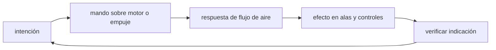

<!-- clase-meta
tipo_documento: clase
clase: 5
codigo: AVIONESPASAJ-05
curso: aviones-pasajeros
titulo: "Mandos e instrumentos del avión de pasajeros"
modalidad: "taller de simulación"
duracion_minutos: 60
nivel: introductorio
prerrequisito: AVIONESPASAJ-04
competencia: "lectura_y_mando"
resultados_aprendizaje:
  - "Explicar controles, instrumentos, entradas y estados del sistema con vocabulario propio de Aviones de pasajeros."
  - "Aplicar esos conceptos a una decisión segura o a un escenario de simulación de Aviones de pasajeros."
evidencia: "Mapa de mandos y resolución de dos estados del tablero."
criterio_aprobacion: "Reconoce los controles críticos y responde a los estados sin introducir acciones inseguras."
fuentes: manuales/fuentes.md
ultima_revision: 2026-09-10
-->

# 🎛️ Mandos e instrumentos del avión de pasajeros

[🏠 Inicio](../../../README.md) · [🛫 Curso: Aviones de pasajeros](../README.md) · 🎛️ Mandos

## Vista general

La cabina de vuelo de un avión de pasajeros está disenada para dos tripulantes,
comandante y copiloto, que reparten tareas y verificaciones. Reune los mandos de
vuelo, los mandos de motor, el panel superior de sistemas y las pantallas de
avionica. El vuelo se apoya en el piloto automático, el autothrottle y el sistema
de gestión de vuelo, y la operación se conduce con listas de verificación.

## Mapa de controles

| Zona | Control | Tipo | Función | Prioridad | Comentarios |
| --- | --- | --- | --- | --- | --- |
| Frente | Yugo o sidestick | Volante / palanca | Cabeceo y alabeo | Alta | Manda actitud; en fly-by-wire con protecciones. |
| Piso | Pedales de timón | Pedales | Guiñada y frenos | Alta | También dirigen la rueda de nariz. |
| Pedestal | Palancas de gases | Palancas | Regular empuje de los motores | Alta | Con autothrottle asociado. |
| Pedestal | Palanca de flaps / slats | Palanca | Configurar sustentación | Alta | Por etapas según fase. |
| Pedestal | Spoilers / aerofrenos | Palanca | Reducir sustentación y frenar | Media | En descenso y en pista. |
| Pedestal | Compensador (trim) | Rueda / interruptor | Aliviar fuerza de cabeceo | Media | Estabiliza la actitud elegida. |
| Pedestal | Reversa de empuje | Palancas | Frenar en pista | Alta | Solo con tren en tierra. |
| Panel superior | Sistemas (hidráulico, eléctrico, aire) | Botones | Gestionar sistemas del avión | Alta | Operado con checklist. |
| Panel de vuelo (FCU/MCP) | Piloto automático y autothrottle | Selectores | Rumbo, altitud, velocidad y senda | Alta | Núcleo de la operación en crucero. |
| Pedestal | Radios y transponder | Teclados | Comunicar y responder al control | Alta | Frecuencias y código asignado. |

## Instrumentos de vuelo

| Instrumento | Mide o muestra | Unidad | Importancia | Notas |
| --- | --- | --- | --- | --- |
| PFD velocidad | Velocidad indicada | nudos | Alta | Con cintas de referencia y límites. |
| PFD altitud | Altitud y altitud seleccionada | pies | Alta | Ajustada con la presión local. |
| PFD actitud | Cabeceo y alabeo | grados | Alta | Horizonte artificial principal. |
| PFD rumbo | Dirección de la nariz | grados | Alta | Integrado con la navegación. |
| Variómetro | Velocidad vertical | pies/min | Media | Ascenso o descenso. |
| Navegación (ND) | Ruta, tráfico y clima | derrota | Alta | Alimentado por el FMS. |
| Parámetros de motor | Empuje, revoluciones, temperatura | varias | Alta | Vigilan cada motor. |
| Altitud de cabina | Presión interior | pies equivalentes | Alta | Salud de la presurización. |

## Entradas de simulación

| Acción | Teclado | Controlador | Palanca de vuelo | Comentarios |
| --- | --- | --- | --- | --- |
| Cabecear | Flechas arriba/abajo | Stick eje Y | Adelante-atrás | Sube o baja el morro. |
| Alabear | Flechas izq/der | Stick eje X | Giro lateral | Inclina las alas. |
| Guiñar | Teclas Z / X | Gatillos / pedales | Pedales | Coordina el vuelo. |
| Empuje | Teclas F2 / F3 | Gatillo derecho | Palancas de gases | Con autothrottle opcional. |
| Flaps / slats | Tecla F | Botón | Selector de flaps | Por etapas. |
| Spoilers | Tecla S | Botón | Palanca de spoilers | Descenso y frenado. |
| Piloto automático | Tecla A | Botón dedicado | Panel FCU/MCP | Rumbo, altitud, velocidad. |
| Reversa | Tecla B | Gatillo | Palancas de reversa | Solo en tierra. |

## Estados del sistema

| Estado | Descripción | Indicadores | Acciones disponibles |
| --- | --- | --- | --- |
| En plataforma | Motores apagados, en puerta | Panel con energía de tierra o APU | Checklist, cargar plan, arrancar. |
| Rodaje | Motores en marcha en tierra | Parámetros de motor activos | Rodar, alinear, configurar despegue. |
| En vuelo | Aeronave volando | PFD y ND activos | Ascender, crucero, navegar, comunicar. |
| Aproximación | Preparando aterrizaje | Flaps y velocidad de aproximación | Configurar, seguir senda, aterrizar. |
| Emergencia | Falla o riesgo | Alertas y avisos | Aplicar checklist y procedimientos. |

## Observaciones ergonomicas

- La velocidad, la altitud y la actitud del PFD deben verse siempre; son críticas.
- El reparto de tareas entre comandante y copiloto debe quedar claro en la interfaz.
- Las palancas de gases, flaps y spoilers deben diferenciarse bien al tacto.
- El panel superior debe mostrar el estado de cada sistema de forma legible.
- La simulación debería guiar el uso de listas de verificación en cada fase.
- Las alertas (pérdida, TCAS, GPWS) deben ser claras y priorizadas.

## 🧭 Guía de estudio aplicada

### Pregunta guía

¿Cómo ayuda **Vista general, Mapa de controles, Instrumentos de vuelo y Entradas de simulación** a **interpretar mandos e indicaciones durante aproximación con cambio tardío de viento y una alerta de configuración**?

### Explicación razonada

Un mando no se aprende memorizando su nombre, sino recorriendo el ciclo intención → acción → indicación → verificación. En Aviones de pasajeros, el operador actúa sobre motor o empuje, observa la respuesta en flujo de aire y confirma el efecto en alas y controles. Una indicación inesperada exige detener la secuencia mental, identificar el modo activo y evitar una segunda orden que agrave el estado.

Esta clase se conecta con el resto del curso mediante **gestión de energía vertical y horizontal mediante actitud, empuje y configuración**. El hilo de
seguridad consiste en reconocer a tiempo **continuar una aproximación inestable o automatizar sin comprender el modo activo** y poder justificar la decisión
**confirmar modo, energía y configuración; frustrar si la estabilidad no se recupera**; en clases posteriores cambiará el ángulo de análisis, no esa relación causal.
La lectura funcional común sigue **motor → empuje → flujo de aire → alas y controles**, de modo que cada concepto pueda
ubicarse dentro del funcionamiento completo y no quede como un dato aislado.

**Apoyo documental:** [Aviation Handbooks and Manuals](https://www.faa.gov/regulations_policies/handbooks_manuals) aporta aerodinámica, sistemas y operación;
[Normativa aeronáutica](https://www.dgac.gob.cl/normativa/) se usa para marco aeronáutico chileno. Estas fuentes
se contrastan con el alcance de la clase y no sustituyen un manual de equipo concreto.

### Caso resuelto: de la observación a la decisión

1. **Intención:** formula qué cambio se necesita durante **aproximación con cambio tardío de viento y una alerta de configuración**.
2. **Mando:** identifica el control que actúa sobre **motor** o **empuje** y el modo que debe estar activo.
3. **Lectura:** localiza la indicación que confirma la respuesta de **flujo de aire** y el efecto en **alas y controles**.
4. **Verificación:** si la lectura no coincide, no acumules órdenes; estabiliza e investiga el estado.

### Comprueba tu comprensión

1. ¿Qué mando inicia la respuesta y qué instrumento confirma que el modo correcto está activo?
2. ¿Qué indicación temprana advertiría **continuar una aproximación inestable o automatizar sin comprender el modo activo**?
3. ¿Qué secuencia usarías si la respuesta de **alas y controles** no coincide con la orden?

Orientación para revisar tus respuestas

- La primera respuesta debe relacionar el eslabón elegido con un efecto posterior, no solo nombrarlo.
- La segunda debe proponer una señal medible u observable y explicar qué tendencia sería preocupante.
- La tercera debe cambiar al menos una variable de capacidad, mando, entorno o margen de seguridad.

## 🎓 Cierre de clase

- **Actividad:** Recorre el puesto de mando simulado de Aviones de pasajeros: localiza los controles de controles, instrumentos, entradas y estados del sistema y asocia cada indicación con una decisión.
- **Evidencia:** Mapa de mandos y resolución de dos estados del tablero.
- **Criterio de aprobación:** Reconoce los controles críticos y responde a los estados sin introducir acciones inseguras.
- **Transferencia:** explica qué cambiaría al pasar a otra variante de esta máquina.

### Fuentes de esta clase

- [US-FAA-HANDBOOKS](https://www.faa.gov/regulations_policies/handbooks_manuals): Aviation Handbooks and Manuals, FAA. Uso: aerodinámica, sistemas y operación.
- [CL-DGAC](https://www.dgac.gob.cl/normativa/): Normativa aeronáutica, DGAC Chile. Uso: marco aeronáutico chileno.

> Las fuentes sostienen el marco conceptual y normativo; esta clase no reemplaza el manual
> del fabricante, la formación certificada ni la habilitación exigida para operar equipos reales.

---

[⬅️ Anterior: Sistemas mecánicos](../operacion/sistemas-mecanicos-avion-pasajeros.md) · [➡️ Siguiente: Principios y operación](../operacion/principios-avion-pasajeros.md)
