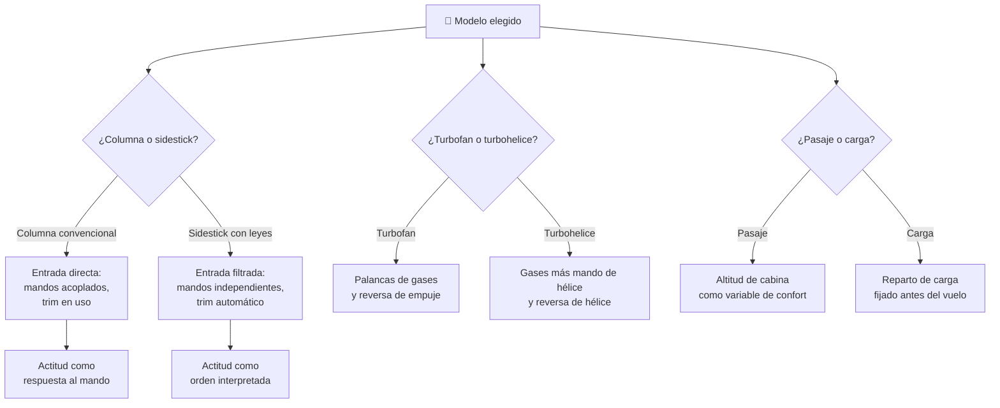

# 🧩 Modelos y variantes del avión de pasajeros

[🏠 Inicio](../../../README.md) · [🛫 Curso: Aviones de pasajeros](../README.md) · 🧩 Modelos

El [Módulo 2](../operacion/caracteristicas-avion-pasajeros.md) ya dijo qué tipos
de avión de pasajeros existen y para qué sirve cada uno. Este módulo responde a
otra cosa: **no todos se pilotan igual**, y la diferencia no es de matiz. Cambia
qué mandos tiene la máquina y, por tanto, qué debe modelar el simulador.

> 🎯 **La idea que sostiene el módulo.** "Un avión de pasajeros" no es una sola
> máquina desde el punto de vista del mando. Entre una columna convencional y un
> sidestick con leyes de control no hay un ajuste de sensibilidad: hay otro
> mando, otro acoplamiento entre los dos puestos y otra filosofía de pilotaje.
> Un simulador que presente un solo esquema de control está representando un
> avión concreto aunque diga representarlos todos.

---

## 🧭 Por qué el modelo decide el simulador

El [Módulo 5](../mandos/manual-mandos-avion-pasajeros.md) lista una sola fila
para el mando de cabeceo y alabeo: **«Yugo o sidestick»**. Esa «o» esconde dos
máquinas distintas. En la columna convencional el mando está unido entre
comandante y copiloto, se mueve solo cuando el piloto automático actúa y ordena
deflexión de superficie. En el sidestick con leyes de control, el mando ordena
una actitud que el sistema interpreta, no lo que la superficie hará, y cada
puesto tiene el suyo sin acoplamiento mecánico.

El [Módulo 9](../simulacion/diseno-simulador-avion-pasajeros.md) declara la
variable `Actitud (cabeceo/alabeo)` con rango `-30..30 grados`. Ese rango
describe la envolvente de la aeronave, no lo que el piloto puede pedir. En la
variante con protecciones, la entrada del piloto queda acotada por las leyes de
control antes de llegar a la superficie: entre el mando y la variable aparece
una capa que en la columna convencional no existe. Si el simulador se construye
sobre el esquema convencional y luego se le «añade» un sidestick, el resultado
es un sidestick sin protecciones, que no es lo que se quería representar.

Lo mismo ocurre con la propulsión. El Módulo 5 da por hecho las **palancas de
gases** y la **reversa de empuje** de un turbofan; el Módulo 2 admite que hay
aviones **turbohelice**, donde el mando de motor no se agota en el empuje.

---

## 🗂️ Qué cambia en el manejo

| Modelo | Qué cambia al pilotarlo |
| --- | --- |
| Fuselaje estrecho | La referencia del curso: turbofan, dos pilotos, rutas cortas y medias, muchos ciclos por jornada. |
| Fuselaje ancho | Más masa e inercia: todo responde con más retardo y hay que anticipar. Más sistemas que vigilar en el panel superior y jornadas largas de crucero. |
| Reactor regional | Menor tamaño y alcance corto: más despegues y aterrizajes por jornada y menos tiempo de crucero estable. |
| Turbohelice regional | Vuela más bajo y más lento, y opera en pistas modestas. El motor de hélice pide una gestión propia y la fase de crucero pierde peso frente al despegue y la aproximación. |
| Carguero derivado | Sin pasaje que atender, pero con carga cuyo reparto se fija en tierra y condiciona el vuelo entero. |
| Versión ejecutiva | Cabina reconfigurada y mayor alcance: la operación se parece más a la de fuselaje ancho que a la del avión del que deriva. |
| Variante con columna convencional | Los dos mandos están unidos: cada piloto ve y siente lo que hace el otro, y la columna se mueve con el piloto automático. |
| Variante con sidestick y leyes de control | El mando pide actitud y el sistema decide; el piloto vuela contra unas protecciones que no le dejarán salir de la envolvente, y el otro puesto no siente la entrada. |

---

## 🎛️ Qué cambia en el mando

| Modelo | Qué mando aparece o desaparece | Consecuencia |
| --- | --- | --- |
| Fuselaje estrecho, ancho, reactor regional, versión ejecutiva | Ninguno: el mapa de controles del Módulo 5 aplica tal cual. | Cambian los rangos y la carga de trabajo, no los controles. |
| Turbohelice regional | **Aparece** un mando propio del motor de hélice junto a las palancas de gases. La **reversa de empuje** de turbofan **se sustituye** por la reversa de la hélice. | La palanca de gases deja de ser el único mando de propulsión: el pedestal cambia de forma. |
| Carguero derivado | **Desaparece** la gestión de cabina de pasaje. **Aparece** el reparto de carga como dato previo al vuelo. | No es un mando de vuelo, pero fija el punto de partida de todos los demás. |
| Variante con columna convencional | Yugo acoplado entre ambos puestos; el **compensador (trim)** es un mando de uso corriente en vuelo. | La fuerza en el mando y la posición del trim son información constante para los dos pilotos. |
| Variante con sidestick y leyes de control | El yugo **se sustituye** por un sidestick lateral, sin unión mecánica entre puestos. El **compensador de cabeceo** deja de ser un mando de rutina en vuelo normal: lo gestiona el sistema. | Ni la fuerza ni la posición del mando informan al otro piloto; la interfaz debe decirlo de otro modo. |

---

## 🎮 Qué cambia en el simulador

Contrastado con las variables del
[Módulo 9](../simulacion/diseno-simulador-avion-pasajeros.md):

| Modelo | Variables que cambian | Esquema de control |
| --- | --- | --- |
| Fuselaje estrecho | Ninguna: es el caso base. | El del Módulo 5. |
| Fuselaje ancho | `Altitud` y `Combustible` usan la parte alta de su rango durante casi toda la partida; `Velocidad` se sostiene en Mach de crucero. | El mismo, con más estado de sistemas que vigilar. |
| Reactor regional | `Altitud` y `Combustible` **reducen** su rango útil; la partida transcurre en las fases de baja altitud. | El mismo. |
| Turbohelice regional | `Empuje de motores` deja de ser un único porcentaje y necesita el mando de hélice. `Altitud` y `Velocidad` **reducen** su rango. `Altitud de cabina` pierde protagonismo al volar más bajo. | Pedestal distinto: propulsión con más de una entrada y reversa de hélice. |
| Carguero derivado | `Altitud de cabina` **deja de ser** una variable de confort de pasaje. El peso y su reparto entran como condición inicial y no se tocan en vuelo. | El mismo. |
| Versión ejecutiva | `Combustible` **amplía** su rango frente al avión del que deriva. | El mismo. |
| Variante con columna convencional | `Actitud` responde directamente a la entrada del piloto dentro del rango declarado; `Modo de piloto automático` mueve el mando al actuar. | El del Módulo 5. |
| Variante con sidestick y leyes de control | `Actitud` **deja de ser** una consecuencia directa de la entrada: la orden pasa por las leyes de control antes de convertirse en actitud, y el rango que el piloto alcanza no es el rango de la variable. | Entrada filtrada por protecciones; dos mandos independientes que hay que resolver entre sí. |

---

## 🗺️ Del modelo al esquema de control

---

## ⚠️ Qué modelos no comparten simulador

Tres familias no se resuelven con un ajuste de parámetros, porque su esquema de
control es otro:

- **El sidestick con leyes de control** frente a la columna convencional: entre
  la entrada del piloto y la actitud se interpone una capa que decide, y los dos
  puestos dejan de estar unidos. Es un modo de control distinto, no una
  dificultad distinta.
- **El turbohelice regional** frente al resto: la propulsión gana una entrada y
  la reversa cambia de naturaleza. Un pedestal de turbofan no lo representa.
- **El carguero derivado** frente a los demás: obliga a tratar el reparto de
  carga como condición del vuelo y vacía de sentido la altitud de cabina como
  medida de confort del pasaje.

El resto de modelos sí caben en un mismo simulador ajustando rangos, tal como
plantean los [niveles de realismo](../../../docs/03-niveles-de-realismo.md): en
el nivel 1 casi todos se comportan igual, y las diferencias emergen a medida que
el nivel sube. La diferencia entre columna y sidestick, en cambio, ya asoma en
el nivel 2 y es inevitable en el nivel 3.

---

[⬅️ Anterior: Características](../operacion/caracteristicas-avion-pasajeros.md) · [➡️ Siguiente: Sistemas mecánicos](../operacion/sistemas-mecanicos-avion-pasajeros.md)
