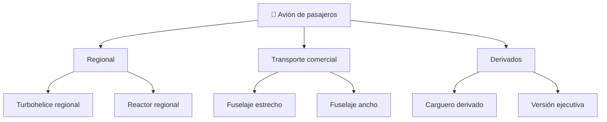

# 📋 Características funcionales del avión de pasajeros

[🏠 Inicio](../../../README.md) · [🛫 Curso: Aviones de pasajeros](../README.md) · 📋 Características

Que es un avión de pasajeros, que tipos existen y para que sirve cada uno. Este
módulo da el contexto antes de abrir los sistemas de la aeronave (Módulo 4).

---

## 🧭 Definición

Un avión de pasajeros es una aeronave de ala fija, más pesada que el aire,
propulsada por motores turbofan o turbohelice, disenada para transportar personas
en operación comercial. Vuela porque sus alas generan sustentación, opera a gran
altitud gracias a la cabina presurizada y es conducido por una tripulación de
vuelo bajo un marco de aviación comercial estricto.

---

## 🧬 Características clave

| Característica | Descripción |
| --- | --- |
| Carga humana | Transporta decenas o cientos de pasajeros; la seguridad es prioritaria. |
| Cabina presurizada | Permite volar cómodo a gran altitud con aire acondicionado. |
| Alta velocidad y altitud | Opera cerca de la velocidad del sonido a nivel de crucero elevado. |
| Redundancia de sistemas | Hidráulica, eléctrica y avionica duplicadas para seguridad. |
| Operación en tripulación | Comandante y copiloto reparten tareas y verificaciones. |
| Marco comercial | Opera bajo certificado de operador aéreo (AOC) y procedimientos. |

---

## 🗂️ Tipos de avión de pasajeros

| Tipo | Uso típico | Rasgo destacado |
| --- | --- | --- |
| Turbohelice regional | Rutas cortas y pistas modestas | Eficiente a baja altitud. |
| Reactor regional | Conexiones de baja densidad | Menor capacidad, alcance corto. |
| Fuselaje estrecho | Rutas cortas y medias | Un pasillo, muy versátil. |
| Fuselaje ancho | Rutas largas intercontinentales | Dos pasillos, gran alcance. |
| Carguero derivado | Transporte de carga | Fuselaje de pasaje adaptado. |
| Versión ejecutiva | Vuelos corporativos | Cabina reconfigurada y mayor alcance. |

---

## 🎯 Para qué se usa

- Transporte comercial de pasajeros entre ciudades y países.
- Conexión de territorio largo y de geografía difícil (caso de Chile).
- Rutas regionales de corto alcance hacia pistas menores.
- Transporte de carga en versiones cargueras.
- Vuelos corporativos y traslados especiales.

---

[⬅️ Anterior: Historia](../historia/historia-avion-pasajeros.md) · [➡️ Siguiente: Modelos y variantes](../modelos/modelos-avion-pasajeros.md)
