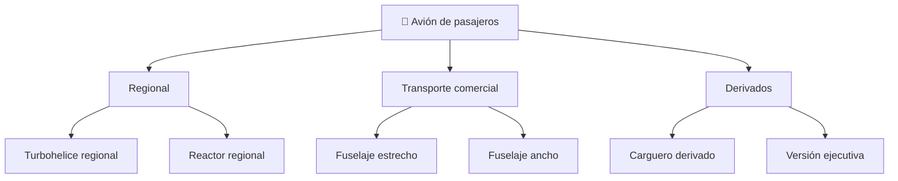

<!-- clase-meta
tipo_documento: clase
clase: 2
codigo: AVIONESPASAJ-02
curso: aviones-pasajeros
titulo: "Características funcionales del avión de pasajeros"
modalidad: "teórica aplicada"
duracion_minutos: 45
nivel: introductorio
prerrequisito: AVIONESPASAJ-01
competencia: "identificacion_funcional"
resultados_aprendizaje:
  - "Explicar definición, rasgos funcionales, tipos y usos con vocabulario propio de Aviones de pasajeros."
  - "Aplicar esos conceptos a una decisión segura o a un escenario de simulación de Aviones de pasajeros."
evidencia: "Matriz comparativa y decisión justificada."
criterio_aprobacion: "La elección considera función, límites, mando y efecto en la simulación; no se apoya solo en preferencias."
fuentes: manuales/fuentes.md
ultima_revision: 2026-09-10
-->

# 📋 Características funcionales del avión de pasajeros

[🏠 Inicio](../../../README.md) · [🛫 Curso: Aviones de pasajeros](../README.md) · 📋 Características

Que es un avión de pasajeros, que tipos existen y para que sirve cada uno. Este
módulo da el contexto antes de abrir los sistemas de la aeronave (Clase 4).

---

## 🧭 Definición

Un avión de pasajeros es una aeronave de ala fija, más pesada que el aire,
propulsada por motores turbofan o turbohelice, disenada para transportar personas
en operación comercial. Vuela porque sus alas generan sustentación, opera a gran
altitud gracias a la cabina presurizada y es conducido por una tripulación de
vuelo bajo un marco de aviación comercial estricto.

---

## 🧬 Características clave

| Característica | Descripción |
| --- | --- |
| Carga humana | Transporta decenas o cientos de pasajeros; la seguridad es prioritaria. |
| Cabina presurizada | Permite volar cómodo a gran altitud con aire acondicionado. |
| Alta velocidad y altitud | Opera cerca de la velocidad del sonido a nivel de crucero elevado. |
| Redundancia de sistemas | Hidráulica, eléctrica y avionica duplicadas para seguridad. |
| Operación en tripulación | Comandante y copiloto reparten tareas y verificaciones. |
| Marco comercial | Opera bajo certificado de operador aéreo (AOC) y procedimientos. |

---

## 🗂️ Tipos de avión de pasajeros

```mermaid
flowchart TD
    Avion[🛫 Avión de pasajeros] --> Regional[Regional]
    Avion --> Comercial[Transporte comercial]
    Avion --> Derivado[Derivados]
    Regional --> Turbo[Turbohelice regional]
    Regional --> Jet[Reactor regional]
    Comercial --> Estrecho[Fuselaje estrecho]
    Comercial --> Ancho[Fuselaje ancho]
    Derivado --> Carga[Carguero derivado]
    Derivado --> Ejecutivo[Versión ejecutiva]
```

| Tipo | Uso típico | Rasgo destacado |
| --- | --- | --- |
| Turbohelice regional | Rutas cortas y pistas modestas | Eficiente a baja altitud. |
| Reactor regional | Conexiones de baja densidad | Menor capacidad, alcance corto. |
| Fuselaje estrecho | Rutas cortas y medias | Un pasillo, muy versátil. |
| Fuselaje ancho | Rutas largas intercontinentales | Dos pasillos, gran alcance. |
| Carguero derivado | Transporte de carga | Fuselaje de pasaje adaptado. |
| Versión ejecutiva | Vuelos corporativos | Cabina reconfigurada y mayor alcance. |

---

## 🎯 Para qué se usa

- Transporte comercial de pasajeros entre ciudades y países.
- Conexión de territorio largo y de geografía difícil (caso de Chile).
- Rutas regionales de corto alcance hacia pistas menores.
- Transporte de carga en versiones cargueras.
- Vuelos corporativos y traslados especiales.

## 🧭 Guía de estudio aplicada

### Pregunta guía

¿Cómo ayuda **Definición, Características clave, Tipos de avión de pasajeros y Para qué se usa** a **elegir una configuración adecuada para aproximación con cambio tardío de viento y una alerta de configuración**?

### Explicación razonada

Una característica solo es útil cuando permite anticipar comportamiento. En Aviones de pasajeros, la relación entre motor, empuje, flujo de aire y alas y controles determina capacidad, respuesta y límites. Por eso «avión de fuselaje estrecho frente a fuselaje ancho» no se compara por apariencia: se compara por misión, entorno, carga de trabajo y exposición al riesgo «continuar una aproximación inestable o automatizar sin comprender el modo activo».

Esta clase se conecta con el resto del curso mediante **gestión de energía vertical y horizontal mediante actitud, empuje y configuración**. El hilo de
seguridad consiste en reconocer a tiempo **continuar una aproximación inestable o automatizar sin comprender el modo activo** y poder justificar la decisión
**confirmar modo, energía y configuración; frustrar si la estabilidad no se recupera**; en clases posteriores cambiará el ángulo de análisis, no esa relación causal.
La lectura funcional común sigue **motor → empuje → flujo de aire → alas y controles**, de modo que cada concepto pueda
ubicarse dentro del funcionamiento completo y no quede como un dato aislado.

**Apoyo documental:** [Aviation Handbooks and Manuals](https://www.faa.gov/regulations_policies/handbooks_manuals) aporta aerodinámica, sistemas y operación;
[Normativa aeronáutica](https://www.dgac.gob.cl/normativa/) se usa para marco aeronáutico chileno. Estas fuentes
se contrastan con el alcance de la clase y no sustituyen un manual de equipo concreto.

### Caso resuelto: de la observación a la decisión

1. **Definir la necesidad:** convierte «aproximación con cambio tardío de viento y una alerta de configuración» en requisitos de capacidad, entorno y respuesta.
2. **Comparar:** contrasta **avión de fuselaje estrecho frente a fuselaje ancho** usando esos requisitos y la cadena **motor → empuje → flujo de aire → alas y controles**.
3. **Descartar:** elimina la alternativa que deja menos margen frente a **continuar una aproximación inestable o automatizar sin comprender el modo activo**.
4. **Elegir:** declara la variante escogida, la evidencia usada y una limitación que todavía debe respetarse.

### Comprueba tu comprensión

1. ¿Qué característica de **alas y controles** condiciona primero el caso «aproximación con cambio tardío de viento y una alerta de configuración»?
2. ¿Qué requisito descartaría una de las alternativas **avión de fuselaje estrecho frente a fuselaje ancho**?
3. ¿Qué límite debe declararse junto con la variante elegida?

Orientación para revisar tus respuestas

- La primera respuesta debe relacionar el eslabón elegido con un efecto posterior, no solo nombrarlo.
- La segunda debe proponer una señal medible u observable y explicar qué tendencia sería preocupante.
- La tercera debe cambiar al menos una variable de capacidad, mando, entorno o margen de seguridad.

## 🎓 Cierre de clase

- **Actividad:** Compara variantes de Aviones de pasajeros mediante los ejes «definición, rasgos funcionales, tipos y usos» y elige una para un caso de uso razonado.
- **Evidencia:** Matriz comparativa y decisión justificada.
- **Criterio de aprobación:** La elección considera función, límites, mando y efecto en la simulación; no se apoya solo en preferencias.
- **Transferencia:** explica qué cambiaría al pasar a otra variante de esta máquina.

### Fuentes de esta clase

- [US-FAA-HANDBOOKS](https://www.faa.gov/regulations_policies/handbooks_manuals): Aviation Handbooks and Manuals, FAA. Uso: aerodinámica, sistemas y operación.
- [CL-DGAC](https://www.dgac.gob.cl/normativa/): Normativa aeronáutica, DGAC Chile. Uso: marco aeronáutico chileno.

> Las fuentes sostienen el marco conceptual y normativo; esta clase no reemplaza el manual
> del fabricante, la formación certificada ni la habilitación exigida para operar equipos reales.

---

[⬅️ Anterior: Historia](../historia/historia-avion-pasajeros.md) · [➡️ Siguiente: Modelos y variantes](../modelos/modelos-avion-pasajeros.md)
