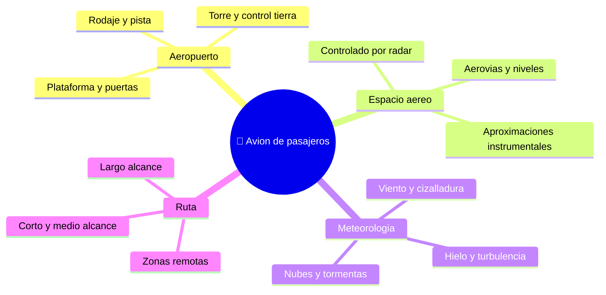

# 🌍 Entornos de trabajo del avión de pasajeros

[🏠 Inicio](../../../README.md) · [🛫 Curso: Aviones de pasajeros](../README.md) · 🌍 Entornos

Dónde opera un avión de pasajeros y cómo cambia el vuelo según el entorno. Cada
entorno implica reglas, riesgos y ajustes distintos, y en simulación se traduce
en escenarios diferentes.

---

## 🗺️ Entornos principales

| Entorno | Características | Riesgos típicos | Ajuste de vuelo |
| --- | --- | --- | --- |
| Aeropuerto | Plataforma, rodaje, pista. | Tráfico en tierra, incursión de pista. | Seguir autorizaciones, listas y señalización. |
| Espacio aéreo controlado | Radar, aerovias, niveles de vuelo. | Interferir con otros vuelos. | Seguir instrucciones del control, transponder activo. |
| Aproximación instrumental | Guiado por instrumentos a la pista. | Baja visibilidad, cizalladura. | Estabilizar la aproximación, procedimientos definidos. |
| Meteorología adversa | Tormentas, hielo, viento. | Turbulencia, desvío de ruta. | Radar meteorológico, rutas alternativas, antihielo. |
| Largo alcance | Rutas oceánicas o remotas. | Distancia a aeropuertos alternativos. | Planificación, combustible y reglas de desvío. |
| Gran altitud | Aire fino, crucero rápido. | Despresurización, envolvente estrecha. | Presurización, control de velocidad y nivel. |

---

## 🌦️ Factores del entorno

- **Viento y cizalladura**: el viento cruzado y las ráfagas complican despegue y
  aterrizaje; la cizalladura cerca del suelo es un riesgo serio.
- **Meteorología**: tormentas, hielo y baja visibilidad exigen radar, antihielo y
  procedimientos por instrumentos.
- **Densidad del aire**: calor y altitud del aeropuerto afectan el rendimiento.
- **Tráfico y control**: el espacio aéreo controlado ordena rutas, niveles y turnos.

---

## 🎮 Traducción a simulación

Cada entorno es un escenario con su tipo de espacio aéreo, su clima y su
aeropuerto. Ver cómo se modela en el
[Módulo 9: Diseño de simulación](../simulacion/diseno-simulador-avion-pasajeros.md).

---

[⬅️ Anterior: Principios y operación](principios-avion-pasajeros.md) · [➡️ Siguiente: Reglamentos](../reglamentos/reglamentos-avion-pasajeros.md)
