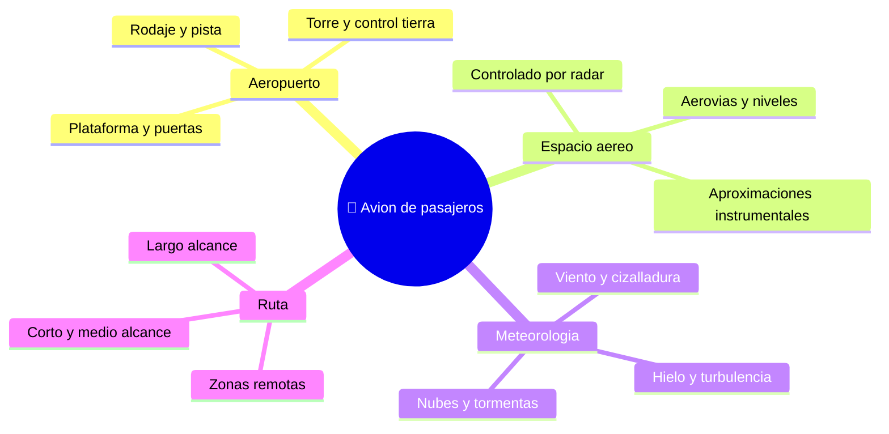

<!-- clase-meta
tipo_documento: clase
clase: 7
codigo: AVIONESPASAJ-07
curso: aviones-pasajeros
titulo: "Entornos de trabajo del avión de pasajeros"
modalidad: "análisis de escenarios"
duracion_minutos: 60
nivel: introductorio
prerrequisito: AVIONESPASAJ-06
competencia: "adaptacion_al_entorno"
resultados_aprendizaje:
  - "Explicar entornos, factores ambientales, riesgos y respuesta de simulación con vocabulario propio de Aviones de pasajeros."
  - "Aplicar esos conceptos a una decisión segura o a un escenario de simulación de Aviones de pasajeros."
evidencia: "Matriz entorno–cambio–riesgo–respuesta."
criterio_aprobacion: "Cada respuesta se adapta al entorno y distingue riesgos que no son intercambiables entre escenarios."
fuentes: manuales/fuentes.md
ultima_revision: 2026-09-10
-->

# 🌍 Entornos de trabajo del avión de pasajeros

[🏠 Inicio](../../../README.md) · [🛫 Curso: Aviones de pasajeros](../README.md) · 🌍 Entornos

Dónde opera un avión de pasajeros y cómo cambia el vuelo según el entorno. Cada
entorno implica reglas, riesgos y ajustes distintos, y en simulación se traduce
en escenarios diferentes.

---

## 🗺️ Entornos principales

```mermaid
mindmap
  root((🛫 Avion de pasajeros))
    Aeropuerto
      Plataforma y puertas
      Rodaje y pista
      Torre y control tierra
    Espacio aereo
      Controlado por radar
      Aerovias y niveles
      Aproximaciones instrumentales
    Meteorologia
      Viento y cizalladura
      Nubes y tormentas
      Hielo y turbulencia
    Ruta
      Corto y medio alcance
      Largo alcance
      Zonas remotas
```

| Entorno | Características | Riesgos típicos | Ajuste de vuelo |
| --- | --- | --- | --- |
| Aeropuerto | Plataforma, rodaje, pista. | Tráfico en tierra, incursión de pista. | Seguir autorizaciones, listas y señalización. |
| Espacio aéreo controlado | Radar, aerovias, niveles de vuelo. | Interferir con otros vuelos. | Seguir instrucciones del control, transponder activo. |
| Aproximación instrumental | Guiado por instrumentos a la pista. | Baja visibilidad, cizalladura. | Estabilizar la aproximación, procedimientos definidos. |
| Meteorología adversa | Tormentas, hielo, viento. | Turbulencia, desvío de ruta. | Radar meteorológico, rutas alternativas, antihielo. |
| Largo alcance | Rutas oceánicas o remotas. | Distancia a aeropuertos alternativos. | Planificación, combustible y reglas de desvío. |
| Gran altitud | Aire fino, crucero rápido. | Despresurización, envolvente estrecha. | Presurización, control de velocidad y nivel. |

---

## 🌦️ Factores del entorno

- **Viento y cizalladura**: el viento cruzado y las ráfagas complican despegue y
  aterrizaje; la cizalladura cerca del suelo es un riesgo serio.
- **Meteorología**: tormentas, hielo y baja visibilidad exigen radar, antihielo y
  procedimientos por instrumentos.
- **Densidad del aire**: calor y altitud del aeropuerto afectan el rendimiento.
- **Tráfico y control**: el espacio aéreo controlado ordena rutas, niveles y turnos.

---

## 🎮 Traducción a simulación

Cada entorno es un escenario con su tipo de espacio aéreo, su clima y su
aeropuerto. Ver cómo se modela en el
[Clase 9: Diseño de simulación](../simulacion/diseno-simulador-avion-pasajeros.md).

## 🧭 Guía de estudio aplicada

### Pregunta guía

¿Cómo ayuda **Entornos principales, Factores del entorno, Traducción a simulación y Guía de estudio aplicada** a **adaptar aproximación con cambio tardío de viento y una alerta de configuración a tres condiciones ambientales distintas**?

### Explicación razonada

El entorno no es decoración: modifica las fuerzas, la percepción y el tiempo disponible. En el caso «aproximación con cambio tardío de viento y una alerta de configuración», cambia el comportamiento de alas y controles y aumenta la probabilidad de continuar una aproximación inestable o automatizar sin comprender el modo activo. La respuesta correcta empieza por reconocer qué variable cambió y después adaptar límites, ruta o misión.

Esta clase se conecta con el resto del curso mediante **gestión de energía vertical y horizontal mediante actitud, empuje y configuración**. El hilo de
seguridad consiste en reconocer a tiempo **continuar una aproximación inestable o automatizar sin comprender el modo activo** y poder justificar la decisión
**confirmar modo, energía y configuración; frustrar si la estabilidad no se recupera**; en clases posteriores cambiará el ángulo de análisis, no esa relación causal.
La lectura funcional común sigue **motor → empuje → flujo de aire → alas y controles**, de modo que cada concepto pueda
ubicarse dentro del funcionamiento completo y no quede como un dato aislado.

**Apoyo documental:** [Aviation Handbooks and Manuals](https://www.faa.gov/regulations_policies/handbooks_manuals) aporta aerodinámica, sistemas y operación;
[Normativa aeronáutica](https://www.dgac.gob.cl/normativa/) se usa para marco aeronáutico chileno. Estas fuentes
se contrastan con el alcance de la clase y no sustituyen un manual de equipo concreto.

### Caso resuelto: de la observación a la decisión

1. **Escenario base:** conserva la misión «aproximación con cambio tardío de viento y una alerta de configuración» para poder comparar.
2. **Cambiar una condición:** modifica sucesivamente superficie o medio, visibilidad y perturbación externa.
3. **Recalcular margen:** explica cómo cada cambio afecta **alas y controles** y acerca o aleja **continuar una aproximación inestable o automatizar sin comprender el modo activo**.
4. **Adaptar:** cambia límite, ruta, configuración o incluso cancela; no mantengas la misma respuesta por hábito.

### Comprueba tu comprensión

1. ¿Cómo cambiaría **alas y controles** si empeora la perturbación externa?
2. ¿Qué condición ambiental acerca más el escenario a **continuar una aproximación inestable o automatizar sin comprender el modo activo**?
3. ¿Cuándo adaptarías la maniobra y cuándo la cancelarías?

Orientación para revisar tus respuestas

- La primera respuesta debe relacionar el eslabón elegido con un efecto posterior, no solo nombrarlo.
- La segunda debe proponer una señal medible u observable y explicar qué tendencia sería preocupante.
- La tercera debe cambiar al menos una variable de capacidad, mando, entorno o margen de seguridad.

## 🎓 Cierre de clase

- **Actividad:** Contrasta tres entornos de Aviones de pasajeros a partir de entornos, factores ambientales, riesgos y respuesta de simulación y determina cómo cambian variables, percepción, riesgos y respuesta.
- **Evidencia:** Matriz entorno–cambio–riesgo–respuesta.
- **Criterio de aprobación:** Cada respuesta se adapta al entorno y distingue riesgos que no son intercambiables entre escenarios.
- **Transferencia:** explica qué cambiaría al pasar a otra variante de esta máquina.

### Fuentes de esta clase

- [US-FAA-HANDBOOKS](https://www.faa.gov/regulations_policies/handbooks_manuals): Aviation Handbooks and Manuals, FAA. Uso: aerodinámica, sistemas y operación.
- [CL-DGAC](https://www.dgac.gob.cl/normativa/): Normativa aeronáutica, DGAC Chile. Uso: marco aeronáutico chileno.

> Las fuentes sostienen el marco conceptual y normativo; esta clase no reemplaza el manual
> del fabricante, la formación certificada ni la habilitación exigida para operar equipos reales.

---

[⬅️ Anterior: Principios y operación](principios-avion-pasajeros.md) · [➡️ Siguiente: Reglamentos](../reglamentos/reglamentos-avion-pasajeros.md)
