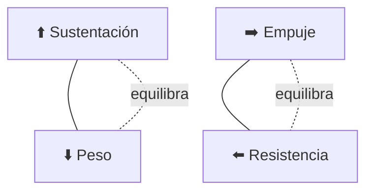

# 🧪 Principios y operación del avión de pasajeros

[🏠 Inicio](../../../README.md) · [🛫 Curso: Aviones de pasajeros](../README.md) · 🧪 Principios

Documento general y educativo. No sustituye la formación aeronáutica certificada
ni los manuales del operador y del fabricante. Describe cómo se opera un avión de
pasajeros en simulación y que principios físicos conviene representar.

## Principios de funcionamiento

- **Sustentación**: el ala genera una fuerza hacia arriba al moverse por el aire;
  crece con la velocidad y el ángulo de ataque, hasta la entrada en pérdida.
- **Peso**: la gravedad tira del avión hacia abajo; se equilibra con la sustentación.
- **Empuje**: los motores turbofan impulsan el avión; lo regulan las palancas de gases.
- **Resistencia**: el aire frena el avance; aumenta con la velocidad y la configuración.
- **Vuelo a gran altitud**: la cabina presurizada permite volar cómodo donde el
  aire es fino, más eficiente para el crucero rápido.

## Las cuatro fuerzas del vuelo

En vuelo nivelado y estable, la sustentación equilibra el peso y el empuje
equilibra la resistencia. Cambiar una fuerza obliga a reajustar las demás.

## Fases de operación

| Fase | Que ocurre | Puntos clave |
| --- | --- | --- |
| Prevuelo | Inspección, plan y checklist | Combustible, peso y balance, meteorología, NOTAM. |
| Rodaje | Mover el avión en tierra | Control con pedales y frenos, autorizaciones del control. |
| Despegue | Acelerar y rotar | Velocidades de decisión y rotación, configuración de despegue. |
| Ascenso | Ganar altitud hacia el crucero | Empuje de ascenso, velocidad y rumbo estables. |
| Crucero | Volar hacia el destino | Ajustar nivel y velocidad, navegar con FMS, comunicar. |
| Descenso | Bajar de altitud | Reducir empuje, gestionar la senda y la velocidad. |
| Aproximación | Alinear con la pista | Configurar flaps, velocidad de aproximación estable. |
| Aterrizaje | Tomar tierra | Redondeo, toma suave, spoilers, reversa y frenos. |

## Aproximación y aterrizaje: idea general

1. Planificar el descenso con anticipación según distancia y altitud.
2. Configurar flaps y velocidad por etapas según el procedimiento.
3. Alinear con la pista y seguir la senda de planeo (guiado por instrumentos).
4. Estabilizar la aproximación antes de un punto de referencia definido.
5. Hacer el redondeo, tomar suave y frenar con spoilers, reversa y frenos.

## La operación en tripulación

- El vuelo se reparte entre **piloto que vuela** y **piloto que monitorea**.
- Las **listas de verificación** ordenan cada fase y previenen olvidos.
- La **gestión de recursos de tripulación** busca decisiones seguras y comunicadas.
- El **piloto automático** y el **autothrottle** reducen la carga en crucero.

## Errores comunes que la simulación puede enseñar a evitar

- Volar demasiado lento y acercarse a la entrada en pérdida.
- Descuidar el peso y balance o el cálculo de combustible.
- No estabilizar la aproximación y aun así continuar el aterrizaje.
- Omitir o apurar las listas de verificación.
- Ignorar las alertas de tráfico o de proximidad al terreno.

## Relación con los niveles de realismo

- **Nivel 1 (educativo)**: despegar, subir, crucero, descender y aterrizar guiado.
- **Nivel 2 (simplificado)**: agregar sustentación, resistencia, entrada en pérdida
  y uso básico del piloto automático.
- **Nivel 3 (técnico)**: sumar gestión de sistemas, presurización, FMS, checklist
  y operación en tripulación.

Ver [`docs/03-niveles-de-realismo.md`](../../../docs/03-niveles-de-realismo.md) para el detalle de cada nivel.

---

[⬅️ Anterior: Mandos](../mandos/manual-mandos-avion-pasajeros.md) · [➡️ Siguiente: Entornos de trabajo](entornos-avion-pasajeros.md)
