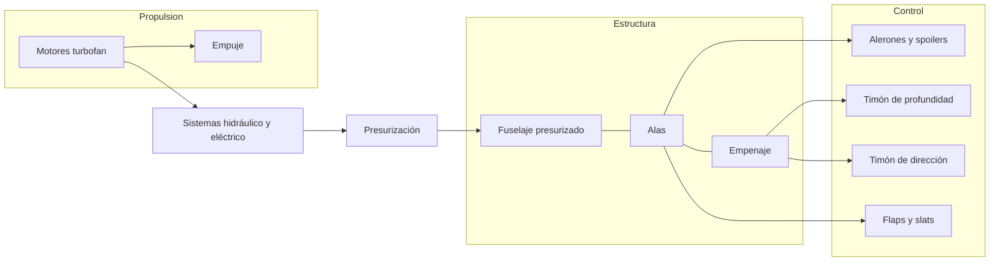
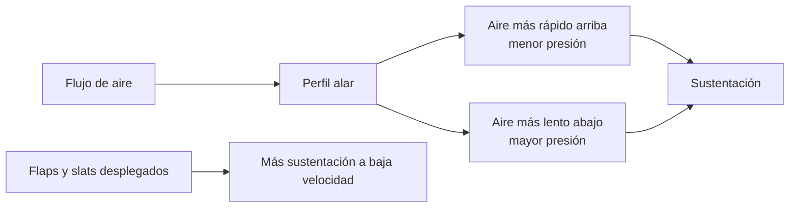
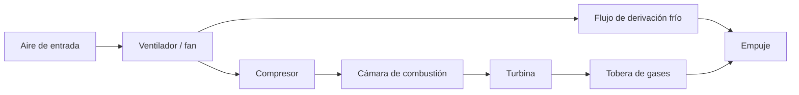
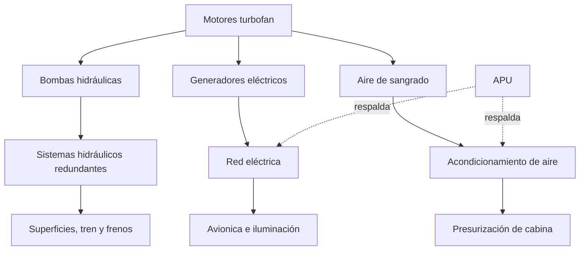

# 🔧 Sistemas mecánicos del avión de pasajeros

[🏠 Inicio](../../../README.md) · [🛫 Curso: Aviones de pasajeros](../README.md) · 🔧 Sistemas mecánicos

Este módulo abre el avión de pasajeros por dentro. Explica cada sistema, como
funciona y cómo se conecta con los demás. Es la base técnica para entender los
mandos (Módulo 5) y la física del vuelo (Módulo 6). Frente a un avión pequeño,
aquí aparecen la presurización, los motores turbofan y la redundancia de sistemas.

---

## 1. 🧱 Célula y fuselaje presurizado

La célula es la estructura que sostiene todo. En un avión de pasajeros, el
fuselaje además es una vasija a presión que permite volar cómodo a gran altitud.

- **Fuselaje**: cuerpo central; aloja cabina de pasaje, carga y une alas y empenaje.
- **Cuadernas y larguerillos**: dan rigidez y forma cilíndrica para resistir presión.
- **Revestimiento estructural**: la piel soporta parte de las cargas y contiene la presión.
- **Ciclos de presurización**: cada vuelo presuriza y despresuriza el fuselaje; es
  un factor clave en la fatiga estructural y las inspecciones.

| Elemento | Función | Nota |
| --- | --- | --- |
| Cuadernas | Definen la sección y resisten la presión | Forma casi cilíndrica. |
| Larguerillos | Rigidizan el revestimiento | Reparten cargas longitudinales. |
| Mamparos de presión | Cierran la vasija a presión | En proa y cola. |
| Revestimiento | Piel exterior estructural | Parte de la resistencia. |
| Ventanas y puertas | Aberturas reforzadas | Zonas críticas de la presurización. |

---

## 2. 🛫 Alas y dispositivos hipersustentadores

El ala genera la sustentación. En transporte, se optimiza para crucero rápido y,
con dispositivos móviles, para volar lento y seguro en despegue y aterrizaje.

| Elemento del ala | Función |
| --- | --- |
| Perfil alar | Crea la diferencia de presión y la sustentación. |
| Flecha (barrido) | Retrasa efectos de compresibilidad a alta velocidad. |
| Flaps | Aumentan sustentación y resistencia para despegue y aterrizaje. |
| Slats / borde de ataque | Retrasan la entrada en pérdida a baja velocidad. |
| Winglets | Reducen la resistencia inducida en las puntas. |
| Cajón de torsión | Estructura interna que aloja combustible. |

---

## 3. 🎚️ Superficies de control

Controlan la aeronave en sus tres ejes. En transporte se agregan superficies
como los spoilers para frenar y descender.

| Eje | Movimiento | Superficie | Mando en cabina |
| --- | --- | --- | --- |
| Longitudinal | Alabeo (rolido) | Alerones y spoilers de rolido | Yugo o sidestick a izquierda / derecha. |
| Lateral | Cabeceo | Timón de profundidad / estabilizador | Yugo o sidestick adelante / atrás. |
| Vertical | Guiñada | Timón de dirección | Pedales. |

- **Alerones**: en los bordes exteriores de las alas; suben un ala y bajan la otra.
- **Spoilers**: se levantan para reducir sustentación, frenar en el aire y en pista.
- **Timón de profundidad y estabilizador**: controlan y compensan el cabeceo.
- **Timón de dirección**: orienta la nariz y coordina el vuelo.
- **Fly-by-wire**: en muchos aviones, las ordenes van por señal eléctrica a los
  actuadores, con protecciones que evitan salir de la envolvente segura.

---

## 4. ⚙️ Motores turbofan

Convierten combustible en empuje. El turbofan mueve una gran masa de aire con un
ventilador frontal, lo que lo hace eficiente y más silencioso.

| Componente | Función |
| --- | --- |
| Ventilador (fan) | Mueve gran masa de aire; da la mayor parte del empuje. |
| Compresor | Comprime el aire antes de la combustión. |
| Cámara de combustión | Quema combustible y libera energía. |
| Turbina | Extrae energía para mover fan y compresor. |
| Reversa de empuje | Redirige el flujo para frenar en pista. |
| FADEC | Control electrónico que regula el motor con precisión. |

---

## 5. 🛞 Tren de aterrizaje

Sostiene el avión en tierra y absorbe el impacto del aterrizaje; en transporte es
retráctil y con varias ruedas por su peso.

- **Configuración triciclo**: tren de nariz más dos o más patas principales.
- **Retráctil**: se recoge en vuelo para reducir la resistencia.
- **Amortiguadores oleoneumaticos**: absorben la energía del contacto.
- **Frenos y antideslizante (antiskid)**: detienen el avión sin bloquear ruedas.
- **Dirección de rueda de nariz**: para maniobrar en tierra.

---

## 6. 🔩 Sistemas hidráulico, eléctrico y de presurización

Los grandes aviones dependen de sistemas potentes y redundantes que mueven
superficies, tren y frenos, y mantienen habitable la cabina.

| Sistema | Función | Nota de seguridad |
| --- | --- | --- |
| Hidráulico | Mueve superficies, tren y frenos | Varios circuitos independientes. |
| Eléctrico | Alimenta avionica, luces y equipos | Generadores más baterías y RAT. |
| Neumático (sangrado) | Aire caliente del motor | Acondicionamiento y antihielo. |
| Presurización | Mantiene presión de cabina cómoda | Controla la altitud de cabina. |
| APU | Turbina auxiliar en tierra y respaldo | Energía sin motores en marcha. |
| Combustible | Depósitos en alas y centro | Bombas y trasvase entre tanques. |

---

## 7. 📟 Avionica y sistemas de navegación

Informan a la tripulación y gestionan el vuelo cuando no hay referencias visuales.

| Sistema | Función |
| --- | --- |
| Pantallas primarias de vuelo (PFD) | Actitud, velocidad, altitud y rumbo integrados. |
| Pantalla multifunción (ND / MFD) | Navegación, ruta y meteorología. |
| Sistema de gestión de vuelo (FMS) | Planifica y sigue la ruta, optimiza el vuelo. |
| Piloto automático y autothrottle | Mantienen rumbo, altitud, velocidad y senda. |
| Radios y transponder | Comunicación y respuesta al control de tráfico. |
| Sistemas de alerta (TCAS, GPWS) | Previenen colisión y vuelo contra el terreno. |

---

## 🔁 Cómo se conecta todo

1. Los **motores turbofan** generan **empuje** y alimentan los sistemas.
2. El empuje da **velocidad**, y las **alas** la convierten en **sustentación**.
3. Las **superficies de control** orientan el avión en los tres ejes.
4. El **fuselaje presurizado** aloja al pasaje y contiene la presión en altitud.
5. Los **sistemas hidráulico, eléctrico y neumático** mueven todo y mantienen la cabina.
6. La **avionica** informa y asiste a la tripulación para volar con seguridad.

Con esto entendido, el [Módulo 5: Mandos](../mandos/manual-mandos-avion-pasajeros.md)
muestra cómo la tripulación opera cada uno de estos sistemas desde la cabina de vuelo.

---

[⬅️ Anterior: Modelos y variantes](../modelos/modelos-avion-pasajeros.md) · [➡️ Siguiente: Mandos e instrumentos](../mandos/manual-mandos-avion-pasajeros.md)
