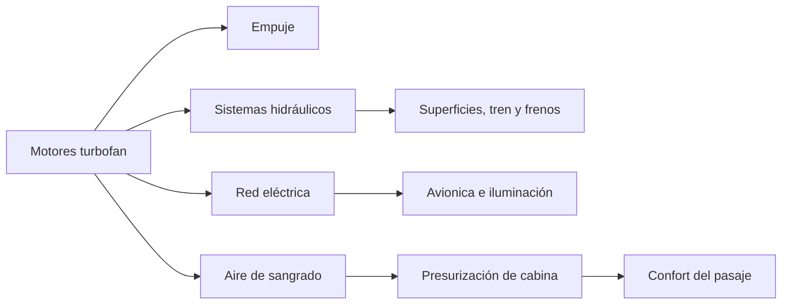

# 🧰 Recursos del avión de pasajeros

[🏠 Inicio](../../../README.md) · [🛫 Curso: Aviones de pasajeros](../README.md) · 🧰 Recursos

Glosario específico, enlaces y diagramas de apoyo del curso de aviones de
pasajeros. Amplia el [glosario general](../../../docs/05-glosario-general.md).

---

## 📖 Glosario específico

| Término | Definición |
| --- | --- |
| Turbofan | Motor a reacción con gran ventilador frontal, eficiente y silencioso. |
| Presurización | Sistema que mantiene una presión de cabina cómoda a gran altitud. |
| Fly-by-wire | Mando de vuelo por señal eléctrica con protecciones de envolvente. |
| Spoiler | Superficie que reduce sustentación para descender y frenar. |
| Slat | Dispositivo de borde de ataque que retrasa la entrada en pérdida. |
| FMS | Sistema de gestión de vuelo que planifica y sigue la ruta. |
| Autothrottle | Sistema que ajusta el empuje de forma automática. |
| ATP | Licencia de Piloto de Transporte de Línea Aérea. |
| AOC | Certificado de operador aéreo que autoriza la operación comercial. |
| IAS | Velocidad indicada respecto al aire, en nudos. |
| Nivel de vuelo | Altitud de referencia estandar en aviación de crucero. |

---

## 🗺️ Diagrama de la cadena de energía y sistemas

---

## 🔗 Enlaces y fuentes

- Marco legal: [⚖️ docs/07-marco-legal-chile.md](../../../docs/07-marco-legal-chile.md)
- Registro de fuentes: [📚 manuales/fuentes.md](../../../manuales/fuentes.md)
- Reglamentación aeronáutica (DGAC) y normas DAN/DAR: ver el registro de fuentes.

Registrar cada recurso nuevo con su origen y licencia, siguiendo
[`recursos/README.md`](../../../recursos/README.md).

---

[🎓 Portada del curso](../README.md) · [⬅️ Anterior: Diseño de simulación](../simulacion/diseno-simulador-avion-pasajeros.md) · [➡️ Siguiente: Ejercicios](../ejercicios/ejercicios-avion-pasajeros.md)
