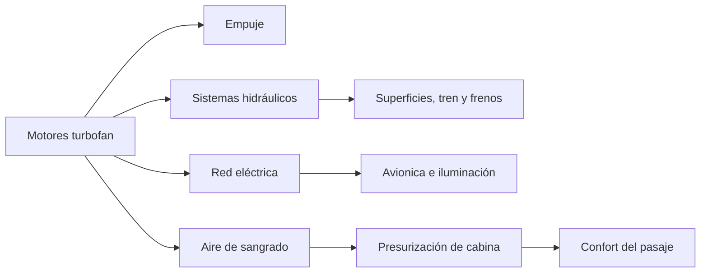

# 🧰 Recursos del avión de pasajeros

[🏠 Inicio](../../../README.md) · [🛫 Curso: Aviones de pasajeros](../README.md) · 🧰 Recursos

Glosario específico, enlaces y diagramas de apoyo del curso de aviones de
pasajeros. Amplia el [glosario general](../../../docs/05-glosario-general.md).

---

## 📖 Glosario específico

| Término | Definición |
| --- | --- |
| Turbofan | Motor a reacción con gran ventilador frontal, eficiente y silencioso. |
| Presurización | Sistema que mantiene una presión de cabina cómoda a gran altitud. |
| Fly-by-wire | Mando de vuelo por señal eléctrica con protecciones de envolvente. |
| Spoiler | Superficie que reduce sustentación para descender y frenar. |
| Slat | Dispositivo de borde de ataque que retrasa la entrada en pérdida. |
| FMS | Sistema de gestión de vuelo que planifica y sigue la ruta. |
| Autothrottle | Sistema que ajusta el empuje de forma automática. |
| ATP | Licencia de Piloto de Transporte de Línea Aérea. |
| AOC | Certificado de operador aéreo que autoriza la operación comercial. |
| IAS | Velocidad indicada respecto al aire, en nudos. |
| Nivel de vuelo | Altitud de referencia estandar en aviación de crucero. |

---

## 🗺️ Diagrama de la cadena de energía y sistemas

```mermaid
flowchart LR
    Motores[Motores turbofan] --> Empuje[Empuje]
    Motores --> Hidra[Sistemas hidráulicos]
    Motores --> Elec[Red eléctrica]
    Motores --> Aire[Aire de sangrado]
    Hidra --> Mando[Superficies, tren y frenos]
    Elec --> Avionica[Avionica e iluminación]
    Aire --> Presur[Presurización de cabina]
    Presur --> Pasaje[Confort del pasaje]
```

---

## 🔗 Enlaces y fuentes

- Marco legal: [⚖️ docs/07-marco-legal-chile.md](../../../docs/07-marco-legal-chile.md)
- Registro de fuentes: [📚 manuales/fuentes.md](../../../manuales/fuentes.md)
- Reglamentación aeronáutica (DGAC) y normas DAN/DAR: ver el registro de fuentes.

Registrar cada recurso nuevo con su origen y licencia, siguiendo
[`recursos/README.md`](../../../recursos/README.md).

## 🎓 Cierre de clase

- **Actividad:** Selecciona términos de glosario, esquemas y trazabilidad de fuentes, explícalos en contexto de Aviones de pasajeros y verifica la procedencia de las fuentes utilizadas.
- **Evidencia:** Glosario aplicado y ficha breve de trazabilidad.
- **Criterio de aprobación:** Los términos permiten interpretar el curso y las fuentes se distinguen por autoridad, alcance y vigencia.
- **Transferencia:** explica qué cambiaría al pasar a otra variante de esta máquina.

### Fuentes de esta clase

- [US-FAA-HANDBOOKS](https://www.faa.gov/regulations_policies/handbooks_manuals): Aviation Handbooks and Manuals, FAA. Uso: aerodinámica, sistemas y operación.
- [CL-DGAC](https://www.dgac.gob.cl/normativa/): Normativa aeronáutica, DGAC Chile. Uso: marco aeronáutico chileno.

> Las fuentes sostienen el marco conceptual y normativo; esta clase no reemplaza el manual
> del fabricante, la formación certificada ni la habilitación exigida para operar equipos reales.

---

[🎓 Portada del curso](../README.md) · [⬅️ Anterior: Diseño de simulación](../simulacion/diseno-simulador-avion-pasajeros.md) · [➡️ Siguiente: Ejercicios](../ejercicios/ejercicios-avion-pasajeros.md)
