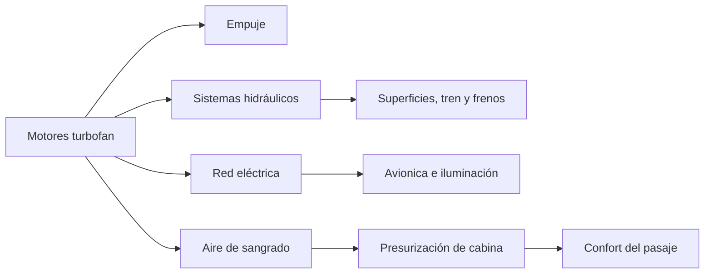

<!-- clase-meta
tipo_documento: clase
clase: 10
codigo: AVIONESPASAJ-10
curso: aviones-pasajeros
titulo: "Recursos del avión de pasajeros"
modalidad: "taller documental"
duracion_minutos: 45
nivel: introductorio
prerrequisito: AVIONESPASAJ-09
competencia: "alfabetizacion_tecnica"
resultados_aprendizaje:
  - "Explicar glosario, esquemas y trazabilidad de fuentes con vocabulario propio de Aviones de pasajeros."
  - "Aplicar esos conceptos a una decisión segura o a un escenario de simulación de Aviones de pasajeros."
evidencia: "Glosario aplicado y ficha breve de trazabilidad."
criterio_aprobacion: "Los términos permiten interpretar el curso y las fuentes se distinguen por autoridad, alcance y vigencia."
fuentes: manuales/fuentes.md
ultima_revision: 2026-09-10
-->

# 🧰 Recursos del avión de pasajeros

[🏠 Inicio](../../../README.md) · [🛫 Curso: Aviones de pasajeros](../README.md) · 🧰 Recursos

Glosario específico, enlaces y diagramas de apoyo del curso de aviones de
pasajeros. Amplia el [glosario general](../../../docs/05-glosario-general.md).

---

## 📖 Glosario específico

| Término | Definición |
| --- | --- |
| Turbofan | Motor a reacción con gran ventilador frontal, eficiente y silencioso. |
| Presurización | Sistema que mantiene una presión de cabina cómoda a gran altitud. |
| Fly-by-wire | Mando de vuelo por señal eléctrica con protecciones de envolvente. |
| Spoiler | Superficie que reduce sustentación para descender y frenar. |
| Slat | Dispositivo de borde de ataque que retrasa la entrada en pérdida. |
| FMS | Sistema de gestión de vuelo que planifica y sigue la ruta. |
| Autothrottle | Sistema que ajusta el empuje de forma automática. |
| ATP | Licencia de Piloto de Transporte de Línea Aérea. |
| AOC | Certificado de operador aéreo que autoriza la operación comercial. |
| IAS | Velocidad indicada respecto al aire, en nudos. |
| Nivel de vuelo | Altitud de referencia estandar en aviación de crucero. |

---

## 🗺️ Diagrama de la cadena de energía y sistemas

```mermaid
flowchart LR
    Motores[Motores turbofan] --> Empuje[Empuje]
    Motores --> Hidra[Sistemas hidráulicos]
    Motores --> Elec[Red eléctrica]
    Motores --> Aire[Aire de sangrado]
    Hidra --> Mando[Superficies, tren y frenos]
    Elec --> Avionica[Avionica e iluminación]
    Aire --> Presur[Presurización de cabina]
    Presur --> Pasaje[Confort del pasaje]
```

---

## 🔗 Enlaces y fuentes

- Marco legal: [⚖️ docs/07-marco-legal-chile.md](../../../docs/07-marco-legal-chile.md)
- Registro de fuentes: [📚 manuales/fuentes.md](../../../manuales/fuentes.md)
- Reglamentación aeronáutica (DGAC) y normas DAN/DAR: ver el registro de fuentes.

Registrar cada recurso nuevo con su origen y licencia, siguiendo
[`recursos/README.md`](../../../recursos/README.md).

## 🧭 Guía de estudio aplicada

### Pregunta guía

¿Cómo ayuda **Glosario específico, Diagrama de la cadena de energía y sistemas, Enlaces y fuentes y Guía de estudio aplicada** a **explicar con fuentes los términos motor, empuje, flujo de aire y alas y controles**?

### Explicación razonada

El vocabulario técnico organiza relaciones: motor, empuje, flujo de aire y alas y controles nombran partes distintas de una misma cadena funcional. Una fuente se usa para sostener una afirmación concreta —principio, límite, procedimiento o contexto— y debe distinguirse del manual particular de un fabricante o de una regla narrativa.

Esta clase se conecta con el resto del curso mediante **gestión de energía vertical y horizontal mediante actitud, empuje y configuración**. El hilo de
seguridad consiste en reconocer a tiempo **continuar una aproximación inestable o automatizar sin comprender el modo activo** y poder justificar la decisión
**confirmar modo, energía y configuración; frustrar si la estabilidad no se recupera**; en clases posteriores cambiará el ángulo de análisis, no esa relación causal.
La lectura funcional común sigue **motor → empuje → flujo de aire → alas y controles**, de modo que cada concepto pueda
ubicarse dentro del funcionamiento completo y no quede como un dato aislado.

**Apoyo documental:** [Aviation Handbooks and Manuals](https://www.faa.gov/regulations_policies/handbooks_manuals) aporta aerodinámica, sistemas y operación;
[Normativa aeronáutica](https://www.dgac.gob.cl/normativa/) se usa para marco aeronáutico chileno. Estas fuentes
se contrastan con el alcance de la clase y no sustituyen un manual de equipo concreto.

### Caso resuelto: de la observación a la decisión

1. **Definir en contexto:** explica **motor**, **empuje**, **flujo de aire** y **alas y controles** por su función y relación.
2. **Respaldar:** enlaza cada afirmación importante con una fuente identificable y declara su alcance.
3. **Contrastar:** separa principios generales, requisitos locales, manual de fabricante y —si aplica— canon ficticio.
4. **Reformular:** convierte una definición copiada en una explicación propia con un ejemplo de **Aviones de pasajeros**.

### Comprueba tu comprensión

1. Explica la diferencia funcional entre **empuje** y **flujo de aire** sin copiar una definición.
2. ¿Qué fuente respalda el principio «gestión de energía vertical y horizontal mediante actitud, empuje y configuración» y cuál es su alcance?
3. ¿Qué dato exigiría un manual de fabricante en vez de una fuente general?

Orientación para revisar tus respuestas

- La primera respuesta debe relacionar el eslabón elegido con un efecto posterior, no solo nombrarlo.
- La segunda debe proponer una señal medible u observable y explicar qué tendencia sería preocupante.
- La tercera debe cambiar al menos una variable de capacidad, mando, entorno o margen de seguridad.

## 🎓 Cierre de clase

- **Actividad:** Selecciona términos de glosario, esquemas y trazabilidad de fuentes, explícalos en contexto de Aviones de pasajeros y verifica la procedencia de las fuentes utilizadas.
- **Evidencia:** Glosario aplicado y ficha breve de trazabilidad.
- **Criterio de aprobación:** Los términos permiten interpretar el curso y las fuentes se distinguen por autoridad, alcance y vigencia.
- **Transferencia:** explica qué cambiaría al pasar a otra variante de esta máquina.

### Fuentes de esta clase

- [US-FAA-HANDBOOKS](https://www.faa.gov/regulations_policies/handbooks_manuals): Aviation Handbooks and Manuals, FAA. Uso: aerodinámica, sistemas y operación.
- [CL-DGAC](https://www.dgac.gob.cl/normativa/): Normativa aeronáutica, DGAC Chile. Uso: marco aeronáutico chileno.

> Las fuentes sostienen el marco conceptual y normativo; esta clase no reemplaza el manual
> del fabricante, la formación certificada ni la habilitación exigida para operar equipos reales.

---

[🎓 Portada del curso](../README.md) · [⬅️ Anterior: Diseño de simulación](../simulacion/diseno-simulador-avion-pasajeros.md) · [➡️ Siguiente: Ejercicios](../ejercicios/ejercicios-avion-pasajeros.md)
