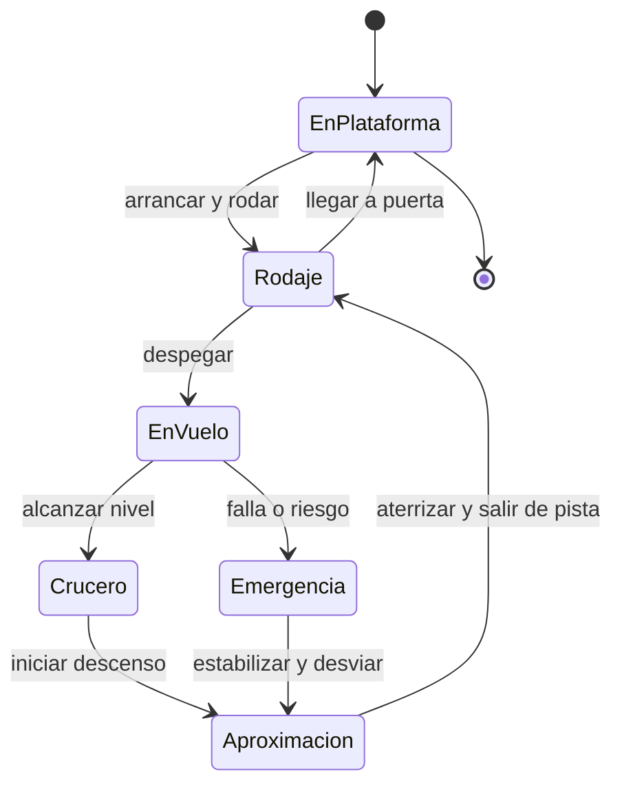

# 🎮 Diseño de simulación del avión de pasajeros

[🏠 Inicio](../../../README.md) · [🛫 Curso: Aviones de pasajeros](../README.md) · 🎮 Simulación

## Objetivo de la simulación

Que el usuario aprenda a operar un avión de pasajeros en tripulación: preparar el
vuelo, despegar, ascender, gestionar el crucero con el piloto automático y el FMS,
descender y realizar una aproximación instrumental estable hasta el aterrizaje,
respetando el control de tráfico y los procedimientos, de forma progresiva.

## Nivel de realismo

- Nivel elegido: se ofrece del 1 al 3 (ver `docs/03-niveles-de-realismo.md`).
- Justificación: el avión de pasajeros suma presurización, motores turbofan,
  gestión de sistemas y operación comercial, por lo que es un curso avanzado
  respecto del avión pequeño.

## Variables principales

| Variable | Tipo | Rango | Afecta a | Comentarios |
| --- | --- | --- | --- | --- |
| Velocidad (IAS/Mach) | numérica | 0-350 nudos / Mach | Sustentación y límites | Clave para la envolvente segura. |
| Altitud | numérica | 0-41000 pies | Rendimiento y navegación | Ligada a la presión y al nivel de vuelo. |
| Actitud (cabeceo/alabeo) | numérica | -30..30 grados | Trayectoria de vuelo | Referencia del PFD. |
| Empuje de motores | numérica | 0-100% | Empuje disponible | Con autothrottle opcional. |
| Configuración de flaps/slats | discreta | 0..varias etapas | Sustentación y resistencia | Por fase de vuelo. |
| Altitud de cabina | numérica | 0-8000 pies equiv. | Confort y seguridad | Salud de la presurización. |
| Combustible | numérica | 0-100% | Autonomía y alcance | Incluye reserva y alternativa. |
| Modo de piloto automático | discreta | manual / auto | Carga de trabajo | Rumbo, altitud, velocidad, senda. |
| Viento | vectorial | dirección + fuerza | Rumbo y aterrizaje | El cruzado y la cizalladura exigen corrección. |

## Ciclo básico

1. Leer entrada del usuario (mandos de vuelo, gases, flaps, spoilers, panel FCU/MCP).
2. Actualizar estado de motores, sistemas y configuración aerodinámica.
3. Calcular fuerzas: sustentación, peso, empuje y resistencia.
4. Aplicar el entorno (viento, densidad del aire, meteorología).
5. Actualizar velocidad, altitud, actitud, posición y estado de la cabina.
6. Refrescar PFD, ND y alertas (pérdida, TCAS, GPWS) y el piloto automático.

## Modos de juego futuros

- Tutorial guiado de cabina, checklist y operación en tripulación.
- Práctica de despegue, crucero con FMS y aproximación instrumental.
- Misiones de navegación entre aeropuertos con control de tráfico.
- Desafíos de viento cruzado, meteorología y aproximación estabilizada.
- Situaciones de emergencia controladas (falla de motor, despresurización) sin
  contenido sensible.

## Elementos fuera de alcance

- Maniobras peligrosas presentadas como recomendables.
- Reproducción de accidentes o victimas de forma sensacionalista.
- Datos técnicos que permitan alterar sistemas reales de una aeronave.

## Pendientes

- [ ] Definir valores por defecto de cada variable por tipo de avión.
- [ ] Prototipar el modelo de sustentación, envolvente y pérdida.
- [ ] Modelar la operación en tripulación y las listas de verificación.
- [ ] Agregar fuentes técnicas públicas a [`manuales/fuentes.md`](../../../manuales/fuentes.md).

---

[⬅️ Anterior: Reglamentos](../reglamentos/reglamentos-avion-pasajeros.md) · [➡️ Siguiente: Recursos](../recursos/recursos-avion-pasajeros.md)
