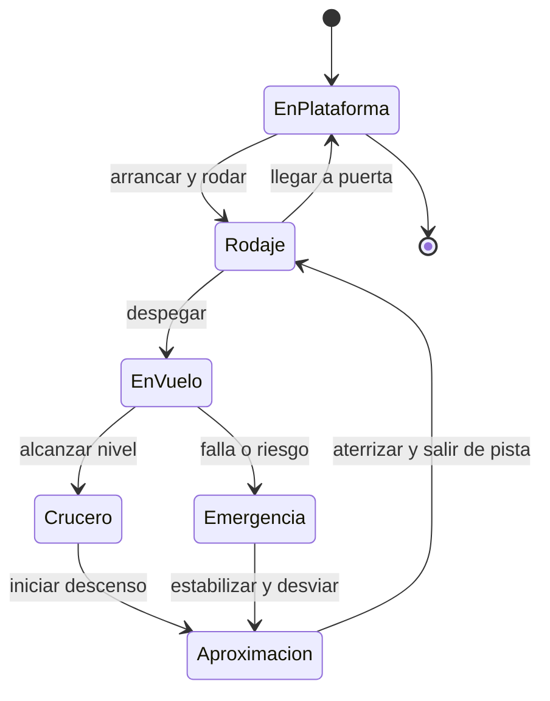
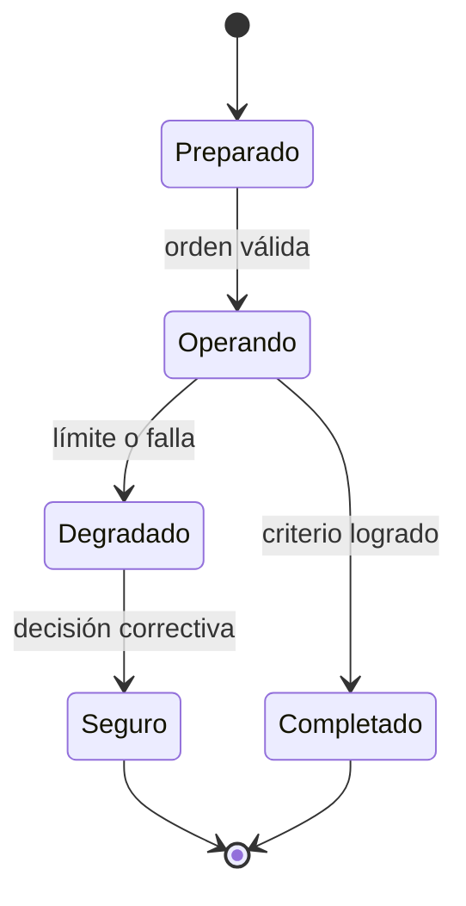

<!-- clase-meta
tipo_documento: clase
clase: 9
codigo: AVIONESPASAJ-09
curso: aviones-pasajeros
titulo: "Diseño de simulación del avión de pasajeros"
modalidad: "laboratorio de diseño"
duracion_minutos: 90
nivel: introductorio
prerrequisito: AVIONESPASAJ-08
competencia: "modelado_de_simulacion"
resultados_aprendizaje:
  - "Explicar objetivo, variables, estados, ciclo y escenarios de simulación con vocabulario propio de Aviones de pasajeros."
  - "Aplicar esos conceptos a una decisión segura o a un escenario de simulación de Aviones de pasajeros."
evidencia: "Ficha de escenario y diagrama de estados."
criterio_aprobacion: "El modelo es específico de la máquina, medible, seguro y trazable a clases anteriores."
fuentes: manuales/fuentes.md
ultima_revision: 2026-09-10
-->

# 🎮 Diseño de simulación del avión de pasajeros

[🏠 Inicio](../../../README.md) · [🛫 Curso: Aviones de pasajeros](../README.md) · 🎮 Simulación

```mermaid
stateDiagram-v2
    [*] --> EnPlataforma
    EnPlataforma --> Rodaje: arrancar y rodar
    Rodaje --> EnVuelo: despegar
    EnVuelo --> Crucero: alcanzar nivel
    Crucero --> Aproximacion: iniciar descenso
    Aproximacion --> Rodaje: aterrizar y salir de pista
    EnVuelo --> Emergencia: falla o riesgo
    Emergencia --> Aproximacion: estabilizar y desviar
    Rodaje --> EnPlataforma: llegar a puerta
    EnPlataforma --> [*]
```

## Objetivo de la simulación

Que el usuario aprenda a operar un avión de pasajeros en tripulación: preparar el
vuelo, despegar, ascender, gestionar el crucero con el piloto automático y el FMS,
descender y realizar una aproximación instrumental estable hasta el aterrizaje,
respetando el control de tráfico y los procedimientos, de forma progresiva.

## Nivel de realismo

- Nivel elegido: se ofrece del 1 al 3 (ver `docs/03-niveles-de-realismo.md`).
- Justificación: el avión de pasajeros suma presurización, motores turbofan,
  gestión de sistemas y operación comercial, por lo que es un curso avanzado
  respecto del avión pequeño.

## Variables principales

| Variable | Tipo | Rango | Afecta a | Comentarios |
| --- | --- | --- | --- | --- |
| Velocidad (IAS/Mach) | numérica | 0-350 nudos / Mach | Sustentación y límites | Clave para la envolvente segura. |
| Altitud | numérica | 0-41000 pies | Rendimiento y navegación | Ligada a la presión y al nivel de vuelo. |
| Actitud (cabeceo/alabeo) | numérica | -30..30 grados | Trayectoria de vuelo | Referencia del PFD. |
| Empuje de motores | numérica | 0-100% | Empuje disponible | Con autothrottle opcional. |
| Configuración de flaps/slats | discreta | 0..varias etapas | Sustentación y resistencia | Por fase de vuelo. |
| Altitud de cabina | numérica | 0-8000 pies equiv. | Confort y seguridad | Salud de la presurización. |
| Combustible | numérica | 0-100% | Autonomía y alcance | Incluye reserva y alternativa. |
| Modo de piloto automático | discreta | manual / auto | Carga de trabajo | Rumbo, altitud, velocidad, senda. |
| Viento | vectorial | dirección + fuerza | Rumbo y aterrizaje | El cruzado y la cizalladura exigen corrección. |

## Ciclo básico

1. Leer entrada del usuario (mandos de vuelo, gases, flaps, spoilers, panel FCU/MCP).
2. Actualizar estado de motores, sistemas y configuración aerodinámica.
3. Calcular fuerzas: sustentación, peso, empuje y resistencia.
4. Aplicar el entorno (viento, densidad del aire, meteorología).
5. Actualizar velocidad, altitud, actitud, posición y estado de la cabina.
6. Refrescar PFD, ND y alertas (pérdida, TCAS, GPWS) y el piloto automático.

## Modos de juego futuros

- Tutorial guiado de cabina, checklist y operación en tripulación.
- Práctica de despegue, crucero con FMS y aproximación instrumental.
- Misiones de navegación entre aeropuertos con control de tráfico.
- Desafíos de viento cruzado, meteorología y aproximación estabilizada.
- Situaciones de emergencia controladas (falla de motor, despresurización) sin
  contenido sensible.

## Elementos fuera de alcance

- Maniobras peligrosas presentadas como recomendables.
- Reproducción de accidentes o victimas de forma sensacionalista.
- Datos técnicos que permitan alterar sistemas reales de una aeronave.

## Pendientes

- [ ] Definir valores por defecto de cada variable por tipo de avión.
- [ ] Prototipar el modelo de sustentación, envolvente y pérdida.
- [ ] Modelar la operación en tripulación y las listas de verificación.
- [ ] Agregar fuentes técnicas públicas a [`manuales/fuentes.md`](../../../manuales/fuentes.md).

## 🧭 Guía de estudio aplicada

### Pregunta guía

¿Cómo ayuda **Objetivo de la simulación, Nivel de realismo, Variables principales y Ciclo básico** a **modelar aproximación con cambio tardío de viento y una alerta de configuración como estados, variables y decisiones observables**?

### Explicación razonada

Una simulación de Aviones de pasajeros es educativa si representa decisiones y consecuencias. Como mínimo debe modelar el estado de motor, la respuesta de empuje, la transición en flujo de aire y el resultado en alas y controles. El escenario «aproximación con cambio tardío de viento y una alerta de configuración» es valioso porque obliga a observar, formular una hipótesis, actuar y comprobar.

```mermaid
stateDiagram-v2
    [*] --> Preparado
    Preparado --> Operando: orden válida
    Operando --> Degradado: límite o falla
    Degradado --> Seguro: decisión correctiva
    Operando --> Completado: criterio logrado
    Seguro --> [*]
    Completado --> [*]
```

Esta clase se conecta con el resto del curso mediante **gestión de energía vertical y horizontal mediante actitud, empuje y configuración**. El hilo de
seguridad consiste en reconocer a tiempo **continuar una aproximación inestable o automatizar sin comprender el modo activo** y poder justificar la decisión
**confirmar modo, energía y configuración; frustrar si la estabilidad no se recupera**; en clases posteriores cambiará el ángulo de análisis, no esa relación causal.
La lectura funcional común sigue **motor → empuje → flujo de aire → alas y controles**, de modo que cada concepto pueda
ubicarse dentro del funcionamiento completo y no quede como un dato aislado.

**Apoyo documental:** [Aviation Handbooks and Manuals](https://www.faa.gov/regulations_policies/handbooks_manuals) aporta aerodinámica, sistemas y operación;
[Normativa aeronáutica](https://www.dgac.gob.cl/normativa/) se usa para marco aeronáutico chileno. Estas fuentes
se contrastan con el alcance de la clase y no sustituyen un manual de equipo concreto.

### Caso resuelto: de la observación a la decisión

1. **Estado inicial:** representa aproximación con cambio tardío de viento y una alerta de configuración con valores observables para **motor**, **empuje**, **flujo de aire** y **alas y controles**.
2. **Decisión del estudiante:** ofrece una elección que cambie el estado, no una animación automática.
3. **Consecuencia:** modela la tendencia hacia **continuar una aproximación inestable o automatizar sin comprender el modo activo** y una señal previa que permita corregir.
4. **Cierre:** evalúa la explicación de la decisión, además de si el estudiante “ganó” el escenario.

### Comprueba tu comprensión

1. ¿Qué cuatro estados mínimos necesita el escenario «aproximación con cambio tardío de viento y una alerta de configuración»?
2. ¿Qué variable anticipa **continuar una aproximación inestable o automatizar sin comprender el modo activo** antes de llegar al estado de falla?
3. ¿Cómo evaluarías la explicación del estudiante y no solo el resultado final?

Orientación para revisar tus respuestas

- La primera respuesta debe relacionar el eslabón elegido con un efecto posterior, no solo nombrarlo.
- La segunda debe proponer una señal medible u observable y explicar qué tendencia sería preocupante.
- La tercera debe cambiar al menos una variable de capacidad, mando, entorno o margen de seguridad.

## 🎓 Cierre de clase

- **Actividad:** Diseña un escenario educativo de Aviones de pasajeros basado en objetivo, variables, estados, ciclo y escenarios de simulación, con entradas, estados, variables y criterio de cierre.
- **Evidencia:** Ficha de escenario y diagrama de estados.
- **Criterio de aprobación:** El modelo es específico de la máquina, medible, seguro y trazable a clases anteriores.
- **Transferencia:** explica qué cambiaría al pasar a otra variante de esta máquina.

### Fuentes de esta clase

- [US-FAA-HANDBOOKS](https://www.faa.gov/regulations_policies/handbooks_manuals): Aviation Handbooks and Manuals, FAA. Uso: aerodinámica, sistemas y operación.
- [CL-DGAC](https://www.dgac.gob.cl/normativa/): Normativa aeronáutica, DGAC Chile. Uso: marco aeronáutico chileno.

> Las fuentes sostienen el marco conceptual y normativo; esta clase no reemplaza el manual
> del fabricante, la formación certificada ni la habilitación exigida para operar equipos reales.

---

[⬅️ Anterior: Reglamentos](../reglamentos/reglamentos-avion-pasajeros.md) · [➡️ Siguiente: Recursos](../recursos/recursos-avion-pasajeros.md)
