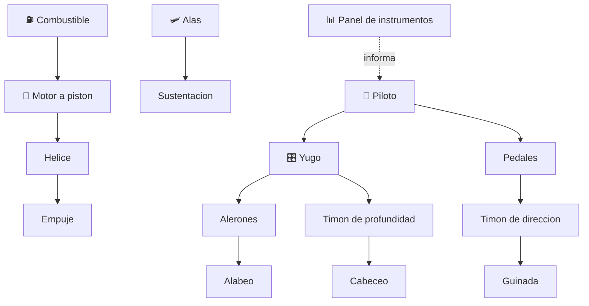

# 🛩️ Curso: Aviones pequenos

[🏠 Inicio](../../README.md) · [🚙 Catalogo de vehiculos](../README.md) · [🎓 Guia de curso](../../docs/08-guia-de-estilo-y-curso.md)

> **Curso completo de aviacion general.** Documenta el avion pequeno de
> principio a fin: historia, caracteristicas, sistemas de la aeronave en
> profundidad, cabina y mandos, fisica del vuelo, entornos aeronauticos,
> reglamentos chilenos y diseno de simulacion. Sigue el modelo del curso de
> motos.

---

## 🎯 Objetivos de aprendizaje

Al terminar este curso deberias poder:

- Explicar como un avion genera sustentacion, avanza, gira y desciende.
- Identificar la celula, las alas, las superficies de control y el grupo motor.
- Reconocer los instrumentos de vuelo y los mandos de la cabina.
- Comprender la fisica del vuelo (sustentacion, resistencia, empuje, peso).
- Conocer el marco aeronautico chileno (DGAC, licencias, reglas de vuelo).
- Traducir todo lo anterior en variables de un simulador educativo.

---

## 🗺️ Mapa del vehiculo

---

## 📚 Modulos del curso

| # | Modulo | Contenido | Enlace |
| :-: | --- | --- | --- |
| 1 | 📜 Historia | Origen y evolucion de la aviacion general, linea de tiempo. | [Abrir](historia/historia-avion-pequeno.md) |
| 2 | 📋 Caracteristicas | Que es, tipos de avion pequeno y para que sirve cada uno. | [Abrir](operacion/caracteristicas-avion-pequeno.md) |
| 3 | 🔧 Sistemas mecanicos | Celula, alas, superficies de control, motor, tren, instrumentos. | [Abrir](operacion/sistemas-mecanicos-avion-pequeno.md) |
| 4 | 🎛️ Mandos e instrumentos | Cabina, controles de vuelo y panel de instrumentos. | [Abrir](mandos/manual-mandos-avion-pequeno.md) |
| 5 | 🧪 Principios y operacion | Fisica del vuelo y fases de operacion. | [Abrir](operacion/principios-avion-pequeno.md) |
| 6 | 🌍 Entornos de trabajo | Aerodromo, espacio aereo y meteorologia. | [Abrir](operacion/entornos-avion-pequeno.md) |
| 7 | ⚖️ Reglamentos | Ley chilena: DGAC, licencia PPL, reglas de vuelo. | [Abrir](reglamentos/reglamentos-avion-pequeno.md) |
| 8 | 🎮 Diseno de simulacion | Variables, ciclo y modos de juego. | [Abrir](simulacion/diseno-simulador-avion-pequeno.md) |
| 9 | 🧰 Recursos | Glosario, enlaces y diagramas. | [Abrir](recursos/recursos-avion-pequeno.md) |

---

## 🧩 Requisitos previos

Se recomienda haber revisado antes el curso de motos, que introduce aceleracion,
frenado y transferencia de peso con menor complejidad. El avion pequeno agrega el
vuelo en tres ejes y la meteorologia. Marco legal comun en
[⚖️ docs/07-marco-legal-chile.md](../../docs/07-marco-legal-chile.md).

---

[➡️ Empezar por el Modulo 1: Historia](historia/historia-avion-pequeno.md)
