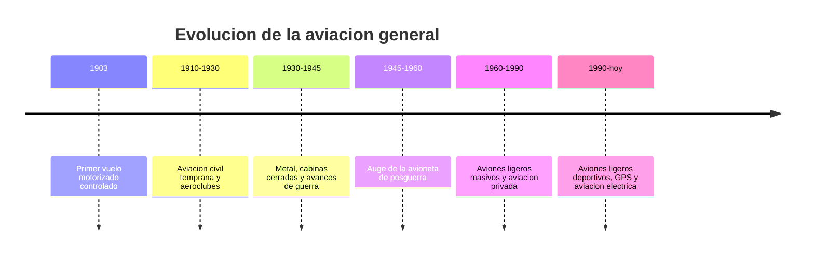

# 📜 Historia del avión pequeño

[🏠 Inicio](../../../README.md) · [🛩️ Curso: Aviones pequeños](../README.md) · 📜 Historia

## Origen

El avión pequeño desciende directamente de los primeros aeroplanos. En 1903 se
logró el primer vuelo motorizado, controlado y sostenido, y desde entonces la
aeronave ligera fue el terreno de pruebas de casi toda la técnica aeronáutica:
alas, superficies de control, motores a pistón e instrumentos de vuelo.

## Línea de tiempo

| Periodo | Hito | Importancia |
| --- | --- | --- |
| 1903 | Primer vuelo motorizado controlado | Prueba del concepto de vuelo más pesado que el aire. |
| 1910-1930 | Aeroclubes y aviación civil temprana | El vuelo deja de ser solo experimental. |
| 1930-1945 | Estructura de metal y cabina cerrada | Aviones más fuertes, rápidos y seguros. |
| 1945-1960 | Avioneta de posguerra | Aviación privada accesible a más pilotos. |
| 1960-1990 | Aviones ligeros de gran serie | El avión pequeño se vuelve herramienta común. |
| 1990-presente | Aviación deportiva, GPS y eléctrica | Navegación satelital y nuevas propulsiones. |

## Evolución tecnológica

- **Materiales**: de la madera y tela al aluminio y los compuestos.
- **Propulsión**: del motor rotativo simple al motor a pistón moderno y eléctrico.
- **Mandos**: superficies de control más eficientes y compensadores.
- **Instrumentos**: de indicadores básicos al panel de cristal (glass cockpit).
- **Navegación**: de la carta y la brújula al GPS y las cartas digitales.
- **Seguridad**: cinturones, estructuras deformables y paracaídas balisticos.

## Tipos representativos

| Tipo | Uso típico | Característica destacada |
| --- | --- | --- |
| Ultraligero | Deporte y ocio | Muy liviano y económico de operar. |
| Monomotor de entrenamiento | Escuela de vuelo | Estable y perdonador para aprender. |
| Turismo monomotor | Viaje personal | Cabina cerrada y buena autonomía. |
| Bimotor ligero | Traslados y trabajo | Más potencia y redundancia de motor. |
| Anfibio / hidroavión | Zonas con agua | Despega y ameriza sobre lagos o mar. |

## Impacto social y económico

La aviación general acerco el vuelo a personas e instituciones fuera de las
grandes aerolineas: aeroclubes, escuelas de pilotos, trabajo aéreo, fotografía,
fumigación agrícola y conexión de zonas aisladas. En países largos y con
geografía difícil, como Chile, el avión pequeño es clave para llegar donde no
alcanza la ruta terrestre.

## Fuentes

- Registrar aquí las fuentes públicas consultadas.
- Enlazar cada fuente también en [`manuales/fuentes.md`](../../../manuales/fuentes.md).

---

[🎓 Portada del curso](../README.md) · [➡️ Siguiente: Características](../operacion/caracteristicas-avion-pequeno.md)
