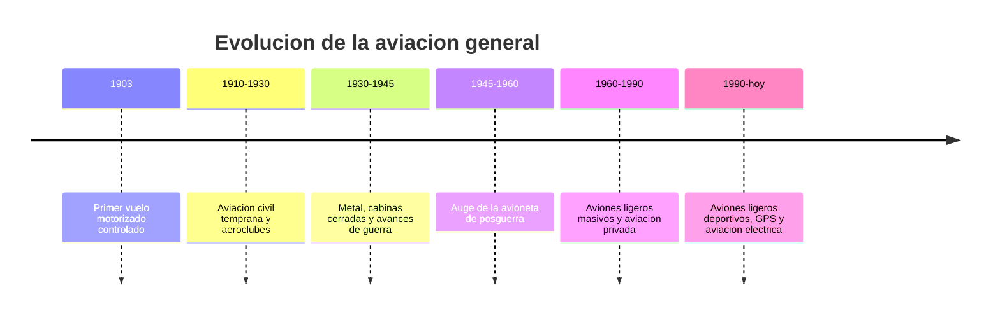

# 📜 Historia del avion pequeno

[🏠 Inicio](../../../README.md) · [🛩️ Curso: Aviones pequenos](../README.md) · 📜 Historia

## Origen

El avion pequeno desciende directamente de los primeros aeroplanos. En 1903 se
logro el primer vuelo motorizado, controlado y sostenido, y desde entonces la
aeronave ligera fue el terreno de pruebas de casi toda la tecnica aeronautica:
alas, superficies de control, motores a piston e instrumentos de vuelo.

## Linea de tiempo

| Periodo | Hito | Importancia |
| --- | --- | --- |
| 1903 | Primer vuelo motorizado controlado | Prueba del concepto de vuelo mas pesado que el aire. |
| 1910-1930 | Aeroclubes y aviacion civil temprana | El vuelo deja de ser solo experimental. |
| 1930-1945 | Estructura de metal y cabina cerrada | Aviones mas fuertes, rapidos y seguros. |
| 1945-1960 | Avioneta de posguerra | Aviacion privada accesible a mas pilotos. |
| 1960-1990 | Aviones ligeros de gran serie | El avion pequeno se vuelve herramienta comun. |
| 1990-presente | Aviacion deportiva, GPS y electrica | Navegacion satelital y nuevas propulsiones. |

## Evolucion tecnologica

- **Materiales**: de la madera y tela al aluminio y los compuestos.
- **Propulsion**: del motor rotativo simple al motor a piston moderno y electrico.
- **Mandos**: superficies de control mas eficientes y compensadores.
- **Instrumentos**: de indicadores basicos al panel de cristal (glass cockpit).
- **Navegacion**: de la carta y la brujula al GPS y las cartas digitales.
- **Seguridad**: cinturones, estructuras deformables y paracaidas balisticos.

## Tipos representativos

| Tipo | Uso tipico | Caracteristica destacada |
| --- | --- | --- |
| Ultraligero | Deporte y ocio | Muy liviano y economico de operar. |
| Monomotor de entrenamiento | Escuela de vuelo | Estable y perdonador para aprender. |
| Turismo monomotor | Viaje personal | Cabina cerrada y buena autonomia. |
| Bimotor ligero | Traslados y trabajo | Mas potencia y redundancia de motor. |
| Anfibio / hidroavion | Zonas con agua | Despega y ameriza sobre lagos o mar. |

## Impacto social y economico

La aviacion general acerco el vuelo a personas e instituciones fuera de las
grandes aerolineas: aeroclubes, escuelas de pilotos, trabajo aereo, fotografia,
fumigacion agricola y conexion de zonas aisladas. En paises largos y con
geografia dificil, como Chile, el avion pequeno es clave para llegar donde no
alcanza la ruta terrestre.

## Fuentes

- Registrar aqui las fuentes publicas consultadas.
- Enlazar cada fuente tambien en [`manuales/fuentes.md`](../../../manuales/fuentes.md).

---

[🎓 Portada del curso](../README.md) · [➡️ Siguiente: Caracteristicas](../operacion/caracteristicas-avion-pequeno.md)
