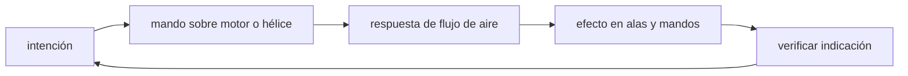

<!-- clase-meta
tipo_documento: clase
clase: 5
codigo: AVIONESPEQUE-05
curso: aviones-pequenos
titulo: "Mandos e instrumentos del avión pequeño"
modalidad: "taller de simulación"
duracion_minutos: 60
nivel: introductorio
prerrequisito: AVIONESPEQUE-04
competencia: "lectura_y_mando"
resultados_aprendizaje:
  - "Explicar controles, instrumentos, entradas y estados del sistema con vocabulario propio de Aviones pequeños."
  - "Aplicar esos conceptos a una decisión segura o a un escenario de simulación de Aviones pequeños."
evidencia: "Mapa de mandos y resolución de dos estados del tablero."
criterio_aprobacion: "Reconoce los controles críticos y responde a los estados sin introducir acciones inseguras."
fuentes: manuales/fuentes.md
ultima_revision: 2026-09-10
-->

# 🎛️ Mandos e instrumentos del avión pequeño

[🏠 Inicio](../../../README.md) · [🛩️ Curso: Aviones pequeños](../README.md) · 🎛️ Mandos

## Vista general

La cabina de un avión pequeño concentra los mandos de vuelo, los mandos de motor y
el panel de instrumentos. El piloto vuela con las dos manos y los dos pies: el
yugo controla cabeceo y alabeo, los pedales controlan la guiñada y los frenos, y
la mano libre gestiona potencia, mezcla y flaps. El panel al frente muestra el
estado del vuelo.

## Mapa de controles

| Zona | Control | Tipo | Función | Prioridad | Comentarios |
| --- | --- | --- | --- | --- | --- |
| Frente | Yugo o bastón | Volante / palanca | Cabeceo y alabeo | Alta | Adelante-atrás cabecea; giro alabea. |
| Piso | Pedales de timón | Pedales | Guiñada y coordinación | Alta | También accionan los frenos. |
| Consola | Acelerador (throttle) | Palanca | Regular potencia del motor | Alta | Controla el empuje. |
| Consola | Mezcla (mixture) | Palanca | Proporción aire-combustible | Alta | Se empobrece con la altitud. |
| Consola | Flaps | Palanca / selector | Sustentación y resistencia | Media | Para despegue y aterrizaje. |
| Consola | Compensador (trim) | Rueda / botón | Aliviar fuerza en el yugo | Media | Estabiliza la actitud elegida. |
| Panel | Interruptores eléctricos | Botones | Luces, bombas, avionica | Media | Encendido por checklist. |
| Panel | Magnetos y arranque | Llave | Encender y apagar el motor | Alta | Prueba de magnetos previa. |
| Panel | Radio y transponder | Teclado | Comunicar y ser visto en radar | Alta | Frecuencias y código asignado. |
| Panel | Instrumentos | Relojes / pantalla | Mostrar estado del vuelo | Alta | Ver sección de instrumentos. |

## Instrumentos de vuelo

| Instrumento | Mide o muestra | Unidad | Importancia | Notas |
| --- | --- | --- | --- | --- |
| Anemómetro (velocidad) | Velocidad respecto al aire | nudos | Alta | Clave para evitar la pérdida. |
| Altímetro | Altitud sobre el nivel de referencia | pies | Alta | Se ajusta con la presión local. |
| Variómetro | Velocidad vertical | pies/min | Media | Muestra ascenso o descenso. |
| Horizonte artificial | Actitud (cabeceo y alabeo) | grados | Alta | Referencia sin ver el exterior. |
| Indicador de rumbo | Dirección de la nariz | grados | Alta | Se alinea con la brújula. |
| Coordinador de viraje | Ritmo de viraje y coordinación | - | Media | La bolita indica vuelo coordinado. |
| Tacómetro | Régimen del motor / hélice | rpm | Media | Ayuda a ajustar potencia. |
| Instrumentos de motor | Aceite, combustible, temperatura | varias | Alta | Vigilan la salud del motor. |

## Entradas de simulación

| Acción | Teclado | Controlador | Palanca de vuelo | Comentarios |
| --- | --- | --- | --- | --- |
| Cabecear | Flechas arriba/abajo | Stick eje Y | Adelante-atrás | Sube o baja el morro. |
| Alabear | Flechas izq/der | Stick eje X | Giro lateral | Inclina las alas. |
| Guiñar | Teclas Z / X | Gatillos / pedales | Pedales | Coordina el viraje. |
| Potencia | Teclas F2 / F3 | Gatillo derecho | Throttle | Sube o baja el empuje. |
| Flaps | Tecla F | Botón | Selector de flaps | Por etapas. |
| Trim | Teclas coma / punto | Cruceta | Rueda de trim | Alivia la fuerza sostenida. |
| Frenos | Tecla B | Botón | Punta de pedales | Solo en tierra. |

## Estados del sistema

| Estado | Descripción | Indicadores | Acciones disponibles |
| --- | --- | --- | --- |
| En tierra apagado | Motor detenido | Panel sin energía | Checklist, encender sistemas. |
| Motor en marcha | Rodando o detenido en tierra | Tacómetro activo | Rodar, alinear, despegar. |
| En vuelo | Aeronave volando | Anemómetro y altímetro activos | Ascender, virar, crucero, descender. |
| Aproximación | Preparando aterrizaje | Flaps y velocidad de aproximación | Configurar, alinear, aterrizar. |
| Emergencia | Falla o riesgo | Testigos de alerta | Aplicar checklist de emergencia. |

## Observaciones ergonomicas

- El anemómetro y el altímetro deben verse siempre; son críticos para la seguridad.
- El horizonte artificial es la referencia principal si no se ve el exterior.
- El acelerador, la mezcla y los flaps deben quedar bien diferenciados al tacto.
- El corte de motor y los magnetos deben ser accesibles y reconocibles.
- La interfaz de simulación debería guiar el uso de checklist en cada fase.

## 🧭 Guía de estudio aplicada

### Pregunta guía

¿Cómo ayuda **Vista general, Mapa de controles, Instrumentos de vuelo y Entradas de simulación** a **interpretar mandos e indicaciones durante aproximación con viento cruzado y pista corta**?

### Explicación razonada

Un mando no se aprende memorizando su nombre, sino recorriendo el ciclo intención → acción → indicación → verificación. En Aviones pequeños, el operador actúa sobre motor o hélice, observa la respuesta en flujo de aire y confirma el efecto en alas y mandos. Una indicación inesperada exige detener la secuencia mental, identificar el modo activo y evitar una segunda orden que agrave el estado.

Esta clase se conecta con el resto del curso mediante **balance entre sustentación, peso, empuje y resistencia dentro de una envolvente limitada**. El hilo de
seguridad consiste en reconocer a tiempo **pérdida aerodinámica o salida de pista por velocidad y trayectoria inestables** y poder justificar la decisión
**estabilizar aproximación y frustrar si no se cumplen criterios antes del umbral**; en clases posteriores cambiará el ángulo de análisis, no esa relación causal.
La lectura funcional común sigue **motor → hélice → flujo de aire → alas y mandos**, de modo que cada concepto pueda
ubicarse dentro del funcionamiento completo y no quede como un dato aislado.

**Apoyo documental:** [Aviation Handbooks and Manuals](https://www.faa.gov/regulations_policies/handbooks_manuals) aporta aerodinámica, sistemas y operación;
[Normativa aeronáutica](https://www.dgac.gob.cl/normativa/) se usa para marco aeronáutico chileno. Estas fuentes
se contrastan con el alcance de la clase y no sustituyen un manual de equipo concreto.

### Caso resuelto: de la observación a la decisión

1. **Intención:** formula qué cambio se necesita durante **aproximación con viento cruzado y pista corta**.
2. **Mando:** identifica el control que actúa sobre **motor** o **hélice** y el modo que debe estar activo.
3. **Lectura:** localiza la indicación que confirma la respuesta de **flujo de aire** y el efecto en **alas y mandos**.
4. **Verificación:** si la lectura no coincide, no acumules órdenes; estabiliza e investiga el estado.

### Comprueba tu comprensión

1. ¿Qué mando inicia la respuesta y qué instrumento confirma que el modo correcto está activo?
2. ¿Qué indicación temprana advertiría **pérdida aerodinámica o salida de pista por velocidad y trayectoria inestables**?
3. ¿Qué secuencia usarías si la respuesta de **alas y mandos** no coincide con la orden?

Orientación para revisar tus respuestas

- La primera respuesta debe relacionar el eslabón elegido con un efecto posterior, no solo nombrarlo.
- La segunda debe proponer una señal medible u observable y explicar qué tendencia sería preocupante.
- La tercera debe cambiar al menos una variable de capacidad, mando, entorno o margen de seguridad.

## 🎓 Cierre de clase

- **Actividad:** Recorre el puesto de mando simulado de Aviones pequeños: localiza los controles de controles, instrumentos, entradas y estados del sistema y asocia cada indicación con una decisión.
- **Evidencia:** Mapa de mandos y resolución de dos estados del tablero.
- **Criterio de aprobación:** Reconoce los controles críticos y responde a los estados sin introducir acciones inseguras.
- **Transferencia:** explica qué cambiaría al pasar a otra variante de esta máquina.

### Fuentes de esta clase

- [US-FAA-HANDBOOKS](https://www.faa.gov/regulations_policies/handbooks_manuals): Aviation Handbooks and Manuals, FAA. Uso: aerodinámica, sistemas y operación.
- [CL-DGAC](https://www.dgac.gob.cl/normativa/): Normativa aeronáutica, DGAC Chile. Uso: marco aeronáutico chileno.

> Las fuentes sostienen el marco conceptual y normativo; esta clase no reemplaza el manual
> del fabricante, la formación certificada ni la habilitación exigida para operar equipos reales.

---

[⬅️ Anterior: Sistemas mecánicos](../operacion/sistemas-mecanicos-avion-pequeno.md) · [➡️ Siguiente: Principios y operación](../operacion/principios-avion-pequeno.md)
