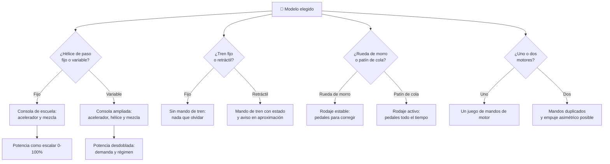

# 🧩 Modelos y variantes del avión pequeño

[🏠 Inicio](../../../README.md) · [🛩️ Curso: Aviones pequeños](../README.md) · 🧩 Modelos

El [Módulo 2](../operacion/caracteristicas-avion-pequeno.md) ya dijo qué tipos de
avión pequeño existen y para qué sirve cada uno. Este módulo responde a lo
siguiente: **no todos se pilotan igual**, y esa diferencia no es de matiz. Cambia
qué mandos tiene la máquina y, por tanto, qué debe modelar el simulador.

> 🎯 **La idea que sostiene el módulo.** "Un avión pequeño" no es una sola
> máquina desde el punto de vista del mando. Un turismo con tren retráctil y
> hélice de paso variable tiene dos palancas que en un monomotor de escuela **no
> existen**: no son las mismas más difíciles, es que no están. Un simulador que
> presente un solo esquema de control está representando un avión concreto aunque
> diga representarlos todos.

---

## 🧭 Por qué el modelo decide el simulador

El [Módulo 5](../mandos/manual-mandos-avion-pequeno.md) describe una consola con
tres mandos de motor: **acelerador, mezcla y flaps**. No hay palanca de hélice ni
selector de tren. El [Módulo 9](../simulacion/diseno-simulador-avion-pequeno.md)
expone una variable `Potencia del motor` de `0-100%` como único parámetro de
propulsión. Ambos describen un avión de **hélice de paso fijo, tren fijo y un
solo motor**: el monomotor de escuela del Módulo 2.

En cuanto el modelo lleva hélice de paso variable, ese `0-100%` deja de bastar:
la potencia pasa a ser un par de valores —presión de admisión y rpm— que el
piloto ajusta con dos palancas distintas, y el tacómetro deja de seguir al
acelerador. Y en cuanto el tren es retráctil, aparece un mando con estado propio
que el Módulo 9 no tiene: la posición del tren no es un ajuste, es una condición
del aterrizaje. Si el simulador se construye sobre el esquema de escuela y luego
se le "añade" un bimotor de turismo, el resultado es un bimotor con una sola
palanca de gases, que no existe.

---

## 🗂️ Qué cambia en el manejo

| Modelo | Qué cambia al pilotarlo |
| --- | --- |
| Monomotor de escuela | La referencia del curso: estable, perdonador y con la respuesta más previsible de la familia. |
| Ultraligero | Muy liviano: el viento deja de ser una corrección y pasa a ser el factor dominante de la trayectoria. |
| Deportivo ligero | Moderno y simple, cercano al de escuela; el mando suele ser bastón en vez de yugo, con la mano de potencia siempre disponible. |
| Turismo monomotor | Vuela más rápido y con más autonomía: el piloto gestiona configuración —tren, hélice, mezcla— además de volar. |
| Bimotor ligero | Con los dos motores dando lo mismo se parece a un monomotor; en cuanto uno falla, el empuje es asimétrico y la guiñada deja de ser una coordinación y pasa a ser una carga sostenida. |
| Anfibio / hidroavión | El "suelo" cambia de naturaleza: sobre agua no hay pista alineada ni frenos de rueda, y la superficie misma se mueve. |
| Tren de patín de cola (variante de varios modelos) | El rodaje se invierte: el avión tiende a irse de cola y el piloto lo corrige activamente con pedales todo el tiempo. |

---

## 🎛️ Qué cambia en el mando

| Modelo | Qué mando aparece o desaparece | Consecuencia |
| --- | --- | --- |
| Monomotor de escuela, Deportivo ligero | Ninguno: el mapa de controles del Módulo 5 aplica tal cual. | Cambian los rangos, no los controles. |
| Ultraligero | El mando de vuelo es bastón en lugar de yugo; la consola es la más reducida del curso. | Menos que gestionar, pero cada entrada pesa más en el resultado. |
| Turismo monomotor (paso variable) | **Aparece** la palanca de hélice, un tercer mando de consola entre acelerador y mezcla. | La potencia deja de fijarse con un solo control, y el tacómetro deja de depender del acelerador. |
| Turismo monomotor (tren retráctil) | **Aparece** el selector de tren, con posición propia y aviso asociado. | Nuevo mando de estado: recogerlo y sacarlo son pasos obligados del despegue y la aproximación. |
| Bimotor ligero | **Se duplican** acelerador, mezcla y hélice; **aparecen** los mandos de selección por motor. | Un solo eje de "potencia" ya no representa la consola: son dos conjuntos que pueden diferir. |
| Anfibio / hidroavión | Sobre flotadores **desaparecen** los frenos de las puntas de los pedales. En el anfibio **aparece** el selector de tren, con la posición correcta dependiendo de la superficie. | El pedal pierde su segunda función en agua; en el anfibio el mismo mando significa cosas opuestas según dónde se ameriza o aterriza. |
| Variante de patín de cola | No aparece ningún mando, pero los pedales dejan de ser un control de coordinación en tierra y pasan a ser un control continuo. | El rodaje deja de ser una fase pasiva del simulador. |

---

## 🎮 Qué cambia en el simulador

Contrastado con las variables del
[Módulo 9](../simulacion/diseno-simulador-avion-pequeno.md):

| Modelo | Variables que cambian | Esquema de control |
| --- | --- | --- |
| Monomotor de escuela | Ninguna: es el caso base. | El del Módulo 5. |
| Ultraligero | `Viento` deja de ser una corrección de rumbo y pasa a pesar en el cálculo como el resto de fuerzas. `Velocidad (IAS)` y `Altitud` reducen su rango útil. | El mismo, con bastón y consola mínima. |
| Deportivo ligero | Ninguna estructural: `Velocidad (IAS)` y `Combustible` ajustan rango. | El mismo. |
| Turismo monomotor (paso variable) | `Potencia del motor` **deja de ser un escalar** `0-100%`: se desdobla en potencia demandada y régimen de hélice, que el piloto fija por separado. | Tres mandos de consola; el tacómetro pasa a ser una lectura gobernada, no un reflejo del acelerador. |
| Turismo monomotor (tren retráctil) | **Aparece** una variable de estado del tren (recogido / extendido / en tránsito) que el Módulo 9 no contempla, y que entra en `Resistencia` y en la validación del aterrizaje. | El mismo, más un mando discreto con consecuencia irreversible dentro de la partida. |
| Bimotor ligero | `Potencia del motor` **pasa a ser una por motor**; `Combustible` se reparte por lado y el desbalance importa. La `Actitud` deja de depender solo de los mandos de vuelo: la asimetría de empuje la mueve. | Consola duplicada; la guiñada pasa de coordinación puntual a entrada sostenida. |
| Anfibio / hidroavión | `Velocidad (IAS)` gana una fase de agua antes del despegue; el `Viento` actúa además sobre la superficie. La frenada en tierra **desaparece** del modelo cuando opera sobre flotadores. | Sin frenos de pedal en agua; con selector de tren en el anfibio. |
| Variante de patín de cola | La guiñada en tierra deja de ser un valor estable y pasa a ser una variable que diverge sin corrección del piloto. | El mismo, con el rodaje modelado como fase activa. |

---

## 🗺️ Del modelo al esquema de control

---

## ⚠️ Qué modelos no comparten simulador

Tres familias no se resuelven con un ajuste de parámetros, porque su esquema de
control es otro:

- **El bimotor ligero** frente al resto: no tiene una consola más grande, tiene
  dos consolas. `Potencia del motor` deja de ser una variable y pasa a ser dos, y
  la diferencia entre ambas produce una fuerza que ningún mando de vuelo del
  Módulo 5 estaba pensado para compensar de forma continua.
- **El turismo con paso variable y tren retráctil** frente al de escuela: añade
  dos mandos que no existen en el mapa del Módulo 5 y una variable de estado que
  no existe en el Módulo 9. Es un puesto de mando distinto, no un avión más
  rápido.
- **El hidroavión de flotadores** frente a los de rueda: le falta una entrada
  —los frenos en las puntas de los pedales— y le sobra una fase, la del agua, que
  el ciclo básico del Módulo 9 no recorre. En el anfibio el problema se agrava:
  el mismo mando de tren tiene la posición correcta invertida según la superficie.

El resto de modelos sí caben en un mismo simulador ajustando rangos, tal como
plantean los [niveles de realismo](../../../docs/03-niveles-de-realismo.md): en
el nivel 1 casi todos se comportan igual, y las diferencias emergen a medida que
el nivel sube. La variante de patín de cola es el caso intermedio: comparte
mandos con el de escuela, pero solo se distingue de él si el simulador modela el
rodaje como algo más que un traslado hasta la pista.

> ⚖️ **El principio detrás de todo esto.** Cuánto pesa la carga y dónde va no cambia
> solo los números: cambia qué puede hacer el operador. La física común a todas las
> máquinas del catálogo —sostener, girar, equilibrar y la masa que cambia en
> marcha— está en [⚖️ carga y manejo](../../../docs/09-carga-y-manejo.md).

---

[⬅️ Anterior: Características](../operacion/caracteristicas-avion-pequeno.md) · [➡️ Siguiente: Sistemas mecánicos](../operacion/sistemas-mecanicos-avion-pequeno.md)
