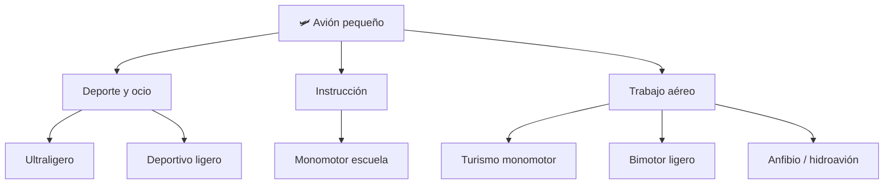

# 📋 Características funcionales del avión pequeño

[🏠 Inicio](../../../README.md) · [🛩️ Curso: Aviones pequeños](../README.md) · 📋 Características

Que es un avión pequeño, que tipos existen y para que sirve cada uno. Este módulo
da el contexto antes de abrir los sistemas de la aeronave (Módulo 3).

---

## 🧭 Definición

Un avión pequeño es una aeronave de ala fija, más pesada que el aire, propulsada
por uno o dos motores, disenada para transportar pocas personas o carga ligera.
Vuela porque sus alas generan sustentación al desplazarse por el aire, y el
piloto lo controla en tres ejes: cabeceo, alabeo y guiñada.

---

## 🧬 Características clave

| Característica | Descripción |
| --- | --- |
| Vuelo en tres ejes | Se controla en cabeceo, alabeo y guiñada a la vez. |
| Sustentación por ala | El ala fija produce el sostén; depende de la velocidad. |
| Dependencia de la energía | Necesita velocidad y potencia para mantenerse en vuelo. |
| Sensibilidad al peso | El peso y balance afectan el rendimiento y la seguridad. |
| Operación tridimensional | Gestiona altitud además de rumbo y velocidad. |
| Exposición al clima | Viento, nubes y visibilidad condicionan el vuelo. |

---

## 🗂️ Tipos de avión pequeño

| Tipo | Uso típico | Rasgo destacado |
| --- | --- | --- |
| Ultraligero | Deporte y ocio | Muy liviano, bajo costo de operación. |
| Deportivo ligero | Vuelo recreativo | Moderno, simple de pilotar. |
| Monomotor de escuela | Instrucción de vuelo | Estable y perdonador para aprender. |
| Turismo monomotor | Viaje personal | Cabina cerrada y buena autonomía. |
| Bimotor ligero | Traslados y trabajo | Dos motores, más potencia y redundancia. |
| Anfibio / hidroavión | Zonas con agua | Opera desde lagos, rios y mar. |

---

## 🎯 Para qué se usa

- Instrucción y formación de nuevos pilotos.
- Viaje personal y conexión de zonas aisladas.
- Trabajo aéreo: fotografía, vigilancia, fumigación agrícola.
- Deporte, turismo y vuelo recreativo.
- Traslado sanitario y apoyo en emergencias.

---

[⬅️ Anterior: Historia](../historia/historia-avion-pequeno.md) · [➡️ Siguiente: Sistemas mecánicos](sistemas-mecanicos-avion-pequeno.md)
