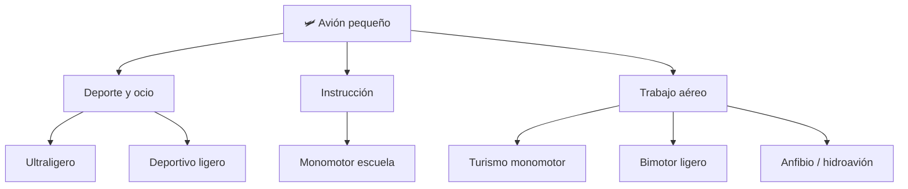

<!-- clase-meta
tipo_documento: clase
clase: 2
codigo: AVIONESPEQUE-02
curso: aviones-pequenos
titulo: "Características funcionales del avión pequeño"
modalidad: "teórica aplicada"
duracion_minutos: 45
nivel: introductorio
prerrequisito: AVIONESPEQUE-01
competencia: "identificacion_funcional"
resultados_aprendizaje:
  - "Explicar definición, rasgos funcionales, tipos y usos con vocabulario propio de Aviones pequeños."
  - "Aplicar esos conceptos a una decisión segura o a un escenario de simulación de Aviones pequeños."
evidencia: "Matriz comparativa y decisión justificada."
criterio_aprobacion: "La elección considera función, límites, mando y efecto en la simulación; no se apoya solo en preferencias."
fuentes: manuales/fuentes.md
ultima_revision: 2026-09-10
-->

# 📋 Características funcionales del avión pequeño

[🏠 Inicio](../../../README.md) · [🛩️ Curso: Aviones pequeños](../README.md) · 📋 Características

Que es un avión pequeño, que tipos existen y para que sirve cada uno. Esta clase
da el contexto antes de abrir los sistemas de la aeronave (Clase 4).

---

## 🧭 Definición

Un avión pequeño es una aeronave de ala fija, más pesada que el aire, propulsada
por uno o dos motores, disenada para transportar pocas personas o carga ligera.
Vuela porque sus alas generan sustentación al desplazarse por el aire, y el
piloto lo controla en tres ejes: cabeceo, alabeo y guiñada.

---

## 🧬 Características clave

| Característica | Descripción |
| --- | --- |
| Vuelo en tres ejes | Se controla en cabeceo, alabeo y guiñada a la vez. |
| Sustentación por ala | El ala fija produce el sostén; depende de la velocidad. |
| Dependencia de la energía | Necesita velocidad y potencia para mantenerse en vuelo. |
| Sensibilidad al peso | El peso y balance afectan el rendimiento y la seguridad. |
| Operación tridimensional | Gestiona altitud además de rumbo y velocidad. |
| Exposición al clima | Viento, nubes y visibilidad condicionan el vuelo. |

---

## 🗂️ Tipos de avión pequeño

```mermaid
flowchart TD
    Avion[🛩️ Avión pequeño] --> Deporte[Deporte y ocio]
    Avion --> Instruccion[Instrucción]
    Avion --> Trabajo[Trabajo aéreo]
    Deporte --> Ultra[Ultraligero]
    Deporte --> LSA[Deportivo ligero]
    Instruccion --> Mono[Monomotor escuela]
    Trabajo --> Turismo[Turismo monomotor]
    Trabajo --> Bimotor[Bimotor ligero]
    Trabajo --> Anfibio[Anfibio / hidroavión]
```

| Tipo | Uso típico | Rasgo destacado |
| --- | --- | --- |
| Ultraligero | Deporte y ocio | Muy liviano, bajo costo de operación. |
| Deportivo ligero | Vuelo recreativo | Moderno, simple de pilotar. |
| Monomotor de escuela | Instrucción de vuelo | Estable y perdonador para aprender. |
| Turismo monomotor | Viaje personal | Cabina cerrada y buena autonomía. |
| Bimotor ligero | Traslados y trabajo | Dos motores, más potencia y redundancia. |
| Anfibio / hidroavión | Zonas con agua | Opera desde lagos, rios y mar. |

---

## 🎯 Para qué se usa

- Instrucción y formación de nuevos pilotos.
- Viaje personal y conexión de zonas aisladas.
- Trabajo aéreo: fotografía, vigilancia, fumigación agrícola.
- Deporte, turismo y vuelo recreativo.
- Traslado sanitario y apoyo en emergencias.

## 🧭 Guía de estudio aplicada

### Pregunta guía

¿Cómo ayuda **Definición, Características clave, Tipos de avión pequeño y Para qué se usa** a **elegir una configuración adecuada para aproximación con viento cruzado y pista corta**?

### Explicación razonada

Una característica solo es útil cuando permite anticipar comportamiento. En Aviones pequeños, la relación entre motor, hélice, flujo de aire y alas y mandos determina capacidad, respuesta y límites. Por eso «entrenador de ala alta frente a turismo de ala baja» no se compara por apariencia: se compara por misión, entorno, carga de trabajo y exposición al riesgo «pérdida aerodinámica o salida de pista por velocidad y trayectoria inestables».

Esta clase se conecta con el resto del curso mediante **balance entre sustentación, peso, empuje y resistencia dentro de una envolvente limitada**. El hilo de
seguridad consiste en reconocer a tiempo **pérdida aerodinámica o salida de pista por velocidad y trayectoria inestables** y poder justificar la decisión
**estabilizar aproximación y frustrar si no se cumplen criterios antes del umbral**; en clases posteriores cambiará el ángulo de análisis, no esa relación causal.
La lectura funcional común sigue **motor → hélice → flujo de aire → alas y mandos**, de modo que cada concepto pueda
ubicarse dentro del funcionamiento completo y no quede como un dato aislado.

**Apoyo documental:** [Aviation Handbooks and Manuals](https://www.faa.gov/regulations_policies/handbooks_manuals) aporta aerodinámica, sistemas y operación;
[Normativa aeronáutica](https://www.dgac.gob.cl/normativa/) se usa para marco aeronáutico chileno. Estas fuentes
se contrastan con el alcance de la clase y no sustituyen un manual de equipo concreto.

### Caso resuelto: de la observación a la decisión

1. **Definir la necesidad:** convierte «aproximación con viento cruzado y pista corta» en requisitos de capacidad, entorno y respuesta.
2. **Comparar:** contrasta **entrenador de ala alta frente a turismo de ala baja** usando esos requisitos y la cadena **motor → hélice → flujo de aire → alas y mandos**.
3. **Descartar:** elimina la alternativa que deja menos margen frente a **pérdida aerodinámica o salida de pista por velocidad y trayectoria inestables**.
4. **Elegir:** declara la variante escogida, la evidencia usada y una limitación que todavía debe respetarse.

### Comprueba tu comprensión

1. ¿Qué característica de **alas y mandos** condiciona primero el caso «aproximación con viento cruzado y pista corta»?
2. ¿Qué requisito descartaría una de las alternativas **entrenador de ala alta frente a turismo de ala baja**?
3. ¿Qué límite debe declararse junto con la variante elegida?

Orientación para revisar tus respuestas

- La primera respuesta debe relacionar el eslabón elegido con un efecto posterior, no solo nombrarlo.
- La segunda debe proponer una señal medible u observable y explicar qué tendencia sería preocupante.
- La tercera debe cambiar al menos una variable de capacidad, mando, entorno o margen de seguridad.

## 🎓 Cierre de clase

- **Actividad:** Compara variantes de Aviones pequeños mediante los ejes «definición, rasgos funcionales, tipos y usos» y elige una para un caso de uso razonado.
- **Evidencia:** Matriz comparativa y decisión justificada.
- **Criterio de aprobación:** La elección considera función, límites, mando y efecto en la simulación; no se apoya solo en preferencias.
- **Transferencia:** explica qué cambiaría al pasar a otra variante de esta máquina.

### Fuentes de esta clase

- [US-FAA-HANDBOOKS](https://www.faa.gov/regulations_policies/handbooks_manuals): Aviation Handbooks and Manuals, FAA. Uso: aerodinámica, sistemas y operación.
- [CL-DGAC](https://www.dgac.gob.cl/normativa/): Normativa aeronáutica, DGAC Chile. Uso: marco aeronáutico chileno.

> Las fuentes sostienen el marco conceptual y normativo; esta clase no reemplaza el manual
> del fabricante, la formación certificada ni la habilitación exigida para operar equipos reales.

---

[⬅️ Anterior: Historia](../historia/historia-avion-pequeno.md) · [➡️ Siguiente: Modelos y variantes](../modelos/modelos-avion-pequeno.md)
