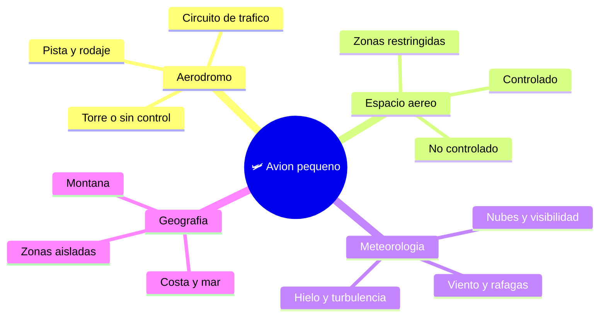

# 🌍 Entornos de trabajo del avión pequeño

[🏠 Inicio](../../../README.md) · [🛩️ Curso: Aviones pequeños](../README.md) · 🌍 Entornos

Dónde opera un avión pequeño y cómo cambia el vuelo según el entorno. Cada entorno
implica reglas, riesgos y ajustes distintos, y en simulación se traduce en
escenarios diferentes.

---

## 🗺️ Entornos principales

| Entorno | Características | Riesgos típicos | Ajuste de vuelo |
| --- | --- | --- | --- |
| Aeródromo | Pista, rodaje, circuito de tráfico. | Tráfico cercano, viento cruzado. | Circuito estandar, comunicación, velocidad estable. |
| Espacio aéreo controlado | Control por torre o radar. | Interferir con otros vuelos. | Seguir instrucciones, transponder activo. |
| Espacio aéreo no controlado | Sin control activo. | Ver y evitar por cuenta propia. | Vigilancia visual, comunicación en frecuencia común. |
| Meteorología adversa | Viento, nubes, poca visibilidad. | Pérdida de referencias, turbulencia. | Volar solo si las condiciones lo permiten. |
| Montaña | Terreno alto, corrientes. | Turbulencia, menor rendimiento. | Margen de altura, planificar rutas de escape. |
| Costa y zonas aisladas | Pocas ayudas en tierra. | Distancia a aeródromos, mar. | Buena planificación y combustible de reserva. |

---

## 🌦️ Factores del entorno

- **Viento**: el viento cruzado dificulta despegue y aterrizaje; la ráfaga sorprende.
- **Visibilidad**: nubes, niebla o lluvia reducen las referencias visuales.
- **Densidad del aire**: calor y altitud reducen sustentación y potencia.
- **Hielo y turbulencia**: afectan el control y el rendimiento del avión.

---

## 🎮 Traducción a simulación

Cada entorno es un escenario con su tipo de espacio aéreo, su clima y su terreno.
Ver cómo se modela en el
[Módulo 8: Diseño de simulación](../simulacion/diseno-simulador-avion-pequeno.md).

---

[⬅️ Anterior: Principios y operación](principios-avion-pequeno.md) · [➡️ Siguiente: Reglamentos](../reglamentos/reglamentos-avion-pequeno.md)
