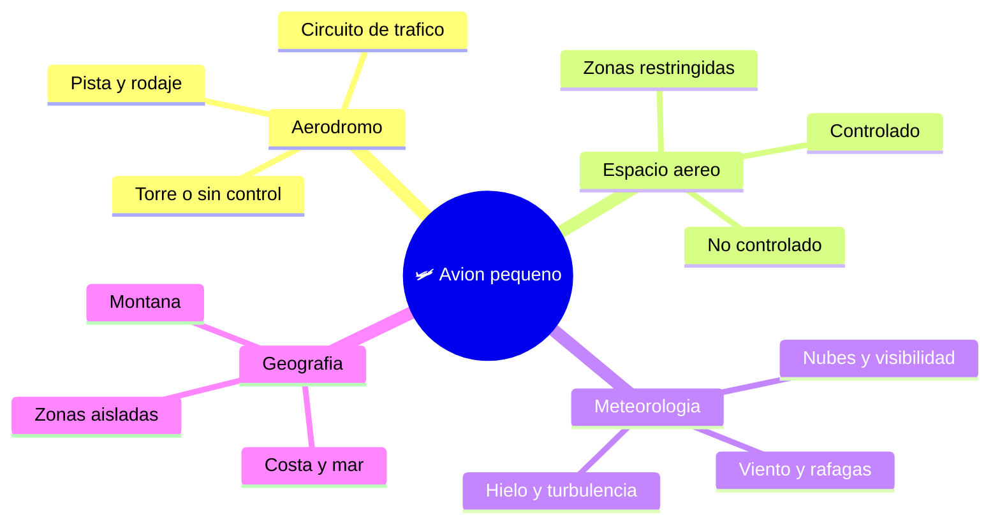

# 🌍 Entornos de trabajo del avion pequeno

[🏠 Inicio](../../../README.md) · [🛩️ Curso: Aviones pequenos](../README.md) · 🌍 Entornos

Donde opera un avion pequeno y como cambia el vuelo segun el entorno. Cada entorno
implica reglas, riesgos y ajustes distintos, y en simulacion se traduce en
escenarios diferentes.

---

## 🗺️ Entornos principales

| Entorno | Caracteristicas | Riesgos tipicos | Ajuste de vuelo |
| --- | --- | --- | --- |
| Aerodromo | Pista, rodaje, circuito de trafico. | Trafico cercano, viento cruzado. | Circuito estandar, comunicacion, velocidad estable. |
| Espacio aereo controlado | Control por torre o radar. | Interferir con otros vuelos. | Seguir instrucciones, transponder activo. |
| Espacio aereo no controlado | Sin control activo. | Ver y evitar por cuenta propia. | Vigilancia visual, comunicacion en frecuencia comun. |
| Meteorologia adversa | Viento, nubes, poca visibilidad. | Perdida de referencias, turbulencia. | Volar solo si las condiciones lo permiten. |
| Montana | Terreno alto, corrientes. | Turbulencia, menor rendimiento. | Margen de altura, planificar rutas de escape. |
| Costa y zonas aisladas | Pocas ayudas en tierra. | Distancia a aerodromos, mar. | Buena planificacion y combustible de reserva. |

---

## 🌦️ Factores del entorno

- **Viento**: el viento cruzado dificulta despegue y aterrizaje; la rafaga sorprende.
- **Visibilidad**: nubes, niebla o lluvia reducen las referencias visuales.
- **Densidad del aire**: calor y altitud reducen sustentacion y potencia.
- **Hielo y turbulencia**: afectan el control y el rendimiento del avion.

---

## 🎮 Traduccion a simulacion

Cada entorno es un escenario con su tipo de espacio aereo, su clima y su terreno.
Ver como se modela en el
[Modulo 8: Diseno de simulacion](../simulacion/diseno-simulador-avion-pequeno.md).

---

[⬅️ Anterior: Principios y operacion](principios-avion-pequeno.md) · [➡️ Siguiente: Reglamentos](../reglamentos/reglamentos-avion-pequeno.md)
