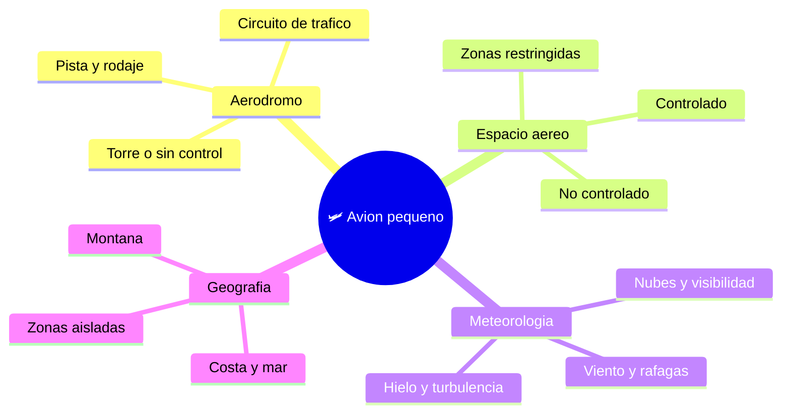

# 🌍 Entornos de trabajo del avión pequeño

[🏠 Inicio](../../../README.md) · [🛩️ Curso: Aviones pequeños](../README.md) · 🌍 Entornos

Dónde opera un avión pequeño y cómo cambia el vuelo según el entorno. Cada entorno
implica reglas, riesgos y ajustes distintos, y en simulación se traduce en
escenarios diferentes.

---

## 🗺️ Entornos principales

```mermaid
mindmap
  root((🛩️ Avion pequeno))
    Aerodromo
      Pista y rodaje
      Circuito de trafico
      Torre o sin control
    Espacio aereo
      Controlado
      No controlado
      Zonas restringidas
    Meteorologia
      Viento y rafagas
      Nubes y visibilidad
      Hielo y turbulencia
    Geografia
      Montana
      Costa y mar
      Zonas aisladas
```

| Entorno | Características | Riesgos típicos | Ajuste de vuelo |
| --- | --- | --- | --- |
| Aeródromo | Pista, rodaje, circuito de tráfico. | Tráfico cercano, viento cruzado. | Circuito estandar, comunicación, velocidad estable. |
| Espacio aéreo controlado | Control por torre o radar. | Interferir con otros vuelos. | Seguir instrucciones, transponder activo. |
| Espacio aéreo no controlado | Sin control activo. | Ver y evitar por cuenta propia. | Vigilancia visual, comunicación en frecuencia común. |
| Meteorología adversa | Viento, nubes, poca visibilidad. | Pérdida de referencias, turbulencia. | Volar solo si las condiciones lo permiten. |
| Montaña | Terreno alto, corrientes. | Turbulencia, menor rendimiento. | Margen de altura, planificar rutas de escape. |
| Costa y zonas aisladas | Pocas ayudas en tierra. | Distancia a aeródromos, mar. | Buena planificación y combustible de reserva. |

---

## 🌦️ Factores del entorno

- **Viento**: el viento cruzado dificulta despegue y aterrizaje; la ráfaga sorprende.
- **Visibilidad**: nubes, niebla o lluvia reducen las referencias visuales.
- **Densidad del aire**: calor y altitud reducen sustentación y potencia.
- **Hielo y turbulencia**: afectan el control y el rendimiento del avión.

---

## 🎮 Traducción a simulación

Cada entorno es un escenario con su tipo de espacio aéreo, su clima y su terreno.
Ver cómo se modela en el
[Módulo 9: Diseño de simulación](../simulacion/diseno-simulador-avion-pequeno.md).

## 🎓 Cierre de clase

- **Actividad:** Contrasta tres entornos de Aviones pequeños a partir de entornos, factores ambientales, riesgos y respuesta de simulación y determina cómo cambian variables, percepción, riesgos y respuesta.
- **Evidencia:** Matriz entorno–cambio–riesgo–respuesta.
- **Criterio de aprobación:** Cada respuesta se adapta al entorno y distingue riesgos que no son intercambiables entre escenarios.
- **Transferencia:** explica qué cambiaría al pasar a otra variante de esta máquina.

### Fuentes de esta clase

- [US-FAA-HANDBOOKS](https://www.faa.gov/regulations_policies/handbooks_manuals): Aviation Handbooks and Manuals, FAA. Uso: aerodinámica, sistemas y operación.
- [CL-DGAC](https://www.dgac.gob.cl/normativa/): Normativa aeronáutica, DGAC Chile. Uso: marco aeronáutico chileno.

> Las fuentes sostienen el marco conceptual y normativo; esta clase no reemplaza el manual
> del fabricante, la formación certificada ni la habilitación exigida para operar equipos reales.

---

[⬅️ Anterior: Principios y operación](principios-avion-pequeno.md) · [➡️ Siguiente: Reglamentos](../reglamentos/reglamentos-avion-pequeno.md)
