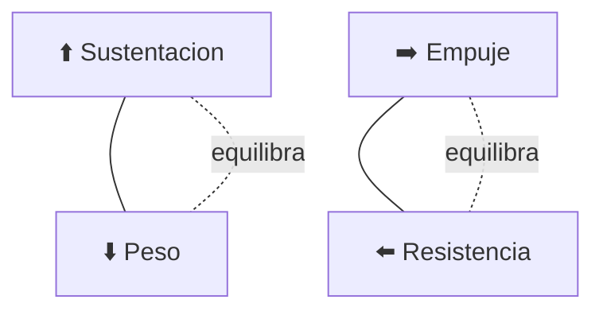

# 🧪 Principios y operacion del avion pequeno

[🏠 Inicio](../../../README.md) · [🛩️ Curso: Aviones pequenos](../README.md) · 🧪 Principios

Documento general y educativo. No sustituye una escuela de vuelo certificada ni
el manual del fabricante. Describe como se opera un avion pequeno en simulacion y
que principios fisicos conviene representar.

## Principios de funcionamiento

- **Sustentacion**: el ala genera una fuerza hacia arriba al moverse por el aire;
  crece con la velocidad y con el angulo de ataque, hasta la entrada en perdida.
- **Peso**: la gravedad tira del avion hacia abajo; se equilibra con la sustentacion.
- **Empuje**: la helice impulsa el avion hacia adelante; lo regula el acelerador.
- **Resistencia**: el aire frena el avance; aumenta con la velocidad y la configuracion.
- **Vuelo en tres ejes**: cabeceo, alabeo y guinada se coordinan para volar suave.

## Las cuatro fuerzas del vuelo

En vuelo nivelado y estable, la sustentacion equilibra el peso y el empuje
equilibra la resistencia. Cambiar una fuerza obliga a reajustar las demas.

## Fases de operacion

| Fase | Que ocurre | Puntos clave |
| --- | --- | --- |
| Prevuelo | Inspeccion y checklist | Combustible, superficies, peso y balance, meteorologia. |
| Rodaje | Mover el avion en tierra | Control con pedales y frenos, velocidad prudente. |
| Despegue | Acelerar y elevarse | Velocidad de rotacion, flaps segun manual, ascenso. |
| Ascenso | Ganar altitud | Potencia de ascenso, velocidad y rumbo estables. |
| Crucero | Volar hacia el destino | Ajustar potencia y mezcla, navegar y comunicar. |
| Descenso | Bajar de altitud | Reducir potencia, controlar velocidad y rumbo. |
| Aproximacion | Alinear con la pista | Configurar flaps, velocidad de aproximacion estable. |
| Aterrizaje | Tomar tierra | Reducir potencia, redondear, tocar suave, frenar. |

## Aproximacion y aterrizaje: idea general

1. Planificar el descenso con anticipacion, no de golpe.
2. Configurar flaps y velocidad segun el manual.
3. Alinear con la pista y controlar la senda de planeo.
4. Reducir potencia y hacer el redondeo (flare) cerca del suelo.
5. Tocar suave sobre las ruedas principales y frenar con control.

## Errores comunes que la simulacion puede ensenar a evitar

- Volar demasiado lento y entrar en perdida cerca del suelo.
- Ignorar el peso y balance antes de despegar.
- Descuidar la meteorologia y el viento cruzado.
- No completar el checklist de cada fase.
- Corregir el rumbo solo con alerones sin coordinar con el timon.

## Relacion con los niveles de realismo

- **Nivel 1 (educativo)**: despegar, volar nivelado, virar y aterrizar.
- **Nivel 2 (simplificado)**: agregar sustentacion, resistencia y entrada en perdida.
- **Nivel 3 (tecnico)**: sumar mezcla, compensador, viento cruzado y checklist.

Ver [`docs/03-niveles-de-realismo.md`](../../../docs/03-niveles-de-realismo.md) para el detalle de cada nivel.

---

[⬅️ Anterior: Mandos](../mandos/manual-mandos-avion-pequeno.md) · [➡️ Siguiente: Entornos de trabajo](entornos-avion-pequeno.md)
