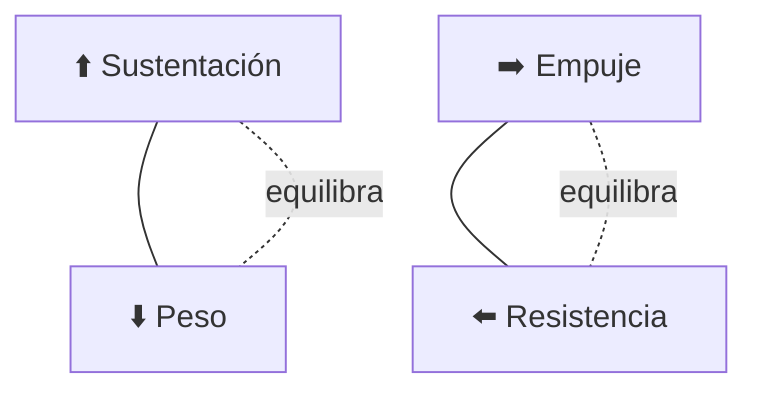

# 🧪 Principios y operación del avión pequeño

[🏠 Inicio](../../../README.md) · [🛩️ Curso: Aviones pequeños](../README.md) · 🧪 Principios

Documento general y educativo. No sustituye una escuela de vuelo certificada ni
el manual del fabricante. Describe cómo se opera un avión pequeño en simulación y
que principios físicos conviene representar.

## Principios de funcionamiento

- **Sustentación**: el ala genera una fuerza hacia arriba al moverse por el aire;
  crece con la velocidad y con el ángulo de ataque, hasta la entrada en pérdida.
- **Peso**: la gravedad tira del avión hacia abajo; se equilibra con la sustentación.
- **Empuje**: la hélice impulsa el avión hacia adelante; lo regula el acelerador.
- **Resistencia**: el aire frena el avance; aumenta con la velocidad y la configuración.
- **Vuelo en tres ejes**: cabeceo, alabeo y guiñada se coordinan para volar suave.

## Las cuatro fuerzas del vuelo

```mermaid
flowchart TD
    Sust[⬆️ Sustentación] --- Peso[⬇️ Peso]
    Empuje[➡️ Empuje] --- Resist[⬅️ Resistencia]
    Sust -. equilibra .- Peso
    Empuje -. equilibra .- Resist
```

En vuelo nivelado y estable, la sustentación equilibra el peso y el empuje
equilibra la resistencia. Cambiar una fuerza obliga a reajustar las demás.

## Fases de operación

| Fase | Que ocurre | Puntos clave |
| --- | --- | --- |
| Prevuelo | Inspección y checklist | Combustible, superficies, peso y balance, meteorología. |
| Rodaje | Mover el avión en tierra | Control con pedales y frenos, velocidad prudente. |
| Despegue | Acelerar y elevarse | Velocidad de rotación, flaps según manual, ascenso. |
| Ascenso | Ganar altitud | Potencia de ascenso, velocidad y rumbo estables. |
| Crucero | Volar hacia el destino | Ajustar potencia y mezcla, navegar y comunicar. |
| Descenso | Bajar de altitud | Reducir potencia, controlar velocidad y rumbo. |
| Aproximación | Alinear con la pista | Configurar flaps, velocidad de aproximación estable. |
| Aterrizaje | Tomar tierra | Reducir potencia, redondear, tocar suave, frenar. |

## Aproximación y aterrizaje: idea general

1. Planificar el descenso con anticipación, no de golpe.
2. Configurar flaps y velocidad según el manual.
3. Alinear con la pista y controlar la senda de planeo.
4. Reducir potencia y hacer el redondeo (flare) cerca del suelo.
5. Tocar suave sobre las ruedas principales y frenar con control.

## Errores comunes que la simulación puede enseñar a evitar

- Volar demasiado lento y entrar en pérdida cerca del suelo.
- Ignorar el peso y balance antes de despegar.
- Descuidar la meteorología y el viento cruzado.
- No completar el checklist de cada fase.
- Corregir el rumbo solo con alerones sin coordinar con el timón.

## Relación con los niveles de realismo

- **Nivel 1 (educativo)**: despegar, volar nivelado, virar y aterrizar.
- **Nivel 2 (simplificado)**: agregar sustentación, resistencia y entrada en pérdida.
- **Nivel 3 (técnico)**: sumar mezcla, compensador, viento cruzado y checklist.

Ver [`docs/03-niveles-de-realismo.md`](../../../docs/03-niveles-de-realismo.md) para el detalle de cada nivel.

## 🎓 Cierre de clase

- **Actividad:** Resuelve un escenario de Aviones pequeños explicando, paso a paso, cómo intervienen principios físicos, fases de operación, decisiones y errores frecuentes.
- **Evidencia:** Resolución argumentada de un escenario operacional.
- **Criterio de aprobación:** Aplica los principios correctos, anticipa consecuencias y respeta los límites del curso.
- **Transferencia:** explica qué cambiaría al pasar a otra variante de esta máquina.

### Fuentes de esta clase

- [US-FAA-HANDBOOKS](https://www.faa.gov/regulations_policies/handbooks_manuals): Aviation Handbooks and Manuals, FAA. Uso: aerodinámica, sistemas y operación.
- [CL-DGAC](https://www.dgac.gob.cl/normativa/): Normativa aeronáutica, DGAC Chile. Uso: marco aeronáutico chileno.

> Las fuentes sostienen el marco conceptual y normativo; esta clase no reemplaza el manual
> del fabricante, la formación certificada ni la habilitación exigida para operar equipos reales.

---

[⬅️ Anterior: Mandos](../mandos/manual-mandos-avion-pequeno.md) · [➡️ Siguiente: Entornos de trabajo](entornos-avion-pequeno.md)
