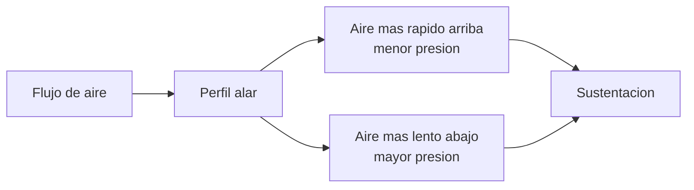
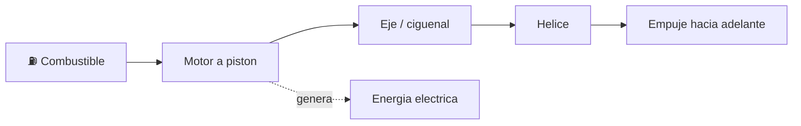

# 🔧 Sistemas mecanicos del avion pequeno

[🏠 Inicio](../../../README.md) · [🛩️ Curso: Aviones pequenos](../README.md) · 🔧 Sistemas mecanicos

Este modulo abre el avion por dentro. Explica cada sistema, como funciona y como
se conecta con los demas. Es la base tecnica para entender los mandos (Modulo 4)
y la fisica del vuelo (Modulo 5).

---

## 1. 🧱 Celula y fuselaje

La celula es la estructura que sostiene todo y le da forma a la aeronave.

- **Fuselaje**: cuerpo central; aloja cabina, carga y une alas y empenaje.
- **Larguerillos y cuadernas**: dan rigidez sin sumar demasiado peso.
- **Revestimiento**: la piel exterior; en muchos casos es estructural.
- **Empenaje**: la cola, que estabiliza el vuelo y sostiene dos superficies de
  control.

---

## 2. 🛩️ Alas y sustentacion

El ala es la superficie que genera la sustentacion al moverse por el aire.

| Elemento del ala | Funcion |
| --- | --- |
| Perfil alar (airfoil) | Forma que crea diferencia de presion y sustentacion. |
| Angulo de ataque | Angulo entre el ala y el aire; a mas angulo, mas sustentacion hasta la entrada en perdida. |
| Flaps | Aumentan sustentacion y resistencia para volar lento en despegue y aterrizaje. |
| Slats / ranuras | Retrasan la entrada en perdida a baja velocidad. |
| Diedro | Inclinacion de las alas que ayuda a la estabilidad lateral. |

---

## 3. 🎚️ Superficies de control

Controlan la aeronave en sus tres ejes. Cada eje tiene su superficie.

| Eje | Movimiento | Superficie | Mando en cabina |
| --- | --- | --- | --- |
| Longitudinal | Alabeo (rolido) | Alerones | Yugo a izquierda / derecha. |
| Lateral | Cabeceo (subir / bajar morro) | Timon de profundidad | Yugo adelante / atras. |
| Vertical | Guinada (nariz izq / der) | Timon de direccion | Pedales. |

- **Alerones**: en los bordes exteriores de las alas; suben un ala y bajan la otra.
- **Timon de profundidad**: en la cola horizontal; sube o baja el morro.
- **Timon de direccion**: en la cola vertical; orienta la nariz y coordina el giro.
- **Compensadores (trim)**: pequenas superficies que alivian la fuerza sostenida
  sobre los mandos.

---

## 4. ⚙️ Grupo motopropulsor

Convierte el combustible en empuje que impulsa al avion.

| Componente | Funcion |
| --- | --- |
| Motor a piston | Quema mezcla de aire y combustible para girar la helice. |
| Helice | Transforma el giro en empuje, como un ala que rota. |
| Carburador / inyeccion | Prepara la mezcla de aire y combustible. |
| Mezcla (mixture) | Ajusta la proporcion aire-combustible segun la altitud. |
| Sistema de combustible | Depositos, bombas y selector de tanques. |
| Sistema electrico | Bateria, alternador; alimenta instrumentos y radio. |

---

## 5. 🛞 Tren de aterrizaje

Sostiene el avion en tierra y absorbe el impacto del aterrizaje.

- **Triciclo**: rueda de nariz mas dos principales; comun y facil de rodar.
- **Convencional (patin de cola)**: dos ruedas adelante y una en la cola; clasico.
- **Fijo o retractil**: el fijo es simple; el retractil reduce resistencia en vuelo.
- **Frenos**: en las ruedas principales, para detener y maniobrar en tierra.

---

## 6. 📟 Instrumentos y sistemas de a bordo

Informan al piloto y sostienen el vuelo cuando no hay referencias visuales.

| Sistema | Funcion |
| --- | --- |
| Instrumentos de presion (Pitot-estatica) | Velocidad, altitud y velocidad vertical. |
| Instrumentos giroscopicos | Actitud, rumbo y viraje. |
| Sistema electrico | Alimenta instrumentos, luces y radio. |
| Avionica y radio | Comunicacion y navegacion (VOR, GPS). |
| Sistema de calefaccion Pitot | Evita el hielo en la toma de presion. |

---

## 🔁 Como se conecta todo

1. El **motor** hace girar la **helice**, que produce **empuje**.
2. El empuje da **velocidad**, y las **alas** convierten esa velocidad en **sustentacion**.
3. Las **superficies de control** orientan la aeronave en los tres ejes.
4. La **celula** mantiene la geometria y transmite las cargas.
5. El **tren de aterrizaje** sostiene el avion en tierra.
6. Los **instrumentos** informan al piloto para volar con seguridad.

Con esto entendido, el [Modulo 4: Mandos](../mandos/manual-mandos-avion-pequeno.md)
muestra como el piloto opera cada uno de estos sistemas.

---

[⬅️ Anterior: Caracteristicas](caracteristicas-avion-pequeno.md) · [➡️ Siguiente: Mandos e instrumentos](../mandos/manual-mandos-avion-pequeno.md)
