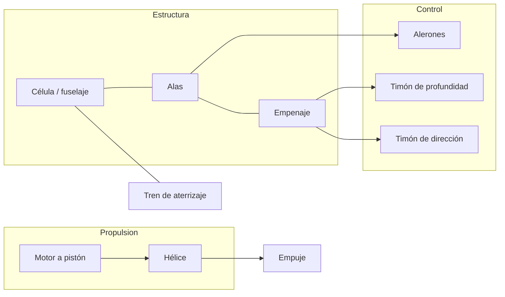
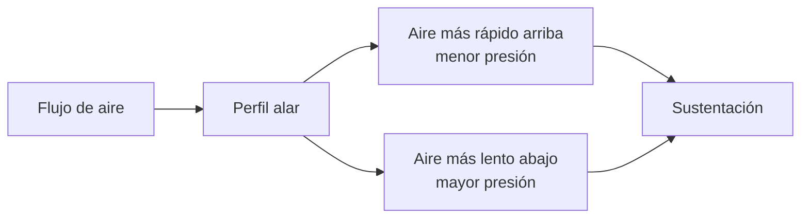
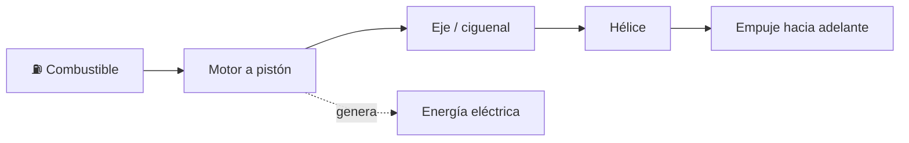

# 🔧 Sistemas mecánicos del avión pequeño

[🏠 Inicio](../../../README.md) · [🛩️ Curso: Aviones pequeños](../README.md) · 🔧 Sistemas mecánicos

Este módulo abre el avión por dentro. Explica cada sistema, como funciona y como
se conecta con los demás. Es la base técnica para entender los mandos (Módulo 4)
y la física del vuelo (Módulo 5).

---

## 1. 🧱 Célula y fuselaje

La célula es la estructura que sostiene todo y le da forma a la aeronave.

- **Fuselaje**: cuerpo central; aloja cabina, carga y une alas y empenaje.
- **Larguerillos y cuadernas**: dan rigidez sin sumar demasiado peso.
- **Revestimiento**: la piel exterior; en muchos casos es estructural.
- **Empenaje**: la cola, que estabiliza el vuelo y sostiene dos superficies de
  control.

---

## 2. 🛩️ Alas y sustentación

El ala es la superficie que genera la sustentación al moverse por el aire.

| Elemento del ala | Función |
| --- | --- |
| Perfil alar (airfoil) | Forma que crea diferencia de presión y sustentación. |
| Ángulo de ataque | Ángulo entre el ala y el aire; a más ángulo, más sustentación hasta la entrada en pérdida. |
| Flaps | Aumentan sustentación y resistencia para volar lento en despegue y aterrizaje. |
| Slats / ranuras | Retrasan la entrada en pérdida a baja velocidad. |
| Diedro | Inclinación de las alas que ayuda a la estabilidad lateral. |

---

## 3. 🎚️ Superficies de control

Controlan la aeronave en sus tres ejes. Cada eje tiene su superficie.

| Eje | Movimiento | Superficie | Mando en cabina |
| --- | --- | --- | --- |
| Longitudinal | Alabeo (rolido) | Alerones | Yugo a izquierda / derecha. |
| Lateral | Cabeceo (subir / bajar morro) | Timón de profundidad | Yugo adelante / atrás. |
| Vertical | Guiñada (nariz izq / der) | Timón de dirección | Pedales. |

- **Alerones**: en los bordes exteriores de las alas; suben un ala y bajan la otra.
- **Timón de profundidad**: en la cola horizontal; sube o baja el morro.
- **Timón de dirección**: en la cola vertical; orienta la nariz y coordina el giro.
- **Compensadores (trim)**: pequeñas superficies que alivian la fuerza sostenida
  sobre los mandos.

---

## 4. ⚙️ Grupo motopropulsor

Convierte el combustible en empuje que impulsa al avión.

| Componente | Función |
| --- | --- |
| Motor a pistón | Quema mezcla de aire y combustible para girar la hélice. |
| Hélice | Transforma el giro en empuje, como un ala que rota. |
| Carburador / inyección | Prepara la mezcla de aire y combustible. |
| Mezcla (mixture) | Ajusta la proporción aire-combustible según la altitud. |
| Sistema de combustible | Depósitos, bombas y selector de tanques. |
| Sistema eléctrico | Batería, alternador; alimenta instrumentos y radio. |

---

## 5. 🛞 Tren de aterrizaje

Sostiene el avión en tierra y absorbe el impacto del aterrizaje.

- **Triciclo**: rueda de nariz más dos principales; común y fácil de rodar.
- **Convencional (patín de cola)**: dos ruedas adelante y una en la cola; clásico.
- **Fijo o retráctil**: el fijo es simple; el retráctil reduce resistencia en vuelo.
- **Frenos**: en las ruedas principales, para detener y maniobrar en tierra.

---

## 6. 📟 Instrumentos y sistemas de a bordo

Informan al piloto y sostienen el vuelo cuando no hay referencias visuales.

| Sistema | Función |
| --- | --- |
| Instrumentos de presión (Pitot-estatica) | Velocidad, altitud y velocidad vertical. |
| Instrumentos giroscópicos | Actitud, rumbo y viraje. |
| Sistema eléctrico | Alimenta instrumentos, luces y radio. |
| Avionica y radio | Comunicación y navegación (VOR, GPS). |
| Sistema de calefacción Pitot | Evita el hielo en la toma de presión. |

---

## 🔁 Cómo se conecta todo

1. El **motor** hace girar la **hélice**, que produce **empuje**.
2. El empuje da **velocidad**, y las **alas** convierten esa velocidad en **sustentación**.
3. Las **superficies de control** orientan la aeronave en los tres ejes.
4. La **célula** mantiene la geometría y transmite las cargas.
5. El **tren de aterrizaje** sostiene el avión en tierra.
6. Los **instrumentos** informan al piloto para volar con seguridad.

Con esto entendido, el [Módulo 4: Mandos](../mandos/manual-mandos-avion-pequeno.md)
muestra como el piloto opera cada uno de estos sistemas.

---

[⬅️ Anterior: Características](caracteristicas-avion-pequeno.md) · [➡️ Siguiente: Mandos e instrumentos](../mandos/manual-mandos-avion-pequeno.md)
