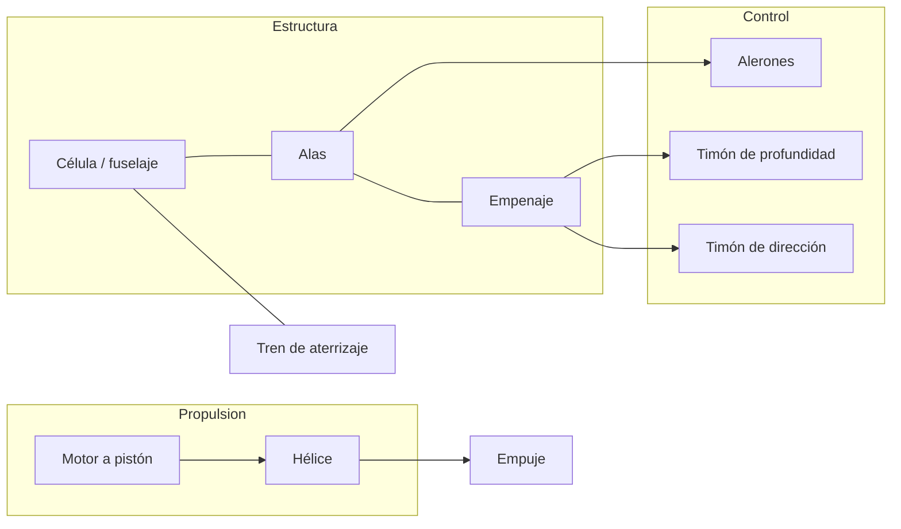
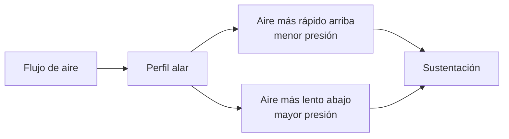
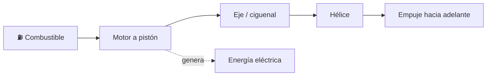
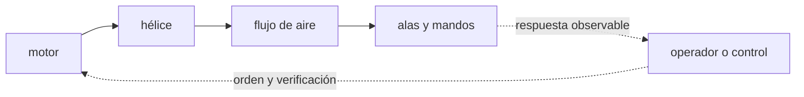

<!-- clase-meta
tipo_documento: clase
clase: 4
codigo: AVIONESPEQUE-04
curso: aviones-pequenos
titulo: "Sistemas mecánicos del avión pequeño"
modalidad: "teórica aplicada"
duracion_minutos: 90
nivel: introductorio
prerrequisito: AVIONESPEQUE-03
competencia: "comprension_de_sistemas"
resultados_aprendizaje:
  - "Explicar Célula y fuselaje, Alas y sustentación, Superficies de control y Grupo motopropulsor con vocabulario propio de Aviones pequeños."
  - "Aplicar esos conceptos a una decisión segura o a un escenario de simulación de Aviones pequeños."
evidencia: "Esquema con flujos de energía, materia o información anotados."
criterio_aprobacion: "Las conexiones esenciales son correctas y la consecuencia de la falla se propaga de manera coherente."
fuentes: manuales/fuentes.md
ultima_revision: 2026-09-10
-->

# 🔧 Sistemas mecánicos del avión pequeño

[🏠 Inicio](../../../README.md) · [🛩️ Curso: Aviones pequeños](../README.md) · 🔧 Sistemas mecánicos

Esta clase abre el avión por dentro. Explica cada sistema, como funciona y como
se conecta con los demás. Es la base técnica para entender los mandos (Clase 5)
y la física del vuelo (Clase 6).

```mermaid
flowchart LR
    subgraph Estructura
        Ce[Célula / fuselaje] --- Al[Alas]
        Al --- Emp[Empenaje]
    end
    subgraph Control
        Ale[Alerones]
        Prof[Timón de profundidad]
        Dir[Timón de dirección]
    end
    subgraph Propulsion
        Mot[Motor a pistón] --> Hel[Hélice]
    end
    Al --> Ale
    Emp --> Prof
    Emp --> Dir
    Hel --> Emp2[Empuje]
    Ce --- Tren[Tren de aterrizaje]
```

---

## 1. 🧱 Célula y fuselaje

La célula es la estructura que sostiene todo y le da forma a la aeronave.

- **Fuselaje**: cuerpo central; aloja cabina, carga y une alas y empenaje.
- **Larguerillos y cuadernas**: dan rigidez sin sumar demasiado peso.
- **Revestimiento**: la piel exterior; en muchos casos es estructural.
- **Empenaje**: la cola, que estabiliza el vuelo y sostiene dos superficies de
  control.

---

## 2. 🛩️ Alas y sustentación

El ala es la superficie que genera la sustentación al moverse por el aire.

```mermaid
flowchart LR
    Aire[Flujo de aire] --> Perfil[Perfil alar]
    Perfil --> Arriba[Aire más rápido arriba<br/>menor presión]
    Perfil --> Abajo[Aire más lento abajo<br/>mayor presión]
    Arriba --> Sust[Sustentación]
    Abajo --> Sust
```

| Elemento del ala | Función |
| --- | --- |
| Perfil alar (airfoil) | Forma que crea diferencia de presión y sustentación. |
| Ángulo de ataque | Ángulo entre el ala y el aire; a más ángulo, más sustentación hasta la entrada en pérdida. |
| Flaps | Aumentan sustentación y resistencia para volar lento en despegue y aterrizaje. |
| Slats / ranuras | Retrasan la entrada en pérdida a baja velocidad. |
| Diedro | Inclinación de las alas que ayuda a la estabilidad lateral. |

---

## 3. 🎚️ Superficies de control

Controlan la aeronave en sus tres ejes. Cada eje tiene su superficie.

| Eje | Movimiento | Superficie | Mando en cabina |
| --- | --- | --- | --- |
| Longitudinal | Alabeo (rolido) | Alerones | Yugo a izquierda / derecha. |
| Lateral | Cabeceo (subir / bajar morro) | Timón de profundidad | Yugo adelante / atrás. |
| Vertical | Guiñada (nariz izq / der) | Timón de dirección | Pedales. |

- **Alerones**: en los bordes exteriores de las alas; suben un ala y bajan la otra.
- **Timón de profundidad**: en la cola horizontal; sube o baja el morro.
- **Timón de dirección**: en la cola vertical; orienta la nariz y coordina el giro.
- **Compensadores (trim)**: pequeñas superficies que alivian la fuerza sostenida
  sobre los mandos.

---

## 4. ⚙️ Grupo motopropulsor

Convierte el combustible en empuje que impulsa al avión.

```mermaid
flowchart LR
    Comb[⛽ Combustible] --> Motor[Motor a pistón]
    Motor --> Eje[Eje / ciguenal]
    Eje --> Helice[Hélice]
    Helice --> Empuje[Empuje hacia adelante]
    Motor -. genera .-> Electrico[Energía eléctrica]
```

| Componente | Función |
| --- | --- |
| Motor a pistón | Quema mezcla de aire y combustible para girar la hélice. |
| Hélice | Transforma el giro en empuje, como un ala que rota. |
| Carburador / inyección | Prepara la mezcla de aire y combustible. |
| Mezcla (mixture) | Ajusta la proporción aire-combustible según la altitud. |
| Sistema de combustible | Depósitos, bombas y selector de tanques. |
| Sistema eléctrico | Batería, alternador; alimenta instrumentos y radio. |

---

## 5. 🛞 Tren de aterrizaje

Sostiene el avión en tierra y absorbe el impacto del aterrizaje.

- **Triciclo**: rueda de nariz más dos principales; común y fácil de rodar.
- **Convencional (patín de cola)**: dos ruedas adelante y una en la cola; clásico.
- **Fijo o retráctil**: el fijo es simple; el retráctil reduce resistencia en vuelo.
- **Frenos**: en las ruedas principales, para detener y maniobrar en tierra.

---

## 6. 📟 Instrumentos y sistemas de a bordo

Informan al piloto y sostienen el vuelo cuando no hay referencias visuales.

| Sistema | Función |
| --- | --- |
| Instrumentos de presión (Pitot-estática) | Velocidad, altitud y velocidad vertical. |
| Instrumentos giroscópicos | Actitud, rumbo y viraje. |
| Sistema eléctrico | Alimenta instrumentos, luces y radio. |
| Avionica y radio | Comunicación y navegación (VOR, GPS). |
| Sistema de calefacción Pitot | Evita el hielo en la toma de presión. |

---

## 🔁 Cómo se conecta todo

1. El **motor** hace girar la **hélice**, que produce **empuje**.
2. El empuje da **velocidad**, y las **alas** convierten esa velocidad en **sustentación**.
3. Las **superficies de control** orientan la aeronave en los tres ejes.
4. La **célula** mantiene la geometría y transmite las cargas.
5. El **tren de aterrizaje** sostiene el avión en tierra.
6. Los **instrumentos** informan al piloto para volar con seguridad.

Con esto entendido, el [Clase 5: Mandos](../mandos/manual-mandos-avion-pequeno.md)
muestra como el piloto opera cada uno de estos sistemas.

## 🧭 Guía de estudio aplicada

### Pregunta guía

¿Cómo ayuda **Célula y fuselaje, Alas y sustentación, Superficies de control y Grupo motopropulsor** a **seguir una alteración desde motor hasta alas y mandos durante aproximación con viento cruzado y pista corta**?

### Explicación razonada

El funcionamiento puede leerse como una cadena causal: motor entrega o transforma energía; hélice la adapta; flujo de aire la transmite o gobierna; y alas y mandos produce el efecto observable. La cadena no es lineal en sentido estricto: sensores, estructura y operador cierran el lazo. Si un eslabón se degrada, la señal importante es cómo cambia el estado de alas y mandos y qué margen queda.

```mermaid
flowchart LR
    A["motor"] --> B["hélice"] --> C["flujo de aire"] --> D["alas y mandos"]
    D -. respuesta observable .-> O["operador o control"]
    O -. orden y verificación .-> A
```

Esta clase se conecta con el resto del curso mediante **balance entre sustentación, peso, empuje y resistencia dentro de una envolvente limitada**. El hilo de
seguridad consiste en reconocer a tiempo **pérdida aerodinámica o salida de pista por velocidad y trayectoria inestables** y poder justificar la decisión
**estabilizar aproximación y frustrar si no se cumplen criterios antes del umbral**; en clases posteriores cambiará el ángulo de análisis, no esa relación causal.
La lectura funcional común sigue **motor → hélice → flujo de aire → alas y mandos**, de modo que cada concepto pueda
ubicarse dentro del funcionamiento completo y no quede como un dato aislado.

**Apoyo documental:** [Aviation Handbooks and Manuals](https://www.faa.gov/regulations_policies/handbooks_manuals) aporta aerodinámica, sistemas y operación;
[Normativa aeronáutica](https://www.dgac.gob.cl/normativa/) se usa para marco aeronáutico chileno. Estas fuentes
se contrastan con el alcance de la clase y no sustituyen un manual de equipo concreto.

### Caso resuelto: de la observación a la decisión

1. **Entrada:** identifica el estado inicial de **motor** durante **aproximación con viento cruzado y pista corta**.
2. **Transformación:** explica qué hacen **hélice** y **flujo de aire**, y qué magnitud cambia en cada paso.
3. **Salida:** comprueba el efecto esperado en **alas y mandos** y busca una desviación temprana.
4. **Falla razonada:** si aparece **pérdida aerodinámica o salida de pista por velocidad y trayectoria inestables**, retrocede por la cadena antes de ordenar otra acción.

### Comprueba tu comprensión

1. Si se degrada **hélice**, ¿qué efecto esperarías primero en **flujo de aire** y después en **alas y mandos**?
2. ¿Qué observación ayudaría a diferenciar una falla de **motor** de una falla de **flujo de aire**?
3. ¿Por qué una segunda orden podría agravar **pérdida aerodinámica o salida de pista por velocidad y trayectoria inestables**?

Orientación para revisar tus respuestas

- La primera respuesta debe relacionar el eslabón elegido con un efecto posterior, no solo nombrarlo.
- La segunda debe proponer una señal medible u observable y explicar qué tendencia sería preocupante.
- La tercera debe cambiar al menos una variable de capacidad, mando, entorno o margen de seguridad.

## 🎓 Cierre de clase

- **Actividad:** Dibuja un esquema funcional de Aviones pequeños que conecte Célula y fuselaje, Alas y sustentación, Superficies de control y Grupo motopropulsor; después predice el efecto de una falla simulada.
- **Evidencia:** Esquema con flujos de energía, materia o información anotados.
- **Criterio de aprobación:** Las conexiones esenciales son correctas y la consecuencia de la falla se propaga de manera coherente.
- **Transferencia:** explica qué cambiaría al pasar a otra variante de esta máquina.

### Fuentes de esta clase

- [US-FAA-HANDBOOKS](https://www.faa.gov/regulations_policies/handbooks_manuals): Aviation Handbooks and Manuals, FAA. Uso: aerodinámica, sistemas y operación.
- [CL-DGAC](https://www.dgac.gob.cl/normativa/): Normativa aeronáutica, DGAC Chile. Uso: marco aeronáutico chileno.

> Las fuentes sostienen el marco conceptual y normativo; esta clase no reemplaza el manual
> del fabricante, la formación certificada ni la habilitación exigida para operar equipos reales.

---

[⬅️ Anterior: Modelos y variantes](../modelos/modelos-avion-pequeno.md) · [➡️ Siguiente: Mandos e instrumentos](../mandos/manual-mandos-avion-pequeno.md)
