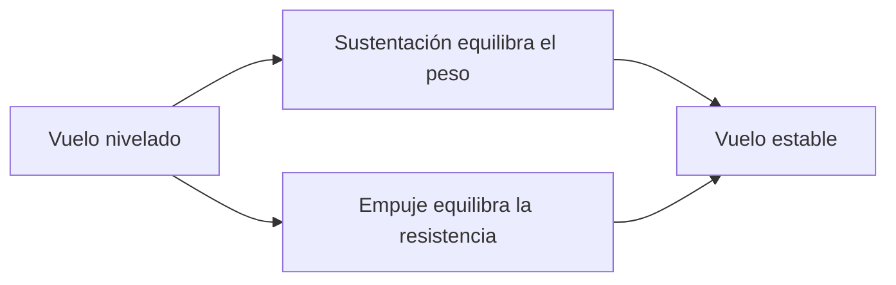

# 🧰 Recursos del avión pequeño

[🏠 Inicio](../../../README.md) · [🛩️ Curso: Aviones pequeños](../README.md) · 🧰 Recursos

Glosario específico, enlaces y diagramas de apoyo del curso de aviones pequeños.
Amplia el [glosario general](../../../docs/05-glosario-general.md).

---

## 📖 Glosario específico

| Término | Definición |
| --- | --- |
| Sustentación | Fuerza hacia arriba que genera el ala al moverse por el aire. |
| Ángulo de ataque | Ángulo entre el ala y el aire incidente. |
| Entrada en pérdida | Pérdida brusca de sustentación al superar el ángulo de ataque límite. |
| Cabeceo | Movimiento de subir o bajar el morro (eje lateral). |
| Alabeo | Inclinación de las alas (eje longitudinal). |
| Guiñada | Giro de la nariz a izquierda o derecha (eje vertical). |
| Flaps | Superficies que aumentan sustentación y resistencia a baja velocidad. |
| Trim | Compensador que alivia la fuerza sostenida sobre los mandos. |
| IAS | Velocidad indicada respecto al aire, en nudos. |

---

## 🗺️ Diagrama de las cuatro fuerzas

---

## 🔗 Enlaces y fuentes

- Marco legal: [⚖️ docs/07-marco-legal-chile.md](../../../docs/07-marco-legal-chile.md)
- Registro de fuentes: [📚 manuales/fuentes.md](../../../manuales/fuentes.md)
- Reglamentación aeronáutica (DGAC): ver el registro de fuentes.

Registrar cada recurso nuevo con su origen y licencia, siguiendo
[`recursos/README.md`](../../../recursos/README.md).

---

[🎓 Portada del curso](../README.md) · [⬅️ Anterior: Diseño de simulación](../simulacion/diseno-simulador-avion-pequeno.md)
