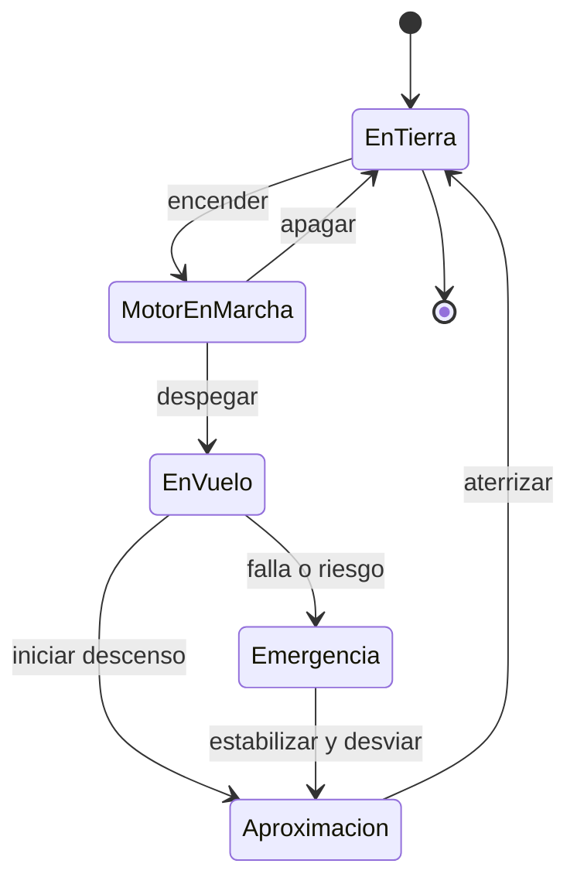

# 🎮 Diseño de simulación del avión pequeño

[🏠 Inicio](../../../README.md) · [🛩️ Curso: Aviones pequeños](../README.md) · 🎮 Simulación

## Objetivo de la simulación

Que el usuario aprenda a despegar, volar nivelado, virar coordinado, gestionar la
altitud y aterrizar con seguridad, respetando el circuito de tráfico y las reglas
básicas del espacio aéreo, de forma progresiva.

## Nivel de realismo

- Nivel elegido: se ofrece del 1 al 3 (ver `docs/03-niveles-de-realismo.md`).
- Justificación: el avión pequeño agrega el vuelo en tres ejes y la meteorología,
  por lo que se recomienda tras dominar un vehículo terrestre.

## Variables principales

| Variable | Tipo | Rango | Afecta a | Comentarios |
| --- | --- | --- | --- | --- |
| Velocidad (IAS) | numérica | 0-160 nudos | Sustentación y control | Clave para evitar la pérdida. |
| Altitud | numérica | 0-15000 pies | Rendimiento y navegación | Ligada a la presión local. |
| Actitud (cabeceo/alabeo) | numérica | -60..60 grados | Trayectoria de vuelo | Referencia del horizonte artificial. |
| Ángulo de ataque | numérica | 0-18 grados | Sustentación y pérdida | Supera el límite y hay pérdida. |
| Potencia del motor | numérica | 0-100% | Empuje disponible | Regulada por el acelerador. |
| Configuración de flaps | discreta | 0..3 etapas | Sustentación y resistencia | Para despegue y aterrizaje. |
| Combustible | numérica | 0-100% | Autonomía | Incluye reserva obligatoria. |
| Viento | vectorial | dirección + fuerza | Rumbo y aterrizaje | El cruzado exige corrección. |

## Ciclo básico

1. Leer entrada del usuario (yugo, pedales, potencia, flaps, trim).
2. Actualizar estado del motor y la configuración aerodinámica.
3. Calcular fuerzas: sustentación, peso, empuje y resistencia.
4. Aplicar el entorno (viento, densidad del aire, terreno).
5. Actualizar velocidad, altitud, actitud y posición.
6. Refrescar instrumentos y retroalimentación (sonido, alertas de pérdida).

## Modos de juego futuros

- Tutorial guiado de cabina y checklist.
- Práctica de circuito de tráfico y aterrizajes.
- Misiones de navegación entre aeródromos.
- Desafíos de viento cruzado y meteorología.
- Situaciones de emergencia controladas (falla de motor) sin contenido sensible.

## Elementos fuera de alcance

- Maniobras acrobaticas peligrosas presentadas como recomendables.
- Reproducción de vuelo temerario como objetivo del juego.
- Datos técnicos que permitan alterar sistemas reales de una aeronave.

## Pendientes

- [ ] Definir valores por defecto de cada variable por tipo de avión.
- [ ] Prototipar el modelo de sustentación y pérdida.
- [ ] Ajustar el modelo de viento cruzado en aterrizaje.
- [ ] Agregar fuentes técnicas públicas a [`manuales/fuentes.md`](../../../manuales/fuentes.md).

---

[⬅️ Anterior: Reglamentos](../reglamentos/reglamentos-avion-pequeno.md) · [➡️ Siguiente: Recursos](../recursos/recursos-avion-pequeno.md)
