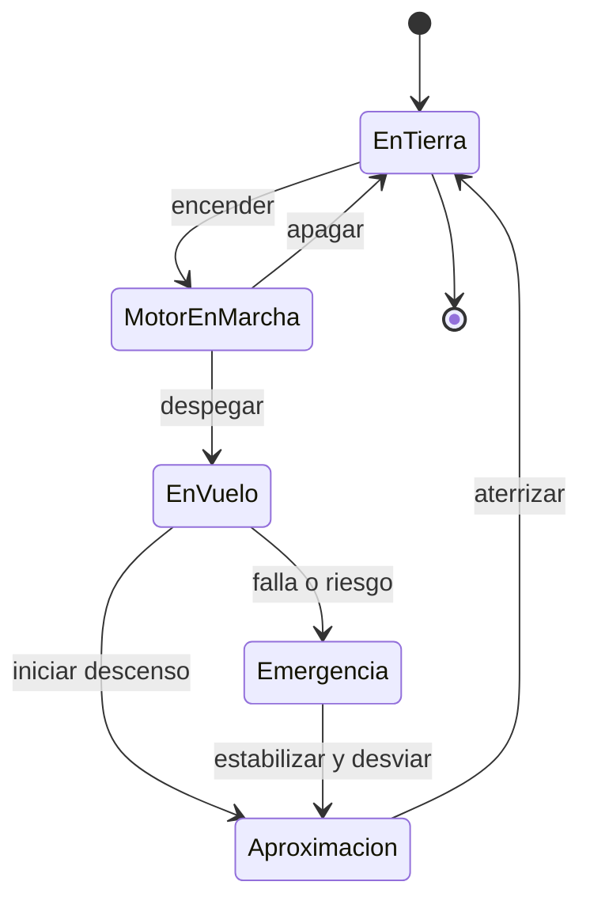

# 🎮 Diseno de simulacion del avion pequeno

[🏠 Inicio](../../../README.md) · [🛩️ Curso: Aviones pequenos](../README.md) · 🎮 Simulacion

## Objetivo de la simulacion

Que el usuario aprenda a despegar, volar nivelado, virar coordinado, gestionar la
altitud y aterrizar con seguridad, respetando el circuito de trafico y las reglas
basicas del espacio aereo, de forma progresiva.

## Nivel de realismo

- Nivel elegido: se ofrece del 1 al 3 (ver `docs/03-niveles-de-realismo.md`).
- Justificacion: el avion pequeno agrega el vuelo en tres ejes y la meteorologia,
  por lo que se recomienda tras dominar un vehiculo terrestre.

## Variables principales

| Variable | Tipo | Rango | Afecta a | Comentarios |
| --- | --- | --- | --- | --- |
| Velocidad (IAS) | numerica | 0-160 nudos | Sustentacion y control | Clave para evitar la perdida. |
| Altitud | numerica | 0-15000 pies | Rendimiento y navegacion | Ligada a la presion local. |
| Actitud (cabeceo/alabeo) | numerica | -60..60 grados | Trayectoria de vuelo | Referencia del horizonte artificial. |
| Angulo de ataque | numerica | 0-18 grados | Sustentacion y perdida | Supera el limite y hay perdida. |
| Potencia del motor | numerica | 0-100% | Empuje disponible | Regulada por el acelerador. |
| Configuracion de flaps | discreta | 0..3 etapas | Sustentacion y resistencia | Para despegue y aterrizaje. |
| Combustible | numerica | 0-100% | Autonomia | Incluye reserva obligatoria. |
| Viento | vectorial | direccion + fuerza | Rumbo y aterrizaje | El cruzado exige correccion. |

## Ciclo basico

1. Leer entrada del usuario (yugo, pedales, potencia, flaps, trim).
2. Actualizar estado del motor y la configuracion aerodinamica.
3. Calcular fuerzas: sustentacion, peso, empuje y resistencia.
4. Aplicar el entorno (viento, densidad del aire, terreno).
5. Actualizar velocidad, altitud, actitud y posicion.
6. Refrescar instrumentos y retroalimentacion (sonido, alertas de perdida).

## Modos de juego futuros

- Tutorial guiado de cabina y checklist.
- Practica de circuito de trafico y aterrizajes.
- Misiones de navegacion entre aerodromos.
- Desafios de viento cruzado y meteorologia.
- Situaciones de emergencia controladas (falla de motor) sin contenido sensible.

## Elementos fuera de alcance

- Maniobras acrobaticas peligrosas presentadas como recomendables.
- Reproduccion de vuelo temerario como objetivo del juego.
- Datos tecnicos que permitan alterar sistemas reales de una aeronave.

## Pendientes

- [ ] Definir valores por defecto de cada variable por tipo de avion.
- [ ] Prototipar el modelo de sustentacion y perdida.
- [ ] Ajustar el modelo de viento cruzado en aterrizaje.
- [ ] Agregar fuentes tecnicas publicas a [`manuales/fuentes.md`](../../../manuales/fuentes.md).

---

[⬅️ Anterior: Reglamentos](../reglamentos/reglamentos-avion-pequeno.md) · [➡️ Siguiente: Recursos](../recursos/recursos-avion-pequeno.md)
