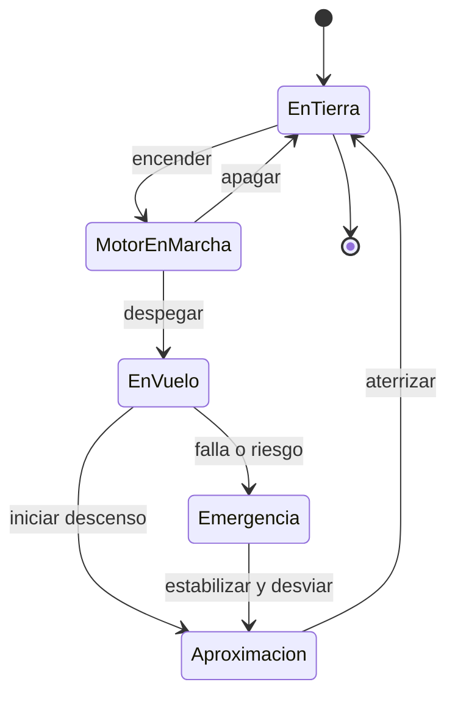
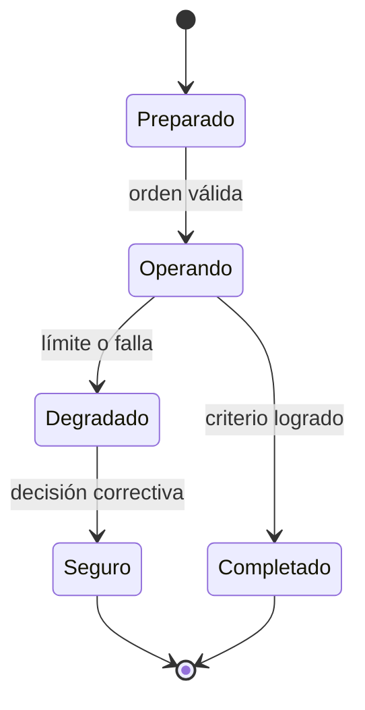

<!-- clase-meta
tipo_documento: clase
clase: 9
codigo: AVIONESPEQUE-09
curso: aviones-pequenos
titulo: "Diseño de simulación del avión pequeño"
modalidad: "laboratorio de diseño"
duracion_minutos: 90
nivel: introductorio
prerrequisito: AVIONESPEQUE-08
competencia: "modelado_de_simulacion"
resultados_aprendizaje:
  - "Explicar objetivo, variables, estados, ciclo y escenarios de simulación con vocabulario propio de Aviones pequeños."
  - "Aplicar esos conceptos a una decisión segura o a un escenario de simulación de Aviones pequeños."
evidencia: "Ficha de escenario y diagrama de estados."
criterio_aprobacion: "El modelo es específico de la máquina, medible, seguro y trazable a clases anteriores."
fuentes: manuales/fuentes.md
ultima_revision: 2026-09-10
-->

# 🎮 Diseño de simulación del avión pequeño

[🏠 Inicio](../../../README.md) · [🛩️ Curso: Aviones pequeños](../README.md) · 🎮 Simulación

```mermaid
stateDiagram-v2
    [*] --> EnTierra
    EnTierra --> MotorEnMarcha: encender
    MotorEnMarcha --> EnVuelo: despegar
    EnVuelo --> Aproximacion: iniciar descenso
    Aproximacion --> EnTierra: aterrizar
    EnVuelo --> Emergencia: falla o riesgo
    Emergencia --> Aproximacion: estabilizar y desviar
    MotorEnMarcha --> EnTierra: apagar
    EnTierra --> [*]
```

## Objetivo de la simulación

Que el usuario aprenda a despegar, volar nivelado, virar coordinado, gestionar la
altitud y aterrizar con seguridad, respetando el circuito de tráfico y las reglas
básicas del espacio aéreo, de forma progresiva.

## Nivel de realismo

- Nivel elegido: se ofrece del 1 al 3 (ver `docs/03-niveles-de-realismo.md`).
- Justificación: el avión pequeño agrega el vuelo en tres ejes y la meteorología,
  por lo que se recomienda tras dominar un vehículo terrestre.

## Variables principales

| Variable | Tipo | Rango | Afecta a | Comentarios |
| --- | --- | --- | --- | --- |
| Velocidad (IAS) | numérica | 0-160 nudos | Sustentación y control | Clave para evitar la pérdida. |
| Altitud | numérica | 0-15000 pies | Rendimiento y navegación | Ligada a la presión local. |
| Actitud (cabeceo/alabeo) | numérica | -60..60 grados | Trayectoria de vuelo | Referencia del horizonte artificial. |
| Ángulo de ataque | numérica | 0-18 grados | Sustentación y pérdida | Supera el límite y hay pérdida. |
| Potencia del motor | numérica | 0-100% | Empuje disponible | Regulada por el acelerador. |
| Configuración de flaps | discreta | 0..3 etapas | Sustentación y resistencia | Para despegue y aterrizaje. |
| Combustible | numérica | 0-100% | Autonomía | Incluye reserva obligatoria. |
| Viento | vectorial | dirección + fuerza | Rumbo y aterrizaje | El cruzado exige corrección. |

## Ciclo básico

1. Leer entrada del usuario (yugo, pedales, potencia, flaps, trim).
2. Actualizar estado del motor y la configuración aerodinámica.
3. Calcular fuerzas: sustentación, peso, empuje y resistencia.
4. Aplicar el entorno (viento, densidad del aire, terreno).
5. Actualizar velocidad, altitud, actitud y posición.
6. Refrescar instrumentos y retroalimentación (sonido, alertas de pérdida).

## Modos de juego futuros

- Tutorial guiado de cabina y checklist.
- Práctica de circuito de tráfico y aterrizajes.
- Misiones de navegación entre aeródromos.
- Desafíos de viento cruzado y meteorología.
- Situaciones de emergencia controladas (falla de motor) sin contenido sensible.

## Elementos fuera de alcance

- Maniobras acrobaticas peligrosas presentadas como recomendables.
- Reproducción de vuelo temerario como objetivo del juego.
- Datos técnicos que permitan alterar sistemas reales de una aeronave.

## Pendientes

- [ ] Definir valores por defecto de cada variable por tipo de avión.
- [ ] Prototipar el modelo de sustentación y pérdida.
- [ ] Ajustar el modelo de viento cruzado en aterrizaje.
- [ ] Agregar fuentes técnicas públicas a [`manuales/fuentes.md`](../../../manuales/fuentes.md).

## 🧭 Guía de estudio aplicada

### Pregunta guía

¿Cómo ayuda **Objetivo de la simulación, Nivel de realismo, Variables principales y Ciclo básico** a **modelar aproximación con viento cruzado y pista corta como estados, variables y decisiones observables**?

### Explicación razonada

Una simulación de Aviones pequeños es educativa si representa decisiones y consecuencias. Como mínimo debe modelar el estado de motor, la respuesta de hélice, la transición en flujo de aire y el resultado en alas y mandos. El escenario «aproximación con viento cruzado y pista corta» es valioso porque obliga a observar, formular una hipótesis, actuar y comprobar.

```mermaid
stateDiagram-v2
    [*] --> Preparado
    Preparado --> Operando: orden válida
    Operando --> Degradado: límite o falla
    Degradado --> Seguro: decisión correctiva
    Operando --> Completado: criterio logrado
    Seguro --> [*]
    Completado --> [*]
```

Esta clase se conecta con el resto del curso mediante **balance entre sustentación, peso, empuje y resistencia dentro de una envolvente limitada**. El hilo de
seguridad consiste en reconocer a tiempo **pérdida aerodinámica o salida de pista por velocidad y trayectoria inestables** y poder justificar la decisión
**estabilizar aproximación y frustrar si no se cumplen criterios antes del umbral**; en clases posteriores cambiará el ángulo de análisis, no esa relación causal.
La lectura funcional común sigue **motor → hélice → flujo de aire → alas y mandos**, de modo que cada concepto pueda
ubicarse dentro del funcionamiento completo y no quede como un dato aislado.

**Apoyo documental:** [Aviation Handbooks and Manuals](https://www.faa.gov/regulations_policies/handbooks_manuals) aporta aerodinámica, sistemas y operación;
[Normativa aeronáutica](https://www.dgac.gob.cl/normativa/) se usa para marco aeronáutico chileno. Estas fuentes
se contrastan con el alcance de la clase y no sustituyen un manual de equipo concreto.

### Caso resuelto: de la observación a la decisión

1. **Estado inicial:** representa aproximación con viento cruzado y pista corta con valores observables para **motor**, **hélice**, **flujo de aire** y **alas y mandos**.
2. **Decisión del estudiante:** ofrece una elección que cambie el estado, no una animación automática.
3. **Consecuencia:** modela la tendencia hacia **pérdida aerodinámica o salida de pista por velocidad y trayectoria inestables** y una señal previa que permita corregir.
4. **Cierre:** evalúa la explicación de la decisión, además de si el estudiante “ganó” el escenario.

### Comprueba tu comprensión

1. ¿Qué cuatro estados mínimos necesita el escenario «aproximación con viento cruzado y pista corta»?
2. ¿Qué variable anticipa **pérdida aerodinámica o salida de pista por velocidad y trayectoria inestables** antes de llegar al estado de falla?
3. ¿Cómo evaluarías la explicación del estudiante y no solo el resultado final?

Orientación para revisar tus respuestas

- La primera respuesta debe relacionar el eslabón elegido con un efecto posterior, no solo nombrarlo.
- La segunda debe proponer una señal medible u observable y explicar qué tendencia sería preocupante.
- La tercera debe cambiar al menos una variable de capacidad, mando, entorno o margen de seguridad.

## 🎓 Cierre de clase

- **Actividad:** Diseña un escenario educativo de Aviones pequeños basado en objetivo, variables, estados, ciclo y escenarios de simulación, con entradas, estados, variables y criterio de cierre.
- **Evidencia:** Ficha de escenario y diagrama de estados.
- **Criterio de aprobación:** El modelo es específico de la máquina, medible, seguro y trazable a clases anteriores.
- **Transferencia:** explica qué cambiaría al pasar a otra variante de esta máquina.

### Fuentes de esta clase

- [US-FAA-HANDBOOKS](https://www.faa.gov/regulations_policies/handbooks_manuals): Aviation Handbooks and Manuals, FAA. Uso: aerodinámica, sistemas y operación.
- [CL-DGAC](https://www.dgac.gob.cl/normativa/): Normativa aeronáutica, DGAC Chile. Uso: marco aeronáutico chileno.

> Las fuentes sostienen el marco conceptual y normativo; esta clase no reemplaza el manual
> del fabricante, la formación certificada ni la habilitación exigida para operar equipos reales.

---

[⬅️ Anterior: Reglamentos](../reglamentos/reglamentos-avion-pequeno.md) · [➡️ Siguiente: Recursos](../recursos/recursos-avion-pequeno.md)
