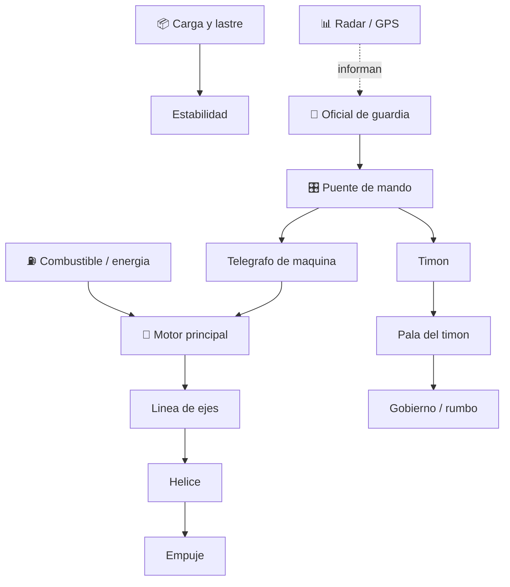

# 🚢 Curso: Barcos mercantes

[🏠 Inicio](../../README.md) · [🚙 Catalogo de vehiculos](../README.md) · [🎓 Guia de curso](../../docs/08-guia-de-estilo-y-curso.md)

> **Curso civil de navegacion mercante.** Documenta el buque mercante de
> principio a fin: historia, caracteristicas, mecanica naval en profundidad,
> puente de mando, fisica de flotacion y gobierno, entornos, reglamentos
> maritimos chilenos e internacionales y diseno de simulacion.

---

## 🎯 Objetivos de aprendizaje

Al terminar este curso deberias poder:

- Explicar como un buque mercante flota, avanza, gobierna y se detiene.
- Identificar sus sistemas (casco, propulsion, gobierno, carga) y como se conectan.
- Reconocer los mandos e instrumentos del puente y su funcion.
- Comprender la fisica de la navegacion (flotacion, empuje, inercia de grandes masas).
- Conocer los reglamentos aplicables (COLREG, SOLAS, MARPOL, DIRECTEMAR).
- Traducir todo lo anterior en variables de un simulador educativo.

---

## 🗺️ Mapa del vehiculo

---

## 📚 Modulos del curso

| # | Modulo | Contenido | Enlace |
| :-: | --- | --- | --- |
| 1 | 📜 Historia | Origen y evolucion del buque mercante, linea de tiempo. | [Abrir](historia/historia-barco-mercante.md) |
| 2 | 📋 Caracteristicas | Que es, tipos de buque mercante y para que sirve cada uno. | [Abrir](operacion/caracteristicas-barco-mercante.md) |
| 3 | 🔧 Sistemas mecanicos | Casco, propulsion, gobierno, carga, estiba y estabilidad. | [Abrir](operacion/sistemas-mecanicos-barco-mercante.md) |
| 4 | 🎛️ Mandos e instrumentos | Puente de mando, controles e instrumentos de navegacion. | [Abrir](mandos/manual-mandos-barco-mercante.md) |
| 5 | 🧪 Principios y operacion | Fisica de flotacion y gobierno, fases de navegacion. | [Abrir](operacion/principios-barco-mercante.md) |
| 6 | 🌍 Entornos de trabajo | Puerto, costa, mar abierto y clima. | [Abrir](operacion/entornos-barco-mercante.md) |
| 7 | ⚖️ Reglamentos | COLREG, SOLAS, MARPOL, STCW y marco DIRECTEMAR. | [Abrir](reglamentos/reglamentos-barco-mercante.md) |
| 8 | 🎮 Diseno de simulacion | Variables, ciclo y modos de simulacion. | [Abrir](simulacion/diseno-simulador-barco-mercante.md) |
| 9 | 🧰 Recursos | Glosario nautico, enlaces y diagramas. | [Abrir](recursos/recursos-barco-mercante.md) |

---

## 🧩 Requisitos previos

Conviene haber visto antes el curso de [🏍️ Motos](../motos/README.md) para
manejar conceptos basicos de propulsion, frenado e inercia. El buque agrega la
flotacion, la inercia de grandes masas y las reglas maritimas. Marco legal comun
en [⚖️ docs/07-marco-legal-chile.md](../../docs/07-marco-legal-chile.md).

---

[➡️ Empezar por el Modulo 1: Historia](historia/historia-barco-mercante.md)
