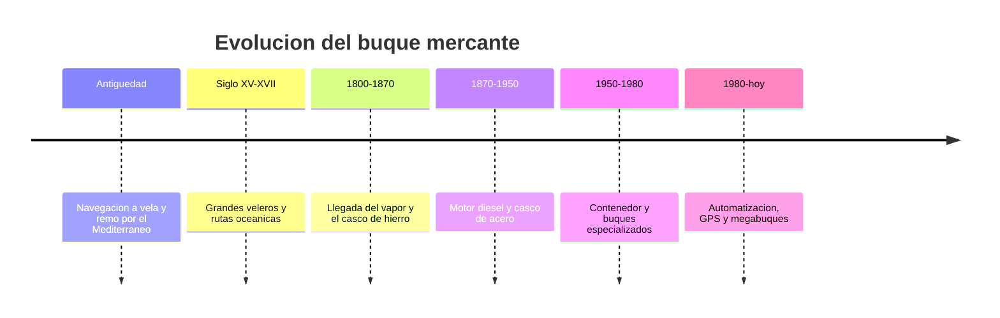

# 📜 Historia del barco mercante

[🏠 Inicio](../../../README.md) · [🚢 Curso: Barcos mercantes](../README.md) · 📜 Historia

## Origen

El transporte de mercancias por agua es una de las actividades economicas mas
antiguas. Desde las embarcaciones a vela y remo del Mediterraneo hasta los
grandes veleros de las rutas oceanicas, el buque mercante fue el motor del
comercio entre continentes mucho antes de la maquina de vapor.

## Linea de tiempo

| Periodo | Hito | Importancia |
| --- | --- | --- |
| Antiguedad | Vela y remo en mares interiores | Primer comercio maritimo a escala. |
| Siglo XV-XVII | Veleros oceanicos | Conexion entre continentes. |
| 1800-1870 | Vapor y casco de hierro | Independencia del viento. |
| 1870-1950 | Motor diesel y casco de acero | Buques mas grandes y fiables. |
| 1950-1980 | El contenedor | Revoluciona la carga y los puertos. |
| 1980-presente | Automatizacion y GPS | Megabuques y navegacion precisa. |

## Evolucion tecnologica

- **Casco**: de la madera al hierro y al acero soldado de alta resistencia.
- **Propulsion**: de la vela al vapor, y del vapor al motor diesel lento.
- **Carga**: del granel y los sacos al contenedor normalizado.
- **Navegacion**: del sextante y las cartas de papel al GPS y las cartas electronicas.
- **Seguridad**: convenios internacionales tras grandes accidentes (SOLAS).
- **Gestion**: control remoto de maquinas y puentes cada vez mas integrados.

## Tipos representativos

| Tipo | Uso tipico | Caracteristica destacada |
| --- | --- | --- |
| Carguero de vela | Comercio historico | Dependiente del viento. |
| Buque de vapor | Rutas regulares | Independencia del viento. |
| Petrolero | Transporte de crudo | Grandes tanques y estabilidad. |
| Portacontenedores | Carga general | Estiba modular y rapida. |
| Granelero | Mineral, grano | Bodegas amplias. |
| Metanero (LNG) | Gas licuado | Tanques criogenicos. |

## Impacto social y economico

El buque mercante mueve la mayor parte del comercio mundial por su bajo costo por
tonelada y kilometro. El contenedor abarato y acelero la logistica global, y hoy
la marina mercante es clave en cadenas de suministro, energia y alimentacion.

## Fuentes

- Registrar aqui las fuentes publicas consultadas.
- Enlazar cada fuente tambien en [`manuales/fuentes.md`](../../../manuales/fuentes.md).

---

[🎓 Portada del curso](../README.md) · [➡️ Siguiente: Caracteristicas](../operacion/caracteristicas-barco-mercante.md)
