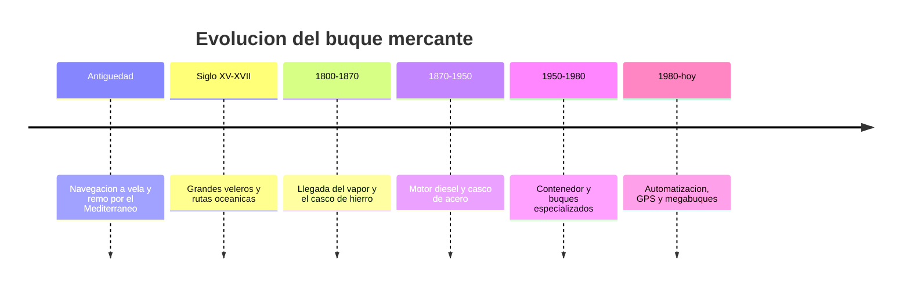

<!-- clase-meta
tipo_documento: clase
clase: 1
codigo: BARCOSMERCAN-01
curso: barcos-mercantes
titulo: "Historia del barco mercante"
modalidad: "teórica dialogada"
duracion_minutos: 45
nivel: introductorio
prerrequisito: ninguno
competencia: "contexto_historico"
resultados_aprendizaje:
  - "Explicar origen, evolución tecnológica, variantes representativas e impacto con vocabulario propio de Barcos mercantes."
  - "Aplicar esos conceptos a una decisión segura o a un escenario de simulación de Barcos mercantes."
evidencia: "Línea de tiempo comentada con cuatro hitos o más."
criterio_aprobacion: "Los hitos están ordenados, son pertinentes y dos relaciones de causa y efecto quedan justificadas."
fuentes: manuales/fuentes.md
ultima_revision: 2026-09-10
-->

# 📜 Historia del barco mercante

[🏠 Inicio](../../../README.md) · [🚢 Curso: Barcos mercantes](../README.md) · 📜 Historia

```mermaid
timeline
    title Evolucion del buque mercante
    Antiguedad : Navegacion a vela y remo por el Mediterraneo
    Siglo XV-XVII : Grandes veleros y rutas oceanicas
    1800-1870 : Llegada del vapor y el casco de hierro
    1870-1950 : Motor diesel y casco de acero
    1950-1980 : Contenedor y buques especializados
    1980-hoy : Automatizacion, GPS y megabuques
```

## Origen

El transporte de mercancías por agua es una de las actividades económicas más
antiguas. Desde las embarcaciones a vela y remo del Mediterráneo hasta los
grandes veleros de las rutas oceánicas, el buque mercante fue el motor del
comercio entre continentes mucho antes de la máquina de vapor.

## Línea de tiempo

| Periodo | Hito | Importancia |
| --- | --- | --- |
| Antiguedad | Vela y remo en mares interiores | Primer comercio marítimo a escala. |
| Siglo XV-XVII | Veleros oceánicos | Conexión entre continentes. |
| 1800-1870 | Vapor y casco de hierro | Independencia del viento. |
| 1870-1950 | Motor diesel y casco de acero | Buques más grandes y fiables. |
| 1950-1980 | El contenedor | Revoluciona la carga y los puertos. |
| 1980-presente | Automatización y GPS | Megabuques y navegación precisa. |

## Evolución tecnológica

- **Casco**: de la madera al hierro y al acero soldado de alta resistencia.
- **Propulsión**: de la vela al vapor, y del vapor al motor diesel lento.
- **Carga**: del granel y los sacos al contenedor normalizado.
- **Navegación**: del sextante y las cartas de papel al GPS y las cartas electrónicas.
- **Seguridad**: convenios internacionales tras grandes accidentes (SOLAS).
- **Gestión**: control remoto de máquinas y puentes cada vez más integrados.

## Tipos representativos

| Tipo | Uso típico | Característica destacada |
| --- | --- | --- |
| Carguero de vela | Comercio histórico | Dependiente del viento. |
| Buque de vapor | Rutas regulares | Independencia del viento. |
| Petrolero | Transporte de crudo | Grandes tanques y estabilidad. |
| Portacontenedores | Carga general | Estiba modular y rápida. |
| Granelero | Mineral, grano | Bodegas amplias. |
| Metanero (LNG) | Gas licuado | Tanques criogenicos. |

## Impacto social y económico

El buque mercante mueve la mayor parte del comercio mundial por su bajo costo por
tonelada y kilómetro. El contenedor abarató y aceleró la logística global, y hoy
la marina mercante es clave en cadenas de suministro, energía y alimentación.

## 🧭 Guía de estudio aplicada

### Pregunta guía

¿Cómo ayuda **Origen, Línea de tiempo, Evolución tecnológica y Tipos representativos** a **explicar cómo la evolución hizo posibles alternativas como portacontenedores frente a granelero**?

### Explicación razonada

La evolución de Barcos mercantes se comprende mejor como una sucesión de respuestas a problemas, no como una lista de fechas. Los cambios en motor principal, eje, hélice y casco y timón alteraron qué podía hacer la máquina, quién podía usarla y qué riesgos debían controlarse. El contraste «portacontenedores frente a granelero» permite observar qué decisiones de diseño permanecieron y cuáles cambiaron con la tecnología y el propósito.

Esta clase se conecta con el resto del curso mediante **inercia hidrodinámica: una orden de máquina o timón tarda en cambiar la trayectoria**. El hilo de
seguridad consiste en reconocer a tiempo **abordaje o varada por decidir con referencias tardías** y poder justificar la decisión
**planificar derrota, velocidad y punto de maniobra con margen suficiente**; en clases posteriores cambiará el ángulo de análisis, no esa relación causal.
La lectura funcional común sigue **motor principal → eje → hélice → casco y timón**, de modo que cada concepto pueda
ubicarse dentro del funcionamiento completo y no quede como un dato aislado.

**Apoyo documental:** [Safety of Navigation](https://www.imo.org/en/ourwork/safety/pages/navigationdefault.aspx) aporta navegación, SOLAS, COLREG y STCW;
[Collision Regulations](https://www.imo.org/en/about/conventions/pages/colreg.aspx) se usa para prevención de abordajes. Estas fuentes
se contrastan con el alcance de la clase y no sustituyen un manual de equipo concreto.

### Caso resuelto: de la observación a la decisión

1. **Situar:** ordena los hitos que explican cómo se llegó a **portacontenedores frente a granelero** y describe la necesidad que impulsó cada cambio.
2. **Relacionar:** explica qué se modificó en **motor principal**, **eje**, **hélice** o **casco y timón**; una fecha sin mecanismo no basta.
3. **Interpretar:** vincula el cambio con una capacidad nueva y también con el riesgo **abordaje o varada por decidir con referencias tardías**.
4. **Transferir:** usa la evolución para justificar por qué hoy conviene **planificar derrota, velocidad y punto de maniobra con margen suficiente**.

### Comprueba tu comprensión

1. ¿Qué necesidad histórica impulsó un cambio en **motor principal** o **eje**?
2. ¿Qué hito modificó la relación entre capacidad y **abordaje o varada por decidir con referencias tardías**?
3. ¿Por qué **portacontenedores frente a granelero** no puede explicarse como una simple diferencia estética?

Orientación para revisar tus respuestas

- La primera respuesta debe relacionar el eslabón elegido con un efecto posterior, no solo nombrarlo.
- La segunda debe proponer una señal medible u observable y explicar qué tendencia sería preocupante.
- La tercera debe cambiar al menos una variable de capacidad, mando, entorno o margen de seguridad.

## 🎓 Cierre de clase

- **Actividad:** Construye una línea de tiempo de Barcos mercantes y explica cómo dos cambios históricos transformaron su función o su puesto de mando.
- **Evidencia:** Línea de tiempo comentada con cuatro hitos o más.
- **Criterio de aprobación:** Los hitos están ordenados, son pertinentes y dos relaciones de causa y efecto quedan justificadas.
- **Transferencia:** explica qué cambiaría al pasar a otra variante de esta máquina.

### Fuentes de esta clase

- [IMO-NAV](https://www.imo.org/en/ourwork/safety/pages/navigationdefault.aspx): Safety of Navigation, International Maritime Organization. Uso: navegación, SOLAS, COLREG y STCW.
- [IMO-COLREG](https://www.imo.org/en/about/conventions/pages/colreg.aspx): Collision Regulations, International Maritime Organization. Uso: prevención de abordajes.
- [CL-DIRECTEMAR](https://www.directemar.cl/directemar/marco-normativo): Marco normativo, DIRECTEMAR. Uso: marco marítimo chileno.

> Las fuentes sostienen el marco conceptual y normativo; esta clase no reemplaza el manual
> del fabricante, la formación certificada ni la habilitación exigida para operar equipos reales.

---

[🎓 Portada del curso](../README.md) · [➡️ Siguiente: Características](../operacion/caracteristicas-barco-mercante.md)
