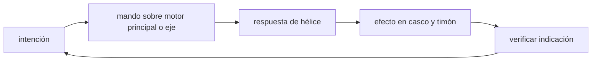

<!-- clase-meta
tipo_documento: clase
clase: 5
codigo: BARCOSMERCAN-05
curso: barcos-mercantes
titulo: "Mandos e instrumentos del barco mercante"
modalidad: "taller de simulación"
duracion_minutos: 60
nivel: introductorio
prerrequisito: BARCOSMERCAN-04
competencia: "lectura_y_mando"
resultados_aprendizaje:
  - "Explicar controles, instrumentos, entradas y estados del sistema con vocabulario propio de Barcos mercantes."
  - "Aplicar esos conceptos a una decisión segura o a un escenario de simulación de Barcos mercantes."
evidencia: "Mapa de mandos y resolución de dos estados del tablero."
criterio_aprobacion: "Reconoce los controles críticos y responde a los estados sin introducir acciones inseguras."
fuentes: manuales/fuentes.md
ultima_revision: 2026-09-10
-->

# 🎛️ Mandos e instrumentos del barco mercante

[🏠 Inicio](../../../README.md) · [🚢 Curso: Barcos mercantes](../README.md) · 🎛️ Mandos

## Vista general

El puesto de mando de un buque mercante es el **puente** (o puente de gobierno),
ubicado en alto para tener buena visibilidad. Desde allí el oficial de guardia
gobierna el rumbo, ordena la potencia a la máquina y vigila la navegación con
radar, GPS y cartas electrónicas. A diferencia de una moto, muchos mandos son
ordenes coordinadas por una tripulación.

## Mapa de controles

| Zona | Control | Tipo | Función | Prioridad | Comentarios |
| --- | --- | --- | --- | --- | --- |
| Consola central | Timón / rueda de gobierno | Rueda o palanca | Cambiar el rumbo | Alta | Actua sobre la pala del timón. |
| Consola central | Telégrafo de máquina | Palanca de rango | Ordenar potencia y sentido | Alta | Avante, atrás, parado. |
| Consola central | Piloto automático | Selector | Mantener rumbo fijo | Media | Libera al timonel en travesía. |
| Consola lateral | Propulsor de proa | Mando lateral | Maniobra en puerto | Media | Movimiento lateral a baja velocidad. |
| Consola | Control de paso de hélice | Mando | Ajustar empuje | Media | Solo en hélice de paso variable. |
| Consola | Bocina / señales acústicas | Botón | Señalizar maniobras | Alta | Reglamentada por COLREG. |
| Consola | Luces de navegación | Interruptores | Ser visto de noche | Alta | Configuración según COLREG. |
| Consola | Alarmas y comunicaciones | Panel / radio | Seguridad y coordinación | Alta | VHF, GMDSS. |
| Alas del puente | Mandos repetidos | Duplicados | Maniobrar atracando | Media | Visión directa del costado. |

## Instrumentos principales

| Instrumento | Mide o muestra | Unidad | Importancia | Notas |
| --- | --- | --- | --- | --- |
| Giroscópica / compás | Rumbo | grados | Alta | Referencia de dirección. |
| Corredera | Velocidad respecto al agua | nudos | Alta | Central para navegar. |
| Radar / ARPA | Otros buques y costa | millas | Alta | Prevención de abordajes. |
| GPS | Posición | lat/long | Alta | Ubicación precisa. |
| ECDIS | Carta electrónica | derrota | Alta | Sustituye cartas de papel. |
| Ecosonda | Profundidad bajo la quilla | metros | Alta | Evita varar. |
| Indicador de timón | Ángulo de la pala | grados | Media | Confirma la orden de gobierno. |
| Indicador de RPM | Régimen del motor | rpm | Media | Estado de la propulsión. |

## Entradas de simulación

| Acción | Teclado | Controlador | Pantalla táctil | Comentarios |
| --- | --- | --- | --- | --- |
| Cambiar rumbo | Flechas izq/der | Stick izquierdo | Rueda táctil | Respuesta lenta por inercia. |
| Ordenar avante | Flecha arriba | Gatillo derecho | Palanca telégrafo | Escalonado por regímenes. |
| Ordenar atrás | Flecha abajo | Gatillo izquierdo | Palanca telégrafo | Detención muy progresiva. |
| Parar máquina | Tecla P | Botón central | Botón parado | Ordena régimen cero. |
| Thruster de proa | Teclas A/D | Cruceta lateral | Botones laterales | Solo a baja velocidad. |
| Piloto automático | Tecla H | Botón dedicado | Interruptor | Mantiene rumbo fijo. |
| Señal acústica | Barra espaciadora | Botón R1 | Botón bocina | Según maniobra COLREG. |

## Estados del sistema

| Estado | Descripción | Indicadores | Acciones disponibles |
| --- | --- | --- | --- |
| Atracado | En muelle, amarrado | Máquina parada | Preparar zarpe, revisar sistemas. |
| Maniobra | Entrando o saliendo de puerto | Thruster activo | Gobierno fino, baja velocidad. |
| Navegación | En travesía | Piloto automático | Rumbo, vigilancia, guardias. |
| Fondeado | Al ancla, sin muelle | Ancla desplegada | Vigilar garreo, guardia. |
| Emergencia | Riesgo o falla | Alarmas activas | Maniobra evasiva, achique, auxilio. |

## Observaciones ergonomicas

- El puente debe tener visión panorámica de 360 grados en lo posible.
- El radar, el ECDIS y el indicador de rumbo deben verse en todo momento.
- El telégrafo debe dejar claro el sentido (avante/atrás) y el régimen actual.
- La simulación debe reflejar el retardo entre la orden y la respuesta del buque.
- Las señales acústicas y luminosas deben seguir el COLREG para ser educativas.

## 🧭 Guía de estudio aplicada

### Pregunta guía

¿Cómo ayuda **Vista general, Mapa de controles, Instrumentos principales y Entradas de simulación** a **interpretar mandos e indicaciones durante entrada a canal angosto con corriente transversal y tráfico**?

### Explicación razonada

Un mando no se aprende memorizando su nombre, sino recorriendo el ciclo intención → acción → indicación → verificación. En Barcos mercantes, el operador actúa sobre motor principal o eje, observa la respuesta en hélice y confirma el efecto en casco y timón. Una indicación inesperada exige detener la secuencia mental, identificar el modo activo y evitar una segunda orden que agrave el estado.

Esta clase se conecta con el resto del curso mediante **inercia hidrodinámica: una orden de máquina o timón tarda en cambiar la trayectoria**. El hilo de
seguridad consiste en reconocer a tiempo **abordaje o varada por decidir con referencias tardías** y poder justificar la decisión
**planificar derrota, velocidad y punto de maniobra con margen suficiente**; en clases posteriores cambiará el ángulo de análisis, no esa relación causal.
La lectura funcional común sigue **motor principal → eje → hélice → casco y timón**, de modo que cada concepto pueda
ubicarse dentro del funcionamiento completo y no quede como un dato aislado.

**Apoyo documental:** [Safety of Navigation](https://www.imo.org/en/ourwork/safety/pages/navigationdefault.aspx) aporta navegación, SOLAS, COLREG y STCW;
[Collision Regulations](https://www.imo.org/en/about/conventions/pages/colreg.aspx) se usa para prevención de abordajes. Estas fuentes
se contrastan con el alcance de la clase y no sustituyen un manual de equipo concreto.

### Caso resuelto: de la observación a la decisión

1. **Intención:** formula qué cambio se necesita durante **entrada a canal angosto con corriente transversal y tráfico**.
2. **Mando:** identifica el control que actúa sobre **motor principal** o **eje** y el modo que debe estar activo.
3. **Lectura:** localiza la indicación que confirma la respuesta de **hélice** y el efecto en **casco y timón**.
4. **Verificación:** si la lectura no coincide, no acumules órdenes; estabiliza e investiga el estado.

### Comprueba tu comprensión

1. ¿Qué mando inicia la respuesta y qué instrumento confirma que el modo correcto está activo?
2. ¿Qué indicación temprana advertiría **abordaje o varada por decidir con referencias tardías**?
3. ¿Qué secuencia usarías si la respuesta de **casco y timón** no coincide con la orden?

Orientación para revisar tus respuestas

- La primera respuesta debe relacionar el eslabón elegido con un efecto posterior, no solo nombrarlo.
- La segunda debe proponer una señal medible u observable y explicar qué tendencia sería preocupante.
- La tercera debe cambiar al menos una variable de capacidad, mando, entorno o margen de seguridad.

## 🎓 Cierre de clase

- **Actividad:** Recorre el puesto de mando simulado de Barcos mercantes: localiza los controles de controles, instrumentos, entradas y estados del sistema y asocia cada indicación con una decisión.
- **Evidencia:** Mapa de mandos y resolución de dos estados del tablero.
- **Criterio de aprobación:** Reconoce los controles críticos y responde a los estados sin introducir acciones inseguras.
- **Transferencia:** explica qué cambiaría al pasar a otra variante de esta máquina.

### Fuentes de esta clase

- [IMO-NAV](https://www.imo.org/en/ourwork/safety/pages/navigationdefault.aspx): Safety of Navigation, International Maritime Organization. Uso: navegación, SOLAS, COLREG y STCW.
- [IMO-COLREG](https://www.imo.org/en/about/conventions/pages/colreg.aspx): Collision Regulations, International Maritime Organization. Uso: prevención de abordajes.
- [CL-DIRECTEMAR](https://www.directemar.cl/directemar/marco-normativo): Marco normativo, DIRECTEMAR. Uso: marco marítimo chileno.

> Las fuentes sostienen el marco conceptual y normativo; esta clase no reemplaza el manual
> del fabricante, la formación certificada ni la habilitación exigida para operar equipos reales.

---

[⬅️ Anterior: Sistemas mecánicos](../operacion/sistemas-mecanicos-barco-mercante.md) · [➡️ Siguiente: Principios y operación](../operacion/principios-barco-mercante.md)
