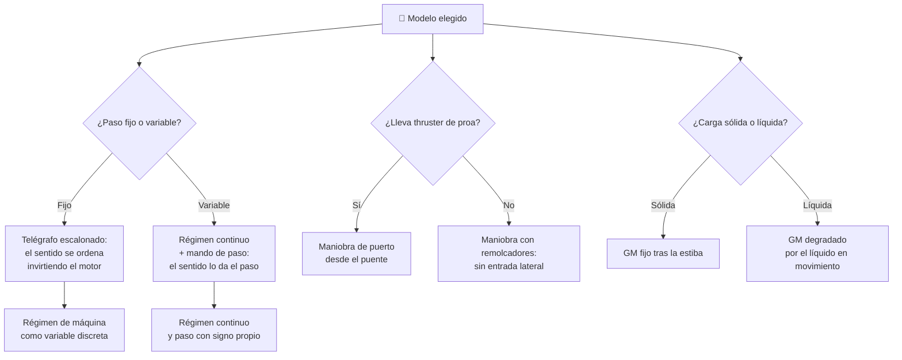

# 🧩 Modelos y variantes del barco mercante

[🏠 Inicio](../../../README.md) · [🚢 Curso: Barcos mercantes](../README.md) · 🧩 Modelos

El [Módulo 2](../operacion/caracteristicas-barco-mercante.md) ya dijo qué tipos
de buque mercante existen y para qué sirve cada uno. Este módulo responde a algo
distinto: **no todos se gobiernan igual**, y esa diferencia no es de matiz.
Cambia qué mandos hay en el puente y, por tanto, qué debe modelar el simulador.

> 🎯 **La idea que sostiene el módulo.** "Un buque mercante" no es una sola
> máquina desde el punto de vista del mando. Un buque con hélice de paso variable
> no ordena el empuje como uno de paso fijo: no es que lo haga con más finura, es
> que **tiene un mando que el otro no tiene** y un telégrafo que deja de ser
> escalonado. Un simulador que presente un solo esquema de control está
> representando un buque concreto aunque diga representarlos todos.

---

## 🧭 Por qué el modelo decide el simulador

El [Módulo 5](../mandos/manual-mandos-barco-mercante.md) describe un puente con
telégrafo de máquina como palanca de rango, un propulsor de proa en la consola
lateral y un control de paso de hélice anotado como **"solo en hélice de paso
variable"**. El [Módulo 9](../simulacion/diseno-simulador-barco-mercante.md)
expone una variable `Régimen de máquina` de tipo **discreta**, con rango
`atrás..avante toda` y la nota "escalonado por telégrafo". Ambos describen, sin
decirlo, un buque de **hélice de paso fijo**.

En un buque de paso variable ese escalonado no existe: el empuje se ordena
variando el paso de las palas, de forma continua y sin invertir el giro del
motor. La variable discreta deja de describir la máquina. Y el thruster tampoco
es universal: el [Módulo 4](../operacion/sistemas-mecanicos-barco-mercante.md) lo
clasifica como propulsor **auxiliar**, y el
[Módulo 6](../operacion/principios-barco-mercante.md) admite la alternativa
—remolcadores— para la misma maniobra. Si el simulador se construye sobre el
esquema de paso fijo con thruster y luego se le "añaden" los demás, el resultado
es un granelero que maniobra como no maniobra.

---

## 🗂️ Qué cambia en el manejo

| Modelo | Qué cambia al gobernarlo |
| --- | --- |
| Carga general | La referencia del curso: carga mixta en bodegas, comportamiento neutro y sin rasgos extremos. |
| Portacontenedores | La carga va apilada en altura y sobre cubierta: el centro de gravedad sube y el costado ofrece mucha superficie al viento, que empuja al buque en maniobra lenta. |
| Granelero | Carga densa asentada en el fondo de bodegas amplias: muy estable, pero por eso mismo vuelve a la vertical con brusquedad tras escorar. |
| Petrolero | Carga líquida en tanques: el líquido se desplaza al escorar y acompaña la inclinación en vez de oponerse a ella. Enorme masa y frenado larguísimo. |
| Gasero / LNG | Tanques criogénicos que ocupan altura y no se llenan al ras: suma la carga alta del portacontenedores al líquido que se mueve del petrolero. |
| Ro-Ro | Cubiertas corridas de vehículos y obra muerta alta: poco peso abajo y mucho costado al viento; el reparto cambia según cómo entren los vehículos. |
| Frigorífico | Bodegas refrigeradas con consumo eléctrico continuo: la máquina nunca queda del todo en reposo aunque el buque esté parado. |
| Pasaje / crucero | La escora deja de ser solo un asunto de seguridad y pasa a ser un límite de confort: se gobierna para no incomodar, no solo para no volcar. |

---

## 🎛️ Qué cambia en el mando

| Modelo | Qué mando aparece o desaparece | Consecuencia |
| --- | --- | --- |
| Carga general, Granelero, Petrolero (paso fijo) | Ninguno: el mapa de controles del Módulo 5 aplica tal cual, sin el control de paso. | Cambian los rangos y los tiempos, no los controles. |
| Cualquier modelo **con hélice de paso variable** | **Aparece** el control de paso de hélice. El telégrafo **deja de ordenar el sentido**: dar atrás ya no exige invertir el motor. | Hay dos mandos para una sola magnitud (empuje): régimen y paso. El operador debe coordinarlos. |
| Buque **sin thruster de proa** (habitual en graneleros y carga general) | **Desaparece** el propulsor de proa de la consola lateral y sus entradas A/D. | La maniobra de puerto se resuelve con remolcadores: el mando deja de estar en el puente y pasa a ser una orden a otra tripulación. |
| Portacontenedores, Ro-Ro | Ninguno nuevo, pero los **mandos repetidos de las alas del puente** pasan de cómodos a imprescindibles: el costado no se ve desde la consola central. | El mismo control, ejercido desde otro sitio y con otra visión. |
| Petrolero, Gasero / LNG | **Aparece** el estado de la carga (tanques, lastre) como algo que el puente consulta antes de maniobrar. | No es un mando, pero condiciona el resultado de todos los demás. |
| Pasaje / crucero | **Aparece** un límite de escora aceptable por confort, más estrecho que el de seguridad. | Acota el uso útil del timón por debajo de su tope mecánico. |

---

## 🎮 Qué cambia en el simulador

Contrastado con las variables del
[Módulo 9](../simulacion/diseno-simulador-barco-mercante.md):

| Modelo | Variables que cambian | Esquema de control |
| --- | --- | --- |
| Carga general | Ninguna: es el caso base. | El del Módulo 5. |
| Hélice de paso variable | `Régimen de máquina` **deja de ser discreta** y se desdobla: régimen continuo más una entrada de paso con sentido propio. | El del Módulo 5 **más** una entrada de paso; el telégrafo pierde el escalón de "atrás". |
| Sin thruster de proa | Ninguna variable nueva, pero **desaparece la entrada** de thruster del ciclo básico. | Sin cruceta lateral; la maniobra de puerto exige asistencia externa. |
| Portacontenedores | `Estabilidad (GM)` baja al subir la carga; `Viento y corriente` gana peso en el cálculo por la superficie expuesta. | El mismo. |
| Granelero | `Estabilidad (GM)` sube; `Calado` varía mucho entre viaje cargado y en lastre. | El mismo, normalmente sin thruster. |
| Petrolero | `Estabilidad (GM)` **deja de depender solo de la estiba** y se degrada con el líquido en movimiento; la inercia domina `Velocidad`. | El mismo, con respuesta mucho más lenta. |
| Gasero / LNG | `Estabilidad (GM)` recibe a la vez la carga alta y el líquido móvil; `Combustible` se acopla a la carga transportada. | El mismo. |
| Ro-Ro | `Estabilidad (GM)` y `Calado` dejan de fijarse al empezar: cambian mientras entran o salen vehículos. | El mismo. |
| Frigorífico | `Combustible` deja de depender solo del régimen: hay consumo aunque la máquina esté parada. | El mismo. |
| Pasaje / crucero | `Ángulo de timón` **reduce** su rango útil por debajo del límite de -35..35: la escora molesta antes de ser peligrosa. | El mismo. |

---

## 🗺️ Del modelo al esquema de control

---

## ⚠️ Qué modelos no comparten simulador

Tres familias no se resuelven con un ajuste de parámetros, porque su esquema de
control o su modelo físico es otro:

- **Los de hélice de paso variable** frente a los de paso fijo: aparece una
  entrada que no existía y el telégrafo deja de ordenar el sentido de la marcha.
  Es un modo de control distinto, no una dificultad distinta.
- **Los que no llevan thruster de proa** frente a los que sí: falta una entrada
  completa y la maniobra de puerto deja de resolverse desde el puente. Simular la
  misma maniobra con y sin thruster no es cambiar un número.
- **Los de carga líquida** —petrolero, gasero— frente a los de carga sólida: la
  estabilidad deja de fijarse al estibar y pasa a ser una variable viva que
  responde a la propia escora, no una constante que se calcula al zarpar.

El resto de modelos sí caben en un mismo simulador ajustando rangos, tal como
plantean los [niveles de realismo](../../../docs/03-niveles-de-realismo.md): en
el nivel 1 casi todos se comportan igual, y las diferencias emergen a medida que
el nivel sube, hasta que en el nivel 3 —estabilidad, calado y maniobra de
puerto— el modelo elegido ya decide el puesto de mando.

---

[⬅️ Anterior: Características](../operacion/caracteristicas-barco-mercante.md) · [➡️ Siguiente: Sistemas mecánicos](../operacion/sistemas-mecanicos-barco-mercante.md)
