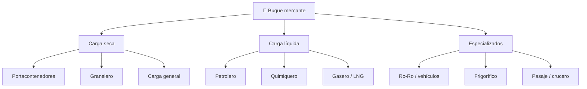

# 📋 Características funcionales del barco mercante

[🏠 Inicio](../../../README.md) · [🚢 Curso: Barcos mercantes](../README.md) · 📋 Características

Que es un buque mercante, que tipos existen y para que sirve cada uno. Este
módulo da el contexto antes de abrir la mecánica naval (Módulo 4).

---

## 🧭 Definición

Un buque mercante es una nave destinada al transporte comercial de carga o
pasajeros por vía acuática. Flota por el principio de Arquímedes, avanza por el
empuje de su propulsión y gobierna mediante el timón. A diferencia de una moto,
maneja masas enormes con gran inercia, por lo que toda maniobra es lenta y
anticipada.

---

## 🧬 Características clave

| Característica | Descripción |
| --- | --- |
| Flotación | Se sostiene por el empuje del agua desplazada (Arquímedes). |
| Gran inercia | Masas de miles de toneladas; frenar y girar toma tiempo y distancia. |
| Estabilidad | Depende del reparto de peso, la carga y el lastre. |
| Autonomía | Recorre largas distancias sin repostar. |
| Capacidad de carga | Medida en toneladas de peso muerto (DWT) o TEU. |
| Calado | Profundidad sumergida; limita puertos y canales. |

---

## 🗂️ Tipos de buque mercante

| Tipo | Uso típico | Rasgo destacado |
| --- | --- | --- |
| Portacontenedores | Carga general en cajas | Estiba modular en TEU. |
| Granelero | Mineral, grano, carbón | Bodegas amplias abiertas. |
| Petrolero | Crudo y derivados | Tanques y doble casco. |
| Gasero / LNG | Gas natural licuado | Tanques criogenicos. |
| Ro-Ro | Vehículos con ruedas | Rampas de carga rodada. |
| Frigorífico | Alimentos perecederos | Bodegas refrigeradas. |
| Pasaje / crucero | Personas | Confort y seguridad de vida. |

---

## 🎯 Para qué se usa

- Transporte masivo de carga a bajo costo por tonelada.
- Comercio internacional entre puertos y continentes.
- Abastecimiento de energía (crudo, gas, carbón).
- Transporte de vehículos y carga rodada.
- Transporte de pasajeros y turismo marítimo.

---

[⬅️ Anterior: Historia](../historia/historia-barco-mercante.md) · [➡️ Siguiente: Modelos y variantes](../modelos/modelos-barco-mercante.md)
