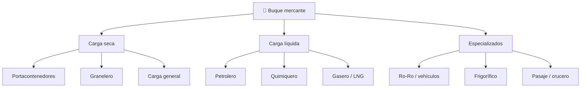

# 📋 Características funcionales del barco mercante

[🏠 Inicio](../../../README.md) · [🚢 Curso: Barcos mercantes](../README.md) · 📋 Características

Que es un buque mercante, que tipos existen y para que sirve cada uno. Este
módulo da el contexto antes de abrir la mecánica naval (Módulo 4).

---

## 🧭 Definición

Un buque mercante es una nave destinada al transporte comercial de carga o
pasajeros por vía acuática. Flota por el principio de Arquímedes, avanza por el
empuje de su propulsión y gobierna mediante el timón. A diferencia de una moto,
maneja masas enormes con gran inercia, por lo que toda maniobra es lenta y
anticipada.

---

## 🧬 Características clave

| Característica | Descripción |
| --- | --- |
| Flotación | Se sostiene por el empuje del agua desplazada (Arquímedes). |
| Gran inercia | Masas de miles de toneladas; frenar y girar toma tiempo y distancia. |
| Estabilidad | Depende del reparto de peso, la carga y el lastre. |
| Autonomía | Recorre largas distancias sin repostar. |
| Capacidad de carga | Medida en toneladas de peso muerto (DWT) o TEU. |
| Calado | Profundidad sumergida; limita puertos y canales. |

---

## 🗂️ Tipos de buque mercante

```mermaid
flowchart TD
    Buque[🚢 Buque mercante] --> Seca[Carga seca]
    Buque --> Liquida[Carga líquida]
    Buque --> Especial[Especializados]
    Seca --> Contenedor[Portacontenedores]
    Seca --> Granel[Granelero]
    Seca --> Carga[Carga general]
    Liquida --> Petrolero[Petrolero]
    Liquida --> Quimiquero[Quimiquero]
    Liquida --> Gasero[Gasero / LNG]
    Especial --> RoRo[Ro-Ro / vehículos]
    Especial --> Frigorifico[Frigorífico]
    Especial --> Pasaje[Pasaje / crucero]
```

| Tipo | Uso típico | Rasgo destacado |
| --- | --- | --- |
| Portacontenedores | Carga general en cajas | Estiba modular en TEU. |
| Granelero | Mineral, grano, carbón | Bodegas amplias abiertas. |
| Petrolero | Crudo y derivados | Tanques y doble casco. |
| Gasero / LNG | Gas natural licuado | Tanques criogenicos. |
| Ro-Ro | Vehículos con ruedas | Rampas de carga rodada. |
| Frigorífico | Alimentos perecederos | Bodegas refrigeradas. |
| Pasaje / crucero | Personas | Confort y seguridad de vida. |

---

## 🎯 Para qué se usa

- Transporte masivo de carga a bajo costo por tonelada.
- Comercio internacional entre puertos y continentes.
- Abastecimiento de energía (crudo, gas, carbón).
- Transporte de vehículos y carga rodada.
- Transporte de pasajeros y turismo marítimo.

## 🎓 Cierre de clase

- **Actividad:** Compara variantes de Barcos mercantes mediante los ejes «definición, rasgos funcionales, tipos y usos» y elige una para un caso de uso razonado.
- **Evidencia:** Matriz comparativa y decisión justificada.
- **Criterio de aprobación:** La elección considera función, límites, mando y efecto en la simulación; no se apoya solo en preferencias.
- **Transferencia:** explica qué cambiaría al pasar a otra variante de esta máquina.

### Fuentes de esta clase

- [IMO-NAV](https://www.imo.org/en/ourwork/safety/pages/navigationdefault.aspx): Safety of Navigation, International Maritime Organization. Uso: navegación, SOLAS, COLREG y STCW.
- [IMO-COLREG](https://www.imo.org/en/about/conventions/pages/colreg.aspx): Collision Regulations, International Maritime Organization. Uso: prevención de abordajes.
- [CL-DIRECTEMAR](https://www.directemar.cl/directemar/marco-normativo): Marco normativo, DIRECTEMAR. Uso: marco marítimo chileno.

> Las fuentes sostienen el marco conceptual y normativo; esta clase no reemplaza el manual
> del fabricante, la formación certificada ni la habilitación exigida para operar equipos reales.

---

[⬅️ Anterior: Historia](../historia/historia-barco-mercante.md) · [➡️ Siguiente: Modelos y variantes](../modelos/modelos-barco-mercante.md)
