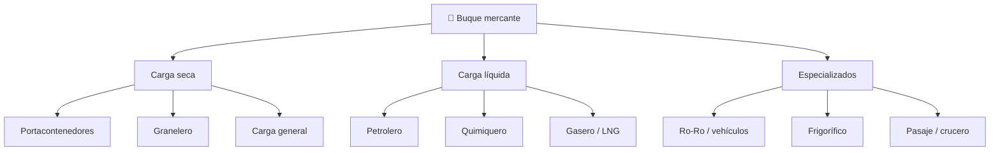

<!-- clase-meta
tipo_documento: clase
clase: 2
codigo: BARCOSMERCAN-02
curso: barcos-mercantes
titulo: "Características funcionales del barco mercante"
modalidad: "teórica aplicada"
duracion_minutos: 45
nivel: introductorio
prerrequisito: BARCOSMERCAN-01
competencia: "identificacion_funcional"
resultados_aprendizaje:
  - "Explicar definición, rasgos funcionales, tipos y usos con vocabulario propio de Barcos mercantes."
  - "Aplicar esos conceptos a una decisión segura o a un escenario de simulación de Barcos mercantes."
evidencia: "Matriz comparativa y decisión justificada."
criterio_aprobacion: "La elección considera función, límites, mando y efecto en la simulación; no se apoya solo en preferencias."
fuentes: manuales/fuentes.md
ultima_revision: 2026-09-10
-->

# 📋 Características funcionales del barco mercante

[🏠 Inicio](../../../README.md) · [🚢 Curso: Barcos mercantes](../README.md) · 📋 Características

Que es un buque mercante, que tipos existen y para que sirve cada uno. Este
módulo da el contexto antes de abrir la mecánica naval (Clase 4).

---

## 🧭 Definición

Un buque mercante es una nave destinada al transporte comercial de carga o
pasajeros por vía acuática. Flota por el principio de Arquímedes, avanza por el
empuje de su propulsión y gobierna mediante el timón. A diferencia de una moto,
maneja masas enormes con gran inercia, por lo que toda maniobra es lenta y
anticipada.

---

## 🧬 Características clave

| Característica | Descripción |
| --- | --- |
| Flotación | Se sostiene por el empuje del agua desplazada (Arquímedes). |
| Gran inercia | Masas de miles de toneladas; frenar y girar toma tiempo y distancia. |
| Estabilidad | Depende del reparto de peso, la carga y el lastre. |
| Autonomía | Recorre largas distancias sin repostar. |
| Capacidad de carga | Medida en toneladas de peso muerto (DWT) o TEU. |
| Calado | Profundidad sumergida; limita puertos y canales. |

---

## 🗂️ Tipos de buque mercante

```mermaid
flowchart TD
    Buque[🚢 Buque mercante] --> Seca[Carga seca]
    Buque --> Liquida[Carga líquida]
    Buque --> Especial[Especializados]
    Seca --> Contenedor[Portacontenedores]
    Seca --> Granel[Granelero]
    Seca --> Carga[Carga general]
    Liquida --> Petrolero[Petrolero]
    Liquida --> Quimiquero[Quimiquero]
    Liquida --> Gasero[Gasero / LNG]
    Especial --> RoRo[Ro-Ro / vehículos]
    Especial --> Frigorifico[Frigorífico]
    Especial --> Pasaje[Pasaje / crucero]
```

| Tipo | Uso típico | Rasgo destacado |
| --- | --- | --- |
| Portacontenedores | Carga general en cajas | Estiba modular en TEU. |
| Granelero | Mineral, grano, carbón | Bodegas amplias abiertas. |
| Petrolero | Crudo y derivados | Tanques y doble casco. |
| Gasero / LNG | Gas natural licuado | Tanques criogenicos. |
| Ro-Ro | Vehículos con ruedas | Rampas de carga rodada. |
| Frigorífico | Alimentos perecederos | Bodegas refrigeradas. |
| Pasaje / crucero | Personas | Confort y seguridad de vida. |

---

## 🎯 Para qué se usa

- Transporte masivo de carga a bajo costo por tonelada.
- Comercio internacional entre puertos y continentes.
- Abastecimiento de energía (crudo, gas, carbón).
- Transporte de vehículos y carga rodada.
- Transporte de pasajeros y turismo marítimo.

## 🧭 Guía de estudio aplicada

### Pregunta guía

¿Cómo ayuda **Definición, Características clave, Tipos de buque mercante y Para qué se usa** a **elegir una configuración adecuada para entrada a canal angosto con corriente transversal y tráfico**?

### Explicación razonada

Una característica solo es útil cuando permite anticipar comportamiento. En Barcos mercantes, la relación entre motor principal, eje, hélice y casco y timón determina capacidad, respuesta y límites. Por eso «portacontenedores frente a granelero» no se compara por apariencia: se compara por misión, entorno, carga de trabajo y exposición al riesgo «abordaje o varada por decidir con referencias tardías».

Esta clase se conecta con el resto del curso mediante **inercia hidrodinámica: una orden de máquina o timón tarda en cambiar la trayectoria**. El hilo de
seguridad consiste en reconocer a tiempo **abordaje o varada por decidir con referencias tardías** y poder justificar la decisión
**planificar derrota, velocidad y punto de maniobra con margen suficiente**; en clases posteriores cambiará el ángulo de análisis, no esa relación causal.
La lectura funcional común sigue **motor principal → eje → hélice → casco y timón**, de modo que cada concepto pueda
ubicarse dentro del funcionamiento completo y no quede como un dato aislado.

**Apoyo documental:** [Safety of Navigation](https://www.imo.org/en/ourwork/safety/pages/navigationdefault.aspx) aporta navegación, SOLAS, COLREG y STCW;
[Collision Regulations](https://www.imo.org/en/about/conventions/pages/colreg.aspx) se usa para prevención de abordajes. Estas fuentes
se contrastan con el alcance de la clase y no sustituyen un manual de equipo concreto.

### Caso resuelto: de la observación a la decisión

1. **Definir la necesidad:** convierte «entrada a canal angosto con corriente transversal y tráfico» en requisitos de capacidad, entorno y respuesta.
2. **Comparar:** contrasta **portacontenedores frente a granelero** usando esos requisitos y la cadena **motor principal → eje → hélice → casco y timón**.
3. **Descartar:** elimina la alternativa que deja menos margen frente a **abordaje o varada por decidir con referencias tardías**.
4. **Elegir:** declara la variante escogida, la evidencia usada y una limitación que todavía debe respetarse.

### Comprueba tu comprensión

1. ¿Qué característica de **casco y timón** condiciona primero el caso «entrada a canal angosto con corriente transversal y tráfico»?
2. ¿Qué requisito descartaría una de las alternativas **portacontenedores frente a granelero**?
3. ¿Qué límite debe declararse junto con la variante elegida?

Orientación para revisar tus respuestas

- La primera respuesta debe relacionar el eslabón elegido con un efecto posterior, no solo nombrarlo.
- La segunda debe proponer una señal medible u observable y explicar qué tendencia sería preocupante.
- La tercera debe cambiar al menos una variable de capacidad, mando, entorno o margen de seguridad.

## 🎓 Cierre de clase

- **Actividad:** Compara variantes de Barcos mercantes mediante los ejes «definición, rasgos funcionales, tipos y usos» y elige una para un caso de uso razonado.
- **Evidencia:** Matriz comparativa y decisión justificada.
- **Criterio de aprobación:** La elección considera función, límites, mando y efecto en la simulación; no se apoya solo en preferencias.
- **Transferencia:** explica qué cambiaría al pasar a otra variante de esta máquina.

### Fuentes de esta clase

- [IMO-NAV](https://www.imo.org/en/ourwork/safety/pages/navigationdefault.aspx): Safety of Navigation, International Maritime Organization. Uso: navegación, SOLAS, COLREG y STCW.
- [IMO-COLREG](https://www.imo.org/en/about/conventions/pages/colreg.aspx): Collision Regulations, International Maritime Organization. Uso: prevención de abordajes.
- [CL-DIRECTEMAR](https://www.directemar.cl/directemar/marco-normativo): Marco normativo, DIRECTEMAR. Uso: marco marítimo chileno.

> Las fuentes sostienen el marco conceptual y normativo; esta clase no reemplaza el manual
> del fabricante, la formación certificada ni la habilitación exigida para operar equipos reales.

---

[⬅️ Anterior: Historia](../historia/historia-barco-mercante.md) · [➡️ Siguiente: Modelos y variantes](../modelos/modelos-barco-mercante.md)
