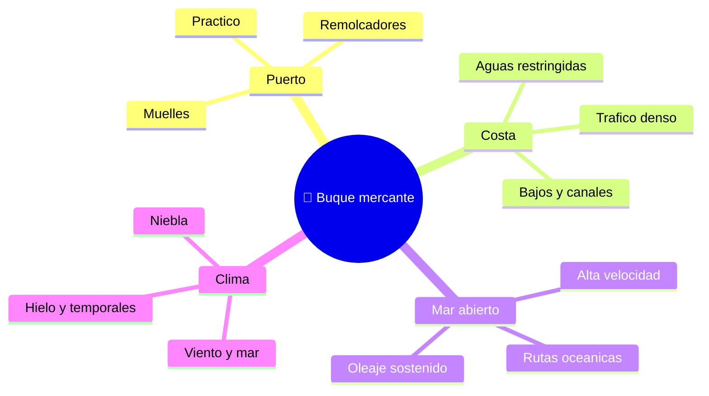

# 🌍 Entornos de trabajo del barco mercante

[🏠 Inicio](../../../README.md) · [🚢 Curso: Barcos mercantes](../README.md) · 🌍 Entornos

Dónde opera un buque mercante y cómo cambia la navegación según el entorno. Cada
entorno implica reglas, riesgos y ajustes distintos, y en simulación se traduce
en escenarios diferentes.

---

## 🗺️ Entornos principales

| Entorno | Características | Riesgos típicos | Ajuste de navegación |
| --- | --- | --- | --- |
| Puerto | Espacio estrecho, muelles. | Colisión, mala maniobra. | Baja velocidad, thruster, práctico. |
| Costa | Aguas restringidas, tráfico. | Varada, abordaje. | Vigilancia, ecosonda, COLREG. |
| Canales / esclusas | Paso estrecho controlado. | Encallar, obstruir. | Velocidad mínima, remolcadores. |
| Mar abierto | Rutas largas, oleaje. | Temporales, fatiga. | Rumbo, guardias, meteorología. |
| Niebla / noche | Baja visibilidad. | No ser visto, abordaje. | Radar, luces, señales acústicas. |

---

## 🌦️ Factores del entorno

- **Viento y mar**: el oleaje y el viento afectan rumbo, escora y confort.
- **Corrientes y mareas**: modifican la trayectoria real y el calado disponible.
- **Profundidad**: los bajos limitan las rutas según el calado del buque.
- **Tráfico**: más buques implica más decisiones y aplicación del COLREG.
- **Visibilidad**: niebla y noche exigen radar, luces y señales.

---

## 🎮 Traducción a simulación

Cada entorno es un escenario con su profundidad, clima, corriente y tráfico. Ver
como se modela en el
[Módulo 9: Diseño de simulación](../simulacion/diseno-simulador-barco-mercante.md).

---

[⬅️ Anterior: Principios y operación](principios-barco-mercante.md) · [➡️ Siguiente: Reglamentos](../reglamentos/reglamentos-barco-mercante.md)
