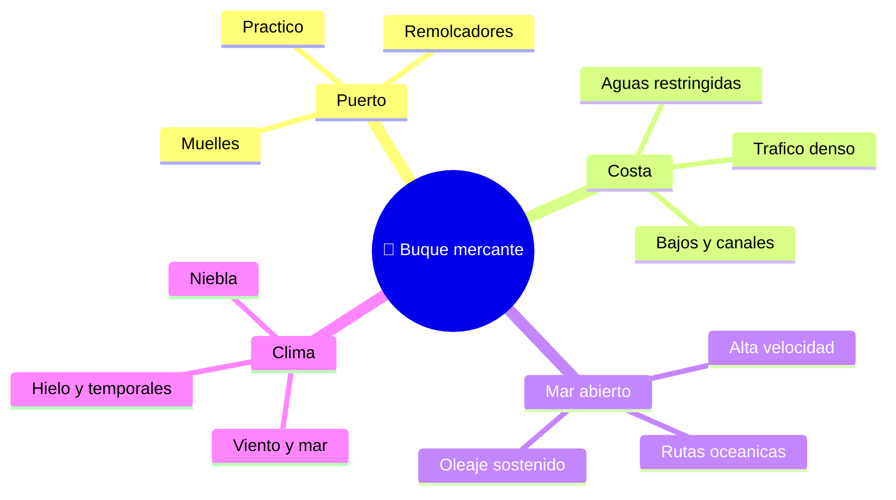

<!-- clase-meta
tipo_documento: clase
clase: 7
codigo: BARCOSMERCAN-07
curso: barcos-mercantes
titulo: "Entornos de trabajo del barco mercante"
modalidad: "análisis de escenarios"
duracion_minutos: 60
nivel: introductorio
prerrequisito: BARCOSMERCAN-06
competencia: "adaptacion_al_entorno"
resultados_aprendizaje:
  - "Explicar entornos, factores ambientales, riesgos y respuesta de simulación con vocabulario propio de Barcos mercantes."
  - "Aplicar esos conceptos a una decisión segura o a un escenario de simulación de Barcos mercantes."
evidencia: "Matriz entorno–cambio–riesgo–respuesta."
criterio_aprobacion: "Cada respuesta se adapta al entorno y distingue riesgos que no son intercambiables entre escenarios."
fuentes: manuales/fuentes.md
ultima_revision: 2026-09-10
-->

# 🌍 Entornos de trabajo del barco mercante

[🏠 Inicio](../../../README.md) · [🚢 Curso: Barcos mercantes](../README.md) · 🌍 Entornos

Dónde opera un buque mercante y cómo cambia la navegación según el entorno. Cada
entorno implica reglas, riesgos y ajustes distintos, y en simulación se traduce
en escenarios diferentes.

---

## 🗺️ Entornos principales

```mermaid
mindmap
  root((🚢 Buque mercante))
    Puerto
      Muelles
      Remolcadores
      Practico
    Costa
      Aguas restringidas
      Trafico denso
      Bajos y canales
    Mar abierto
      Alta velocidad
      Rutas oceanicas
      Oleaje sostenido
    Clima
      Viento y mar
      Niebla
      Hielo y temporales
```

| Entorno | Características | Riesgos típicos | Ajuste de navegación |
| --- | --- | --- | --- |
| Puerto | Espacio estrecho, muelles. | Colisión, mala maniobra. | Baja velocidad, thruster, práctico. |
| Costa | Aguas restringidas, tráfico. | Varada, abordaje. | Vigilancia, ecosonda, COLREG. |
| Canales / esclusas | Paso estrecho controlado. | Encallar, obstruir. | Velocidad mínima, remolcadores. |
| Mar abierto | Rutas largas, oleaje. | Temporales, fatiga. | Rumbo, guardias, meteorología. |
| Niebla / noche | Baja visibilidad. | No ser visto, abordaje. | Radar, luces, señales acústicas. |

---

## 🌦️ Factores del entorno

- **Viento y mar**: el oleaje y el viento afectan rumbo, escora y confort.
- **Corrientes y mareas**: modifican la trayectoria real y el calado disponible.
- **Profundidad**: los bajos limitan las rutas según el calado del buque.
- **Tráfico**: más buques implica más decisiones y aplicación del COLREG.
- **Visibilidad**: niebla y noche exigen radar, luces y señales.

---

## 🎮 Traducción a simulación

Cada entorno es un escenario con su profundidad, clima, corriente y tráfico. Ver
como se modela en el
[Clase 9: Diseño de simulación](../simulacion/diseno-simulador-barco-mercante.md).

## 🧭 Guía de estudio aplicada

### Pregunta guía

¿Cómo ayuda **Entornos principales, Factores del entorno, Traducción a simulación y Guía de estudio aplicada** a **adaptar entrada a canal angosto con corriente transversal y tráfico a tres condiciones ambientales distintas**?

### Explicación razonada

El entorno no es decoración: modifica las fuerzas, la percepción y el tiempo disponible. En el caso «entrada a canal angosto con corriente transversal y tráfico», cambia el comportamiento de casco y timón y aumenta la probabilidad de abordaje o varada por decidir con referencias tardías. La respuesta correcta empieza por reconocer qué variable cambió y después adaptar límites, ruta o misión.

Esta clase se conecta con el resto del curso mediante **inercia hidrodinámica: una orden de máquina o timón tarda en cambiar la trayectoria**. El hilo de
seguridad consiste en reconocer a tiempo **abordaje o varada por decidir con referencias tardías** y poder justificar la decisión
**planificar derrota, velocidad y punto de maniobra con margen suficiente**; en clases posteriores cambiará el ángulo de análisis, no esa relación causal.
La lectura funcional común sigue **motor principal → eje → hélice → casco y timón**, de modo que cada concepto pueda
ubicarse dentro del funcionamiento completo y no quede como un dato aislado.

**Apoyo documental:** [Safety of Navigation](https://www.imo.org/en/ourwork/safety/pages/navigationdefault.aspx) aporta navegación, SOLAS, COLREG y STCW;
[Collision Regulations](https://www.imo.org/en/about/conventions/pages/colreg.aspx) se usa para prevención de abordajes. Estas fuentes
se contrastan con el alcance de la clase y no sustituyen un manual de equipo concreto.

### Caso resuelto: de la observación a la decisión

1. **Escenario base:** conserva la misión «entrada a canal angosto con corriente transversal y tráfico» para poder comparar.
2. **Cambiar una condición:** modifica sucesivamente superficie o medio, visibilidad y perturbación externa.
3. **Recalcular margen:** explica cómo cada cambio afecta **casco y timón** y acerca o aleja **abordaje o varada por decidir con referencias tardías**.
4. **Adaptar:** cambia límite, ruta, configuración o incluso cancela; no mantengas la misma respuesta por hábito.

### Comprueba tu comprensión

1. ¿Cómo cambiaría **casco y timón** si empeora la perturbación externa?
2. ¿Qué condición ambiental acerca más el escenario a **abordaje o varada por decidir con referencias tardías**?
3. ¿Cuándo adaptarías la maniobra y cuándo la cancelarías?

Orientación para revisar tus respuestas

- La primera respuesta debe relacionar el eslabón elegido con un efecto posterior, no solo nombrarlo.
- La segunda debe proponer una señal medible u observable y explicar qué tendencia sería preocupante.
- La tercera debe cambiar al menos una variable de capacidad, mando, entorno o margen de seguridad.

## 🎓 Cierre de clase

- **Actividad:** Contrasta tres entornos de Barcos mercantes a partir de entornos, factores ambientales, riesgos y respuesta de simulación y determina cómo cambian variables, percepción, riesgos y respuesta.
- **Evidencia:** Matriz entorno–cambio–riesgo–respuesta.
- **Criterio de aprobación:** Cada respuesta se adapta al entorno y distingue riesgos que no son intercambiables entre escenarios.
- **Transferencia:** explica qué cambiaría al pasar a otra variante de esta máquina.

### Fuentes de esta clase

- [IMO-NAV](https://www.imo.org/en/ourwork/safety/pages/navigationdefault.aspx): Safety of Navigation, International Maritime Organization. Uso: navegación, SOLAS, COLREG y STCW.
- [IMO-COLREG](https://www.imo.org/en/about/conventions/pages/colreg.aspx): Collision Regulations, International Maritime Organization. Uso: prevención de abordajes.
- [CL-DIRECTEMAR](https://www.directemar.cl/directemar/marco-normativo): Marco normativo, DIRECTEMAR. Uso: marco marítimo chileno.

> Las fuentes sostienen el marco conceptual y normativo; esta clase no reemplaza el manual
> del fabricante, la formación certificada ni la habilitación exigida para operar equipos reales.

---

[⬅️ Anterior: Principios y operación](principios-barco-mercante.md) · [➡️ Siguiente: Reglamentos](../reglamentos/reglamentos-barco-mercante.md)
