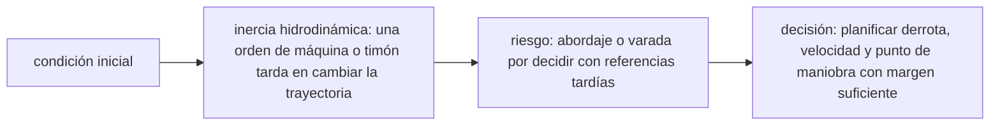

<!-- clase-meta
tipo_documento: clase
clase: 6
codigo: BARCOSMERCAN-06
curso: barcos-mercantes
titulo: "Principios y operación del barco mercante"
modalidad: "resolución de problemas"
duracion_minutos: 90
nivel: introductorio
prerrequisito: BARCOSMERCAN-05
competencia: "razonamiento_operacional"
resultados_aprendizaje:
  - "Explicar principios físicos, fases de operación, decisiones y errores frecuentes con vocabulario propio de Barcos mercantes."
  - "Aplicar esos conceptos a una decisión segura o a un escenario de simulación de Barcos mercantes."
evidencia: "Resolución argumentada de un escenario operacional."
criterio_aprobacion: "Aplica los principios correctos, anticipa consecuencias y respeta los límites del curso."
fuentes: manuales/fuentes.md
ultima_revision: 2026-09-10
-->

# 🧪 Principios y operación del barco mercante

[🏠 Inicio](../../../README.md) · [🚢 Curso: Barcos mercantes](../README.md) · 🧪 Principios

Documento general y educativo. No sustituye la formación náutica certificada
(STCW) ni los manuales del fabricante. Describe cómo se opera un buque mercante
en simulación y que principios físicos conviene representar.

## Principios de funcionamiento

- **Flotación**: el buque flota porque desplaza un peso de agua igual al suyo
  (principio de Arquímedes). El empuje vertical sostiene el casco.
- **Propulsión**: la hélice empuja agua hacia atrás y, por reacción, el buque
  avanza hacia adelante (tercera ley de Newton).
- **Gobierno**: la pala del timón desvia el flujo de agua en popa y genera una
  fuerza que hace rotar el buque; necesita velocidad para responder.
- **Inercia**: por su gran masa, el buque tarda mucho en acelerar, frenar o
  girar; toda maniobra se anticipa con minutos y millas de margen.
- **Estabilidad**: el reparto de peso, la carga y el lastre determinan que el
  buque vuelva a la vertical tras una escora.

## Fases de operación

| Fase | Que ocurre | Puntos clave |
| --- | --- | --- |
| Preparación | Revisión antes de zarpar | Máquina, gobierno, cartas, combustible. |
| Desatraque | Salir del muelle | Thruster, cabos, remolcadores si aplica. |
| Salida de puerto | Navegar el canal | Baja velocidad, práctico, señales. |
| Navegación | Travesía en mar abierto | Rumbo, guardias, vigilancia radar. |
| Aproximación | Acercarse al puerto destino | Reducir velocidad con anticipación. |
| Atraque | Amarrar en muelle | Maniobra fina, thruster, cabos. |
| Cierre | Dejar segura la nave | Máquina parada, amarre firme, guardias. |

## Maniobras: idea general

1. Anticipar toda maniobra por la **inercia** del buque.
2. Reducir la velocidad **mucho antes** de la aproximación.
3. Usar el **thruster de proa** y remolcadores en espacios estrechos.
4. Respetar las **reglas de rumbo** COLREG frente a otros buques.
5. Vigilar calado y **profundidad** para no varar.

## Errores comunes que la simulación puede enseñar a evitar

- Subestimar la distancia de frenado por la inercia.
- Intentar gobernar con el buque casi parado (el timón no responde).
- Ignorar la profundidad bajo la quilla y varar.
- No respetar la prioridad de paso según COLREG.
- Mala estiba o lastre que compromete la estabilidad.

## Relación con los niveles de realismo

- **Nivel 1 (educativo)**: rumbo, velocidad y respetar señales básicas.
- **Nivel 2 (simplificado)**: agregar inercia, distancia de frenado y viento.
- **Nivel 3 (técnico)**: sumar estabilidad, calado, corrientes y maniobra de
  puerto con thruster y remolcadores.

Ver [`docs/03-niveles-de-realismo.md`](../../../docs/03-niveles-de-realismo.md) para el detalle de cada nivel.

## 🧭 Guía de estudio aplicada

### Pregunta guía

¿Cómo ayuda **Principios de funcionamiento, Fases de operación, Maniobras: idea general y Errores comunes que la simulación puede enseñar a evitar** a **resolver entrada a canal angosto con corriente transversal y tráfico sin agotar el margen operacional**?

### Explicación razonada

El principio rector puede resumirse así: inercia hidrodinámica: una orden de máquina o timón tarda en cambiar la trayectoria. Esto explica por qué una misma orden produce resultados distintos cuando cambian velocidad, carga, configuración o entorno. Operar bien consiste en leer la tendencia antes de agotar el margen y tomar esta decisión: planificar derrota, velocidad y punto de maniobra con margen suficiente.

Esta clase se conecta con el resto del curso mediante **inercia hidrodinámica: una orden de máquina o timón tarda en cambiar la trayectoria**. El hilo de
seguridad consiste en reconocer a tiempo **abordaje o varada por decidir con referencias tardías** y poder justificar la decisión
**planificar derrota, velocidad y punto de maniobra con margen suficiente**; en clases posteriores cambiará el ángulo de análisis, no esa relación causal.
La lectura funcional común sigue **motor principal → eje → hélice → casco y timón**, de modo que cada concepto pueda
ubicarse dentro del funcionamiento completo y no quede como un dato aislado.

**Apoyo documental:** [Safety of Navigation](https://www.imo.org/en/ourwork/safety/pages/navigationdefault.aspx) aporta navegación, SOLAS, COLREG y STCW;
[Collision Regulations](https://www.imo.org/en/about/conventions/pages/colreg.aspx) se usa para prevención de abordajes. Estas fuentes
se contrastan con el alcance de la clase y no sustituyen un manual de equipo concreto.

### Caso resuelto: de la observación a la decisión

1. **Datos:** reconoce condiciones, configuración y margen disponibles en **entrada a canal angosto con corriente transversal y tráfico**.
2. **Modelo:** aplica **inercia hidrodinámica: una orden de máquina o timón tarda en cambiar la trayectoria** para predecir una tendencia antes de actuar.
3. **Riesgo:** explica mediante qué cadena de causas podría ocurrir **abordaje o varada por decidir con referencias tardías**.
4. **Decisión:** ejecuta mentalmente **planificar derrota, velocidad y punto de maniobra con margen suficiente** y define qué observación confirmaría que funcionó.

### Comprueba tu comprensión

1. ¿Qué variable del principio «inercia hidrodinámica: una orden de máquina o timón tarda en cambiar la trayectoria» cambia primero en el caso?
2. ¿Cómo se propaga ese cambio hasta **casco y timón**?
3. ¿Qué evidencia confirmaría que **planificar derrota, velocidad y punto de maniobra con margen suficiente** conservó margen operacional?

Orientación para revisar tus respuestas

- La primera respuesta debe relacionar el eslabón elegido con un efecto posterior, no solo nombrarlo.
- La segunda debe proponer una señal medible u observable y explicar qué tendencia sería preocupante.
- La tercera debe cambiar al menos una variable de capacidad, mando, entorno o margen de seguridad.

## 🎓 Cierre de clase

- **Actividad:** Resuelve un escenario de Barcos mercantes explicando, paso a paso, cómo intervienen principios físicos, fases de operación, decisiones y errores frecuentes.
- **Evidencia:** Resolución argumentada de un escenario operacional.
- **Criterio de aprobación:** Aplica los principios correctos, anticipa consecuencias y respeta los límites del curso.
- **Transferencia:** explica qué cambiaría al pasar a otra variante de esta máquina.

### Fuentes de esta clase

- [IMO-NAV](https://www.imo.org/en/ourwork/safety/pages/navigationdefault.aspx): Safety of Navigation, International Maritime Organization. Uso: navegación, SOLAS, COLREG y STCW.
- [IMO-COLREG](https://www.imo.org/en/about/conventions/pages/colreg.aspx): Collision Regulations, International Maritime Organization. Uso: prevención de abordajes.
- [CL-DIRECTEMAR](https://www.directemar.cl/directemar/marco-normativo): Marco normativo, DIRECTEMAR. Uso: marco marítimo chileno.

> Las fuentes sostienen el marco conceptual y normativo; esta clase no reemplaza el manual
> del fabricante, la formación certificada ni la habilitación exigida para operar equipos reales.

---

[⬅️ Anterior: Mandos](../mandos/manual-mandos-barco-mercante.md) · [➡️ Siguiente: Entornos de trabajo](entornos-barco-mercante.md)
