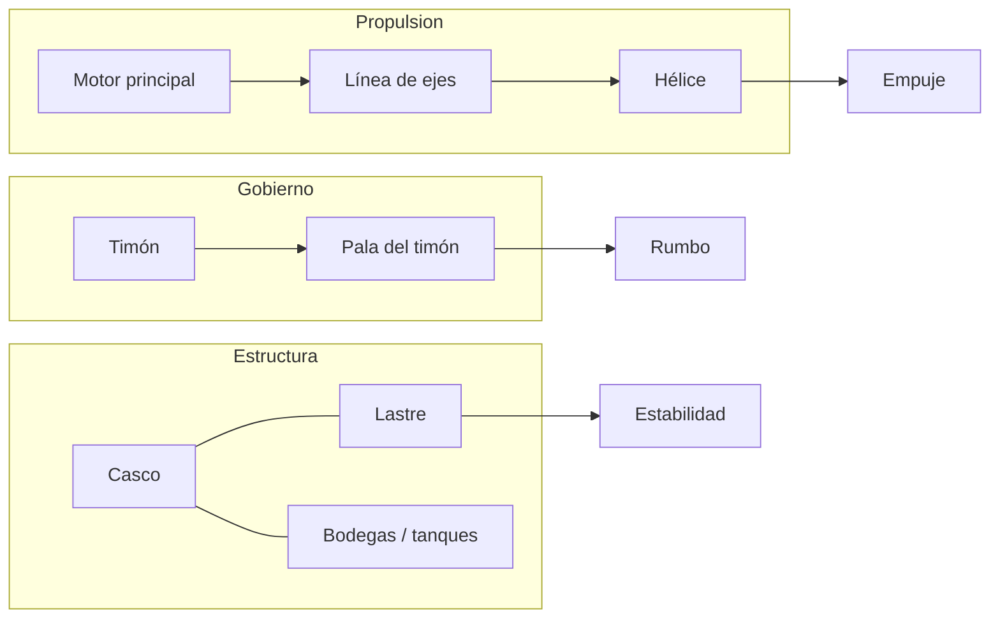
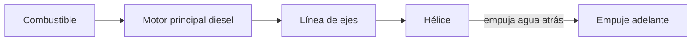
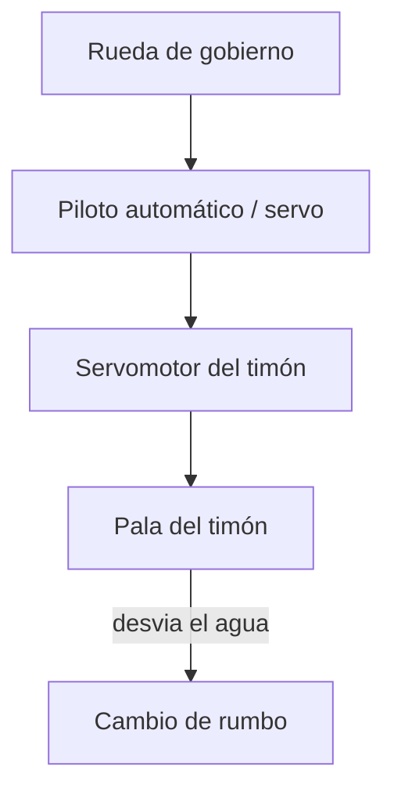

# 🔧 Sistemas mecánicos del barco mercante

[🏠 Inicio](../../../README.md) · [🚢 Curso: Barcos mercantes](../README.md) · 🔧 Sistemas mecánicos

Este módulo abre el buque por dentro. Explica cada sistema, como funciona y como
se conecta con los demás. Es la base técnica para entender los mandos (Módulo 4)
y la física de la navegación (Módulo 5).

---

## 1. 🚢 Casco

El casco es la estructura estanca que da flotación, resistencia y forma
hidrodinámica. Todo el buque se construye alrededor de el.

- **Obra viva**: parte sumergida; su forma define resistencia al avance.
- **Obra muerta**: parte sobre la línea de flotación.
- **Doble casco / doble fondo**: protección ante averías y espacio de lastre.
- **Mamparos estancos**: dividen el casco en compartimentos para limitar
  inundaciones.

| Parte | Función | Efecto en el buque |
| --- | --- | --- |
| Proa | Corta el agua | Menor resistencia al avance. |
| Popa | Aloja timón y hélice | Gobierno y propulsión. |
| Quilla | Eje estructural inferior | Rigidez y estabilidad. |
| Francobordo | Altura hasta cubierta | Reserva de flotabilidad. |
| Calado | Profundidad sumergida | Limita puertos y canales. |

---

## 2. 🔧 Propulsión

Convierte energía (combustible o electricidad) en empuje para avanzar.

- **Motor principal**: normalmente un motor diesel lento de gran tamaño acoplado
  directo al eje, o una planta diesel-eléctrica.
- **Línea de ejes**: transmite el giro del motor a la hélice.
- **Hélice**: al empujar agua hacia atrás, genera empuje hacia adelante
  (tercera ley de Newton). Puede ser de paso fijo o de paso variable.
- **Propulsores auxiliares**: los de proa (bow thruster) ayudan a maniobrar en
  puerto a baja velocidad.

| Componente | Función | Nota |
| --- | --- | --- |
| Motor principal | Genera potencia | Diesel lento, muy eficiente. |
| Reductor | Adapta revoluciones | No siempre presente. |
| Línea de ejes | Transmite giro | Atraviesa el casco por la bocina. |
| Hélice | Convierte giro en empuje | Paso fijo o variable. |
| Thruster de proa | Maniobra en puerto | Movimiento lateral a baja velocidad. |

---

## 3. ⚙️ Gobierno y timón

El gobierno cambia el rumbo desviando el flujo de agua en la popa.

- **Pala del timón**: al girar, desvia el flujo de agua y genera una fuerza que
  hace rotar el buque.
- **Servomotor**: mueve la pala con fuerza hidráulica siguiendo la orden del
  puente.
- **Efecto de la velocidad**: el timón casi no responde con el buque parado;
  necesita flujo de agua para gobernar.

---

## 4. 📦 Carga, estiba y estabilidad

El buque mercante existe para transportar carga con seguridad. La forma de
cargar afecta directamente la estabilidad.

- **Bodegas y tanques**: espacios donde se estiba la carga (seca o líquida).
- **Estiba**: distribución de la carga para equilibrar el buque y evitar
  esfuerzos excesivos en el casco.
- **Lastre**: agua que se toma o descarga para ajustar calado y estabilidad
  cuando el buque va vacío o parcialmente cargado.
- **Metacentro y centro de gravedad**: su posición relativa define si el buque
  es estable y vuelve a la vertical tras una escora.

| Concepto | Definición | Riesgo si falla |
| --- | --- | --- |
| Centro de gravedad (G) | Punto donde actua el peso total. | Muy alto: buque inestable. |
| Metacentro (M) | Punto de equilibrio al escorar. | G sobre M: puede volcar. |
| Escora | Inclinación transversal. | Excesiva: pérdida de carga. |
| Asiento (trimado) | Diferencia de calado proa-popa. | Mal asiento: mal gobierno. |
| Lastre | Agua de ajuste de peso. | Mal manejo: inestabilidad. |

---

## 5. 🔩 Sistemas auxiliares

- **Generadores**: producen la electricidad de a bordo.
- **Sistema de achique**: extrae agua que entra al casco.
- **Sistema contraincendios**: bombas, detectores y extinción.
- **Fondeo**: anclas y cadenas para inmovilizar el buque.
- **Amarre**: cabos y cabrestantes para atracar en muelle.

---

## 🔁 Cómo se conecta todo

1. El **motor principal** genera potencia.
2. La **línea de ejes** la lleva a la **hélice**, que produce empuje.
3. El **timón** desvia el agua en popa para cambiar el rumbo.
4. El **casco** aporta flotación y aloja **carga y lastre**.
5. La **estiba y el lastre** mantienen la estabilidad.
6. Los **sistemas auxiliares** dan energía y seguridad.

Con esto entendido, el
[Módulo 4: Mandos](../mandos/manual-mandos-barco-mercante.md) muestra cómo la
tripulación opera cada uno de estos sistemas desde el puente.

---

[⬅️ Anterior: Características](caracteristicas-barco-mercante.md) · [➡️ Siguiente: Mandos e instrumentos](../mandos/manual-mandos-barco-mercante.md)
