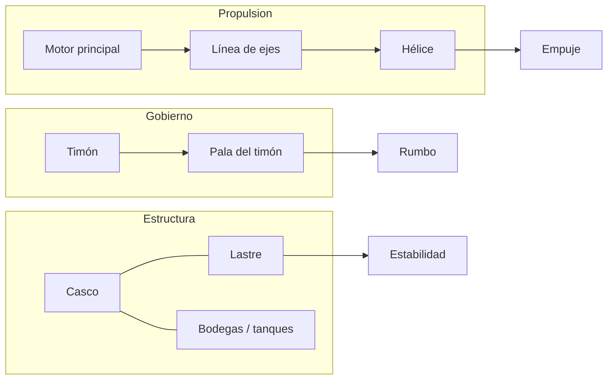
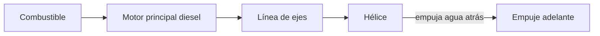
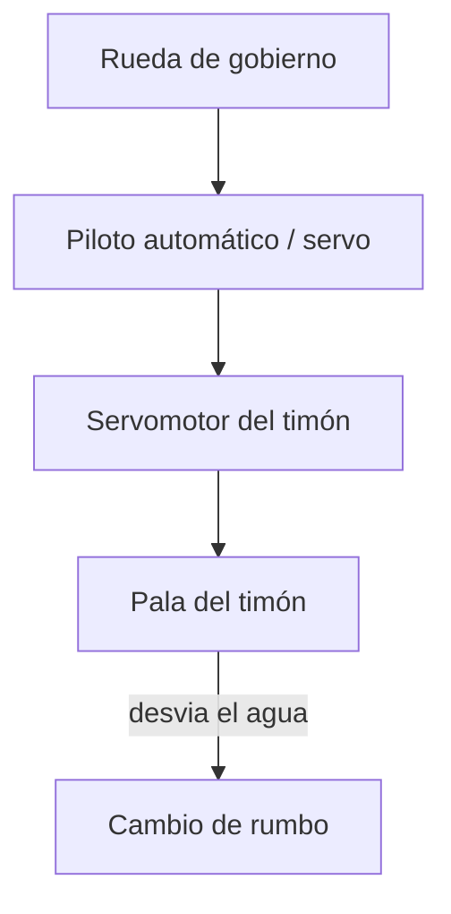
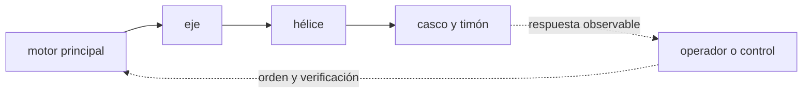

<!-- clase-meta
tipo_documento: clase
clase: 4
codigo: BARCOSMERCAN-04
curso: barcos-mercantes
titulo: "Sistemas mecánicos del barco mercante"
modalidad: "teórica aplicada"
duracion_minutos: 90
nivel: introductorio
prerrequisito: BARCOSMERCAN-03
competencia: "comprension_de_sistemas"
resultados_aprendizaje:
  - "Explicar Casco, Propulsión, Gobierno y timón y Carga, estiba y estabilidad con vocabulario propio de Barcos mercantes."
  - "Aplicar esos conceptos a una decisión segura o a un escenario de simulación de Barcos mercantes."
evidencia: "Esquema con flujos de energía, materia o información anotados."
criterio_aprobacion: "Las conexiones esenciales son correctas y la consecuencia de la falla se propaga de manera coherente."
fuentes: manuales/fuentes.md
ultima_revision: 2026-09-10
-->

# 🔧 Sistemas mecánicos del barco mercante

[🏠 Inicio](../../../README.md) · [🚢 Curso: Barcos mercantes](../README.md) · 🔧 Sistemas mecánicos

Esta clase abre el buque por dentro. Explica cada sistema, como funciona y como
se conecta con los demás. Es la base técnica para entender los mandos (Clase 5)
y la física de la navegación (Clase 6).

```mermaid
flowchart LR
    subgraph Propulsion
        M[Motor principal] --> Ej[Línea de ejes] --> H[Hélice]
    end
    subgraph Gobierno
        Ti[Timón] --> Pa[Pala del timón]
    end
    subgraph Estructura
        Ca[Casco] --- La[Lastre]
        Ca --- Bo[Bodegas / tanques]
    end
    H --> Empuje[Empuje]
    Pa --> Rumbo[Rumbo]
    La --> Estabilidad[Estabilidad]
```

---

## 1. 🚢 Casco

El casco es la estructura estanca que da flotación, resistencia y forma
hidrodinámica. Todo el buque se construye alrededor de el.

- **Obra viva**: parte sumergida; su forma define resistencia al avance.
- **Obra muerta**: parte sobre la línea de flotación.
- **Doble casco / doble fondo**: protección ante averías y espacio de lastre.
- **Mamparos estancos**: dividen el casco en compartimentos para limitar
  inundaciones.

| Parte | Función | Efecto en el buque |
| --- | --- | --- |
| Proa | Corta el agua | Menor resistencia al avance. |
| Popa | Aloja timón y hélice | Gobierno y propulsión. |
| Quilla | Eje estructural inferior | Rigidez y estabilidad. |
| Francobordo | Altura hasta cubierta | Reserva de flotabilidad. |
| Calado | Profundidad sumergida | Limita puertos y canales. |

---

## 2. 🔧 Propulsión

Convierte energía (combustible o electricidad) en empuje para avanzar.

```mermaid
flowchart LR
    Combustible[Combustible] --> Motor[Motor principal diesel]
    Motor --> Eje[Línea de ejes]
    Eje --> Helice[Hélice]
    Helice -->|empuja agua atrás| Empuje[Empuje adelante]
```

- **Motor principal**: normalmente un motor diesel lento de gran tamaño acoplado
  directo al eje, o una planta diesel-eléctrica.
- **Línea de ejes**: transmite el giro del motor a la hélice.
- **Hélice**: al empujar agua hacia atrás, genera empuje hacia adelante
  (tercera ley de Newton). Puede ser de paso fijo o de paso variable.
- **Propulsores auxiliares**: los de proa (bow thruster) ayudan a maniobrar en
  puerto a baja velocidad.

| Componente | Función | Nota |
| --- | --- | --- |
| Motor principal | Genera potencia | Diesel lento, muy eficiente. |
| Reductor | Adapta revoluciones | No siempre presente. |
| Línea de ejes | Transmite giro | Atraviesa el casco por la bocina. |
| Hélice | Convierte giro en empuje | Paso fijo o variable. |
| Thruster de proa | Maniobra en puerto | Movimiento lateral a baja velocidad. |

---

## 3. ⚙️ Gobierno y timón

El gobierno cambia el rumbo desviando el flujo de agua en la popa.

```mermaid
flowchart TD
    Rueda[Rueda de gobierno] --> Piloto[Piloto automático / servo]
    Piloto --> Servo[Servomotor del timón]
    Servo --> Pala[Pala del timón]
    Pala -->|desvia el agua| Giro[Cambio de rumbo]
```

- **Pala del timón**: al girar, desvia el flujo de agua y genera una fuerza que
  hace rotar el buque.
- **Servomotor**: mueve la pala con fuerza hidráulica siguiendo la orden del
  puente.
- **Efecto de la velocidad**: el timón casi no responde con el buque parado;
  necesita flujo de agua para gobernar.

---

## 4. 📦 Carga, estiba y estabilidad

El buque mercante existe para transportar carga con seguridad. La forma de
cargar afecta directamente la estabilidad.

- **Bodegas y tanques**: espacios donde se estiba la carga (seca o líquida).
- **Estiba**: distribución de la carga para equilibrar el buque y evitar
  esfuerzos excesivos en el casco.
- **Lastre**: agua que se toma o descarga para ajustar calado y estabilidad
  cuando el buque va vacío o parcialmente cargado.
- **Metacentro y centro de gravedad**: su posición relativa define si el buque
  es estable y vuelve a la vertical tras una escora.

| Concepto | Definición | Riesgo si falla |
| --- | --- | --- |
| Centro de gravedad (G) | Punto donde actua el peso total. | Muy alto: buque inestable. |
| Metacentro (M) | Punto de equilibrio al escorar. | G sobre M: puede volcar. |
| Escora | Inclinación transversal. | Excesiva: pérdida de carga. |
| Asiento (trimado) | Diferencia de calado proa-popa. | Mal asiento: mal gobierno. |
| Lastre | Agua de ajuste de peso. | Mal manejo: inestabilidad. |

---

## 5. 🔩 Sistemas auxiliares

- **Generadores**: producen la electricidad de a bordo.
- **Sistema de achique**: extrae agua que entra al casco.
- **Sistema contraincendios**: bombas, detectores y extinción.
- **Fondeo**: anclas y cadenas para inmovilizar el buque.
- **Amarre**: cabos y cabrestantes para atracar en muelle.

---

## 🔁 Cómo se conecta todo

1. El **motor principal** genera potencia.
2. La **línea de ejes** la lleva a la **hélice**, que produce empuje.
3. El **timón** desvia el agua en popa para cambiar el rumbo.
4. El **casco** aporta flotación y aloja **carga y lastre**.
5. La **estiba y el lastre** mantienen la estabilidad.
6. Los **sistemas auxiliares** dan energía y seguridad.

Con esto entendido, el
[Clase 5: Mandos](../mandos/manual-mandos-barco-mercante.md) muestra cómo la
tripulación opera cada uno de estos sistemas desde el puente.

## 🧭 Guía de estudio aplicada

### Pregunta guía

¿Cómo ayuda **Casco, Propulsión, Gobierno y timón y Carga, estiba y estabilidad** a **seguir una alteración desde motor principal hasta casco y timón durante entrada a canal angosto con corriente transversal y tráfico**?

### Explicación razonada

El funcionamiento puede leerse como una cadena causal: motor principal entrega o transforma energía; eje la adapta; hélice la transmite o gobierna; y casco y timón produce el efecto observable. La cadena no es lineal en sentido estricto: sensores, estructura y operador cierran el lazo. Si un eslabón se degrada, la señal importante es cómo cambia el estado de casco y timón y qué margen queda.

```mermaid
flowchart LR
    A["motor principal"] --> B["eje"] --> C["hélice"] --> D["casco y timón"]
    D -. respuesta observable .-> O["operador o control"]
    O -. orden y verificación .-> A
```

Esta clase se conecta con el resto del curso mediante **inercia hidrodinámica: una orden de máquina o timón tarda en cambiar la trayectoria**. El hilo de
seguridad consiste en reconocer a tiempo **abordaje o varada por decidir con referencias tardías** y poder justificar la decisión
**planificar derrota, velocidad y punto de maniobra con margen suficiente**; en clases posteriores cambiará el ángulo de análisis, no esa relación causal.
La lectura funcional común sigue **motor principal → eje → hélice → casco y timón**, de modo que cada concepto pueda
ubicarse dentro del funcionamiento completo y no quede como un dato aislado.

**Apoyo documental:** [Safety of Navigation](https://www.imo.org/en/ourwork/safety/pages/navigationdefault.aspx) aporta navegación, SOLAS, COLREG y STCW;
[Collision Regulations](https://www.imo.org/en/about/conventions/pages/colreg.aspx) se usa para prevención de abordajes. Estas fuentes
se contrastan con el alcance de la clase y no sustituyen un manual de equipo concreto.

### Caso resuelto: de la observación a la decisión

1. **Entrada:** identifica el estado inicial de **motor principal** durante **entrada a canal angosto con corriente transversal y tráfico**.
2. **Transformación:** explica qué hacen **eje** y **hélice**, y qué magnitud cambia en cada paso.
3. **Salida:** comprueba el efecto esperado en **casco y timón** y busca una desviación temprana.
4. **Falla razonada:** si aparece **abordaje o varada por decidir con referencias tardías**, retrocede por la cadena antes de ordenar otra acción.

### Comprueba tu comprensión

1. Si se degrada **eje**, ¿qué efecto esperarías primero en **hélice** y después en **casco y timón**?
2. ¿Qué observación ayudaría a diferenciar una falla de **motor principal** de una falla de **hélice**?
3. ¿Por qué una segunda orden podría agravar **abordaje o varada por decidir con referencias tardías**?

Orientación para revisar tus respuestas

- La primera respuesta debe relacionar el eslabón elegido con un efecto posterior, no solo nombrarlo.
- La segunda debe proponer una señal medible u observable y explicar qué tendencia sería preocupante.
- La tercera debe cambiar al menos una variable de capacidad, mando, entorno o margen de seguridad.

## 🎓 Cierre de clase

- **Actividad:** Dibuja un esquema funcional de Barcos mercantes que conecte Casco, Propulsión, Gobierno y timón y Carga, estiba y estabilidad; después predice el efecto de una falla simulada.
- **Evidencia:** Esquema con flujos de energía, materia o información anotados.
- **Criterio de aprobación:** Las conexiones esenciales son correctas y la consecuencia de la falla se propaga de manera coherente.
- **Transferencia:** explica qué cambiaría al pasar a otra variante de esta máquina.

### Fuentes de esta clase

- [IMO-NAV](https://www.imo.org/en/ourwork/safety/pages/navigationdefault.aspx): Safety of Navigation, International Maritime Organization. Uso: navegación, SOLAS, COLREG y STCW.
- [IMO-COLREG](https://www.imo.org/en/about/conventions/pages/colreg.aspx): Collision Regulations, International Maritime Organization. Uso: prevención de abordajes.
- [CL-DIRECTEMAR](https://www.directemar.cl/directemar/marco-normativo): Marco normativo, DIRECTEMAR. Uso: marco marítimo chileno.

> Las fuentes sostienen el marco conceptual y normativo; esta clase no reemplaza el manual
> del fabricante, la formación certificada ni la habilitación exigida para operar equipos reales.

---

[⬅️ Anterior: Modelos y variantes](../modelos/modelos-barco-mercante.md) · [➡️ Siguiente: Mandos e instrumentos](../mandos/manual-mandos-barco-mercante.md)
