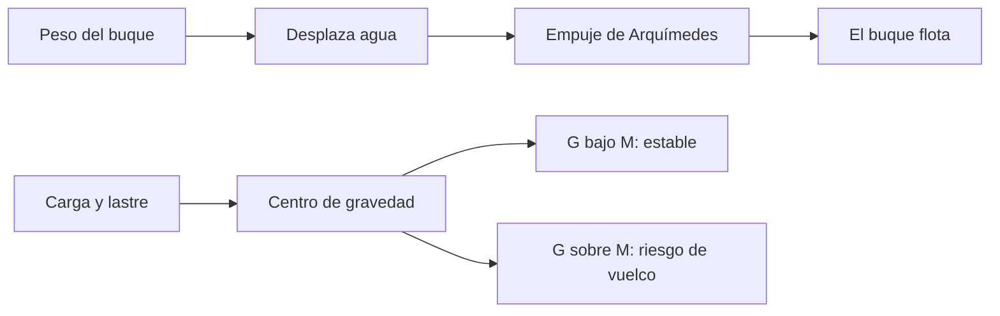

# 🧰 Recursos del barco mercante

[🏠 Inicio](../../../README.md) · [🚢 Curso: Barcos mercantes](../README.md) · 🧰 Recursos

Glosario náutico específico, enlaces y diagramas de apoyo del curso de barcos
mercantes. Amplia el [glosario general](../../../docs/05-glosario-general.md).

---

## 📖 Glosario específico

| Término | Definición |
| --- | --- |
| Calado | Profundidad sumergida del casco desde la línea de flotación. |
| Francobordo | Altura del casco desde la flotación hasta la cubierta. |
| Escora | Inclinación transversal del buque. |
| Asiento (trimado) | Diferencia de calado entre proa y popa. |
| Lastre | Agua que se toma o descarga para ajustar peso y estabilidad. |
| Metacentro | Punto de referencia de la estabilidad transversal. |
| Estiba | Distribución de la carga a bordo. |
| Nudo | Unidad de velocidad: una milla náutica por hora. |
| Babor / estribor | Costado izquierdo / derecho mirando a proa. |

---

## 🗺️ Diagrama de flotación y estabilidad

---

## 🔗 Enlaces y fuentes

- Marco legal: [⚖️ docs/07-marco-legal-chile.md](../../../docs/07-marco-legal-chile.md)
- Registro de fuentes: [📚 manuales/fuentes.md](../../../manuales/fuentes.md)
- Convenios OMI (SOLAS, MARPOL, STCW, COLREG) y DIRECTEMAR: ver el registro de fuentes.

Registrar cada recurso nuevo con su origen y licencia, siguiendo
[`recursos/README.md`](../../../recursos/README.md).

---

[🎓 Portada del curso](../README.md) · [⬅️ Anterior: Diseño de simulación](../simulacion/diseno-simulador-barco-mercante.md) · [➡️ Siguiente: Ejercicios](../ejercicios/ejercicios-barco-mercante.md)
