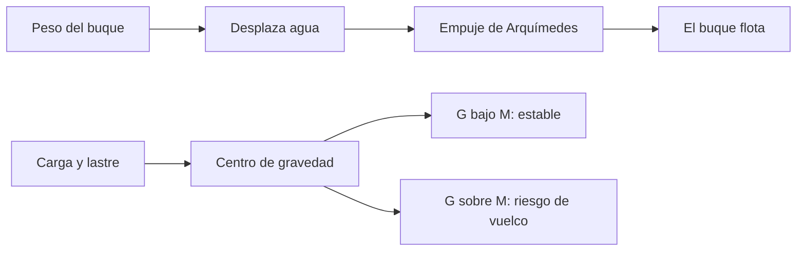

<!-- clase-meta
tipo_documento: clase
clase: 10
codigo: BARCOSMERCAN-10
curso: barcos-mercantes
titulo: "Recursos del barco mercante"
modalidad: "taller documental"
duracion_minutos: 45
nivel: introductorio
prerrequisito: BARCOSMERCAN-09
competencia: "alfabetizacion_tecnica"
resultados_aprendizaje:
  - "Explicar glosario, esquemas y trazabilidad de fuentes con vocabulario propio de Barcos mercantes."
  - "Aplicar esos conceptos a una decisión segura o a un escenario de simulación de Barcos mercantes."
evidencia: "Glosario aplicado y ficha breve de trazabilidad."
criterio_aprobacion: "Los términos permiten interpretar el curso y las fuentes se distinguen por autoridad, alcance y vigencia."
fuentes: manuales/fuentes.md
ultima_revision: 2026-09-10
-->

# 🧰 Recursos del barco mercante

[🏠 Inicio](../../../README.md) · [🚢 Curso: Barcos mercantes](../README.md) · 🧰 Recursos

Glosario náutico específico, enlaces y diagramas de apoyo del curso de barcos
mercantes. Amplia el [glosario general](../../../docs/05-glosario-general.md).

---

## 📖 Glosario específico

| Término | Definición |
| --- | --- |
| Calado | Profundidad sumergida del casco desde la línea de flotación. |
| Francobordo | Altura del casco desde la flotación hasta la cubierta. |
| Escora | Inclinación transversal del buque. |
| Asiento (trimado) | Diferencia de calado entre proa y popa. |
| Lastre | Agua que se toma o descarga para ajustar peso y estabilidad. |
| Metacentro | Punto de referencia de la estabilidad transversal. |
| Estiba | Distribución de la carga a bordo. |
| Nudo | Unidad de velocidad: una milla náutica por hora. |
| Babor / estribor | Costado izquierdo / derecho mirando a proa. |

---

## 🗺️ Diagrama de flotación y estabilidad

```mermaid
flowchart LR
    Peso[Peso del buque] --> Desplaza[Desplaza agua]
    Desplaza --> Empuje[Empuje de Arquímedes]
    Empuje --> Flota[El buque flota]
    Carga[Carga y lastre] --> G[Centro de gravedad]
    G --> Estable[G bajo M: estable]
    G --> Riesgo[G sobre M: riesgo de vuelco]
```

---

## 🔗 Enlaces y fuentes

- Marco legal: [⚖️ docs/07-marco-legal-chile.md](../../../docs/07-marco-legal-chile.md)
- Registro de fuentes: [📚 manuales/fuentes.md](../../../manuales/fuentes.md)
- Convenios OMI (SOLAS, MARPOL, STCW, COLREG) y DIRECTEMAR: ver el registro de fuentes.

Registrar cada recurso nuevo con su origen y licencia, siguiendo
[`recursos/README.md`](../../../recursos/README.md).

## 🧭 Guía de estudio aplicada

### Pregunta guía

¿Cómo ayuda **Glosario específico, Diagrama de flotación y estabilidad, Enlaces y fuentes y Guía de estudio aplicada** a **explicar con fuentes los términos motor principal, eje, hélice y casco y timón**?

### Explicación razonada

El vocabulario técnico organiza relaciones: motor principal, eje, hélice y casco y timón nombran partes distintas de una misma cadena funcional. Una fuente se usa para sostener una afirmación concreta —principio, límite, procedimiento o contexto— y debe distinguirse del manual particular de un fabricante o de una regla narrativa.

Esta clase se conecta con el resto del curso mediante **inercia hidrodinámica: una orden de máquina o timón tarda en cambiar la trayectoria**. El hilo de
seguridad consiste en reconocer a tiempo **abordaje o varada por decidir con referencias tardías** y poder justificar la decisión
**planificar derrota, velocidad y punto de maniobra con margen suficiente**; en clases posteriores cambiará el ángulo de análisis, no esa relación causal.
La lectura funcional común sigue **motor principal → eje → hélice → casco y timón**, de modo que cada concepto pueda
ubicarse dentro del funcionamiento completo y no quede como un dato aislado.

**Apoyo documental:** [Safety of Navigation](https://www.imo.org/en/ourwork/safety/pages/navigationdefault.aspx) aporta navegación, SOLAS, COLREG y STCW;
[Collision Regulations](https://www.imo.org/en/about/conventions/pages/colreg.aspx) se usa para prevención de abordajes. Estas fuentes
se contrastan con el alcance de la clase y no sustituyen un manual de equipo concreto.

### Caso resuelto: de la observación a la decisión

1. **Definir en contexto:** explica **motor principal**, **eje**, **hélice** y **casco y timón** por su función y relación.
2. **Respaldar:** enlaza cada afirmación importante con una fuente identificable y declara su alcance.
3. **Contrastar:** separa principios generales, requisitos locales, manual de fabricante y —si aplica— canon ficticio.
4. **Reformular:** convierte una definición copiada en una explicación propia con un ejemplo de **Barcos mercantes**.

### Comprueba tu comprensión

1. Explica la diferencia funcional entre **eje** y **hélice** sin copiar una definición.
2. ¿Qué fuente respalda el principio «inercia hidrodinámica: una orden de máquina o timón tarda en cambiar la trayectoria» y cuál es su alcance?
3. ¿Qué dato exigiría un manual de fabricante en vez de una fuente general?

Orientación para revisar tus respuestas

- La primera respuesta debe relacionar el eslabón elegido con un efecto posterior, no solo nombrarlo.
- La segunda debe proponer una señal medible u observable y explicar qué tendencia sería preocupante.
- La tercera debe cambiar al menos una variable de capacidad, mando, entorno o margen de seguridad.

## 🎓 Cierre de clase

- **Actividad:** Selecciona términos de glosario, esquemas y trazabilidad de fuentes, explícalos en contexto de Barcos mercantes y verifica la procedencia de las fuentes utilizadas.
- **Evidencia:** Glosario aplicado y ficha breve de trazabilidad.
- **Criterio de aprobación:** Los términos permiten interpretar el curso y las fuentes se distinguen por autoridad, alcance y vigencia.
- **Transferencia:** explica qué cambiaría al pasar a otra variante de esta máquina.

### Fuentes de esta clase

- [IMO-NAV](https://www.imo.org/en/ourwork/safety/pages/navigationdefault.aspx): Safety of Navigation, International Maritime Organization. Uso: navegación, SOLAS, COLREG y STCW.
- [IMO-COLREG](https://www.imo.org/en/about/conventions/pages/colreg.aspx): Collision Regulations, International Maritime Organization. Uso: prevención de abordajes.
- [CL-DIRECTEMAR](https://www.directemar.cl/directemar/marco-normativo): Marco normativo, DIRECTEMAR. Uso: marco marítimo chileno.

> Las fuentes sostienen el marco conceptual y normativo; esta clase no reemplaza el manual
> del fabricante, la formación certificada ni la habilitación exigida para operar equipos reales.

---

[🎓 Portada del curso](../README.md) · [⬅️ Anterior: Diseño de simulación](../simulacion/diseno-simulador-barco-mercante.md) · [➡️ Siguiente: Ejercicios](../ejercicios/ejercicios-barco-mercante.md)
