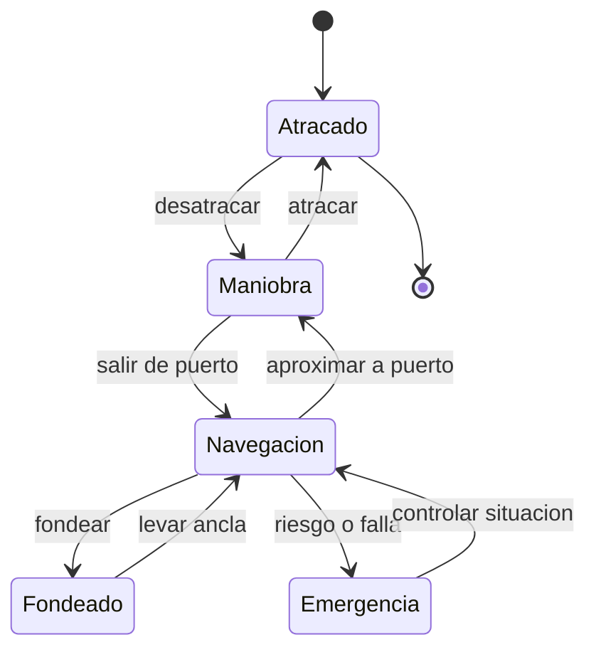

# 🎮 Diseño de simulación del barco mercante

[🏠 Inicio](../../../README.md) · [🚢 Curso: Barcos mercantes](../README.md) · 🎮 Simulación

## Objetivo de la simulación

Que el usuario aprenda a gobernar un buque mercante respetando la inercia,
manejar la propulsión y el timón, aplicar reglas básicas de navegación (COLREG)
y realizar maniobras de puerto de forma segura y progresiva.

## Nivel de realismo

- Nivel elegido: se ofrece del 1 al 3 (ver `docs/03-niveles-de-realismo.md`).
- Justificación: el buque agrega flotación, inercia de grandes masas y reglas
  marítimas, por lo que es un curso intermedio respecto de la moto.

## Variables principales

| Variable | Tipo | Rango | Afecta a | Comentarios |
| --- | --- | --- | --- | --- |
| Velocidad | numérica | 0-25 nudos | Avance y gobierno | El timón necesita flujo. |
| Rumbo | numérica | 0-359 grados | Dirección | Cambia con retardo. |
| Régimen de máquina | discreta | atrás..avante toda | Empuje | Escalonado por telégrafo. |
| Ángulo de timón | numérica | -35..35 grados | Radio de giro | Limitado por diseño. |
| Calado | numérica | según carga | Riesgo de varada | Depende de carga y lastre. |
| Estabilidad (GM) | numérica | positiva | Escora y seguridad | Depende de la estiba. |
| Viento y corriente | vectorial | variable | Deriva | Ajuste del entorno. |
| Combustible | numérica | 0-100% | Autonomía | Consumo por régimen. |

## Ciclo básico

1. Leer entrada del usuario (timón, telégrafo, thruster, piloto automático).
2. Actualizar estado de la máquina y la posición del timón.
3. Calcular fuerzas: empuje, resistencia del agua, viento y corriente.
4. Aplicar la inercia de la masa del buque al cambio de velocidad y rumbo.
5. Actualizar posición, rumbo, escora y calado.
6. Refrescar instrumentos (radar, GPS, ecosonda) y alarmas.

## Modos de juego futuros

- Tutorial guiado del puente y el telégrafo.
- Práctica libre de maniobra en puerto.
- Travesía costera respetando COLREG.
- Desafíos de atraque con viento y corriente.
- Situaciones de baja visibilidad con radar, sin contenido sensible.

## Elementos fuera de alcance

- Maniobras temerarias presentadas como recomendables.
- Reproducción de navegación negligente como objetivo del juego.
- Datos que permitan alterar sistemas reales de un buque.

## Pendientes

- [ ] Definir valores por defecto de cada variable por tipo de buque.
- [ ] Prototipar el modelo de inercia y gobierno.
- [ ] Ajustar el efecto de viento y corriente en la deriva.
- [ ] Agregar fuentes técnicas públicas a [`manuales/fuentes.md`](../../../manuales/fuentes.md).

---

[⬅️ Anterior: Reglamentos](../reglamentos/reglamentos-barco-mercante.md) · [➡️ Siguiente: Recursos](../recursos/recursos-barco-mercante.md)
